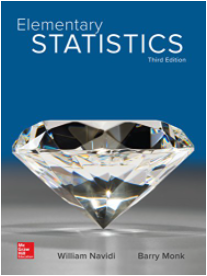

<style type="text/css">

div#TOC li {
    list-style:none;
    background-image:none;
    background-repeat:none;
    background-position:0;
}
h1.title {
  font-size: 24px;
  color: DarkRed;
  text-align: center;
}
h4.author { /* Header 4 - and the author and data headers use this too  */
    font-size: 18px;
  font-family: "Times New Roman", Times, serif;
  color: DarkRed;
  text-align: center;
}
h4.date { /* Header 4 - and the author and data headers use this too  */
  font-size: 18px;
  font-family: "Times New Roman", Times, serif;
  color: DarkBlue;
  text-align: center;
}

h1 { /* Header 3 - and the author and data headers use this too  */
    font-size: 20px;
    font-family: "Times New Roman", Times, serif;
    color: darkred;
    text-align: center;
}
h2 { /* Header 3 - and the author and data headers use this too  */
    font-size: 18px;
    font-family: "Times New Roman", Times, serif;
    color: navy;
    text-align: left;
}

h3 { /* Header 3 - and the author and data headers use this too  */
    font-size: 16px;
    font-family: "Times New Roman", Times, serif;
    color: navy;
    text-align: left;
}


</style>

```{r setup, include=FALSE}
# code chunk specifies whether the R code, warnings, and output 
# will be included in the output files.
if(!require('vembedr')) {
  install.packages('vembedr')
  library('vembedr')
}
if (!require("knitr")) {
   install.packages("knitr")
   library(knitr)
}
# knitr::opts_knit$set(root.dir = "C:/Users/75CPENG/OneDrive - West Chester University of PA/Documents")
# knitr::opts_knit$set(root.dir = "C:\\STA490\\w05")

knitr::opts_chunk$set(echo = FALSE,       
                      warning = FALSE,   
                      result = TRUE,   
                      message = FALSE)
```

\

\

# Introduction 

This is a 100% online course. <font color = "darkred"><b>This means that we will NOT hold scheduled meetings two times or three times per week throughout the semester!</b></font>. 

## What Are You Expected to Do Every Week?


Although we don't meet in class every week, we still accomplish weekly learning goals by following the weekly learning schedule that is laid out clearly on the course web page. To be more specific, your weekly learning tasks include 

1. studying the weekly note (or the corresponding chapter in the eBook). **Practice** (<font color = "red">not simply read)</font> all examples in the note (eBook). 

2. practicing the online multiple choice problems. <font color = "blue"> [A piece of advice: do all multiple choice problems as if they were show-your-work problems, then based on work choose the correct answer. **Click the answer button to view the correct answer and its explanation is the last step!**] </font>. Please use this online learning material wisely and responsibly.

3. using an appropriate **InteractiveStatsApps** to check your work to make sure your statistical reasoning is correct. If your answer is different from what the Apps produced, check your work to see where is wrong. This is the most effective way of using these apps to debug your thinking and enhance your understanding of the material. 

4. If you have any difficulty understanding some concepts or some examples, please take note and then **reach out to me directly or work with our great tutors at MLC**. Please trust yourself that **you can do it regardless of what prior mathematics experience you may have**. It is perfectly normal to challenge in the learning process. All you need to do is to seek help from me, tutors, or your peers. Never give up!

5. The last task of each is to to D2L to complete the weekly quiz. You should think of the weekly as the regular weekly homework assignment. _Weely Quizzes_ are <font color = "blue"> available at **12:00 PM** every Thursday</font> and <font color = "red">due **11:30PM** the following Sunday</font>. You have three and a half days to complete the weekly assignment. D2L will automatically grade your quiz. 

6. **Additional information about the weekly quizzes**
   * Every weekly quiz has about 10 - 15 multiple-choice questions. There will be no show-your-work problems in weekly quizzes.

   * Everyone will have their own version of the quiz with the same number of questions at the same level of difficulty.
  
   * For each weekly quiz, you will be allowed three attempts. The one with the highest score will be recorded as the weekly score.
  
   * If you re-attempt the quiz, you have to start all over the entire quiz <font color = "red">(not just the ones you did wrong in the previous attempts)</font>. 
  
   * The key to the master problem set on which your quiz was built will be posted on the course webpage every Monday so you use it to practice and prepare for your midterm exams and the final exam.
  
   * If your answers to some of the problems in quizzes are different from the suggested answer key and you still don't see the issues that cause the difference, please reach out as early as possible.
  
   * There will be NO time limits for doing weekly quizzes. You can use any resources you can find when you do the weekly assignments.

\

# Policies, Resources, and Expectations

Course policies and expectations on exams and assignments are outlined in the syllabus that is also available online at: <https://pengdsci.github.io/MAT121/w00/MAT121-Fall-2023.pdf>


# Logistics

Since I wrote a self-contained electronic course pack (E-Pack) and developed 17 interactive statistics learning apps for this class, you are **NOT** required to buy any materials and devices to complete this course. All you need to do is to put effort into studying weekly materials and practicing problems in online exercises.

## Textbook <font color = "red">(Optional)</font>

**Elementary	Statistics**, by Navidi and Monk, 3rd edition.

```{r fig.align='center', out.width = '30%'}

```

Everyone has already been charged for the above eBook. You can opt out of the required eBook and get a refund. I don't how this is proceeded. You may want to send an email to the student IT HelpDesk to see whether they help. Once I have relevant information, I post it on the cost web page and send it to you via email as well.

**E-Pack** written by myself will be used throughout the semester.

```{r fig.align='center', out.width = '30%'}
include_graphics("eBook.png")
```

The link to this [eBook](https://pengdsci.github.io/MAT121EB/) is on the course web page as well


## Interactive Statistics Learning Apps (ISLA)

I have put a lot of effort into creating many graphics in the notes and the eBook to help you visualize the contents whenever possible. In the meantime, I have also created interactive apps (called **InteractiveStatsApps**) accompanying the topics included in the lecture notes and the eBook as standalone sections under the same title **Use of Technology** to enhance your understanding of the materials.

Since you have already been charged for the textbook, if you decide to continue to use the book as a major reference book (I encourage you to do so), you can access the textbook through D2L's  **Inclusive Access**: 

<br>
<center><font color = "red"><b>log into D2L $\to$ MAT121-08-11 $\to$ Inclusive Access $\to$ ALEKS. </b></font></center>
<br>


## Calculators and Technologies

Calculators are not required for this class. We only use calculators occasionally to do simple calculations. Because of this, you should have a very basic scientific calculator that can do the four basic operations ($+, -, \times, \div$) and square root ($\sqrt{x}$). A TI graphic calculator is not required.

The **ISLA** can be used as a statistical calculator.  You can use them to verify your manual work. I also use these apps to check the results of the examples used in lecture notes.

\


# Components of Course Grade

As stated in the syllabus, the course grade will be calculated based on weekly quizzes, three midterm exams, final exams, and attendance. 

## Weekly Quizzes 

To fairly assess your learning outcomes, you will do weekly quizzes in addition to the exams. All weekly quizzes will be administered through D2L. You can consider these weekly quizzes as weekly homework assignments. Detailed information about the quizzes has been described in the opening section of this note.


## Midterm Exams

There will be three **timed** midterm exams in the semester. They will be administered through D2L and the duration of each is 80 minutes. Similar to weekly quizzes, all midterm exams will only have about 20 multiple-choice questions. The will be no make-up exams. If you miss any midterm exam due to legitimate reasons, I will use your (raw) grade in the final exam to replace the missed midterm exam score(s). The answer key to each midterm exam will be posted on the course web page shortly after the exam due date. 

I may curve the midterm scores based on the overall performance of the class if it is necessary.

\

## Final Exam Information

**Time and Date**: 3:30 PM - 5:30 PM, Tuesday, 12/12/2023.

**Location**: online through D2L.

**Format** All questions are multiple-choice. There are about 35 questions in total in the final exam.

**Duration**: <font color = "red"><b>The final exam is 2-hour comprehensive exam </b></font>. <font color = "blue"> You must complete your exam within 2 hours. No extension will be given.</font>

**Coverage**:  All topics delivered this semester are supposed to be covered in the final exam. 


\


