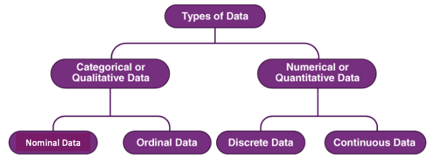
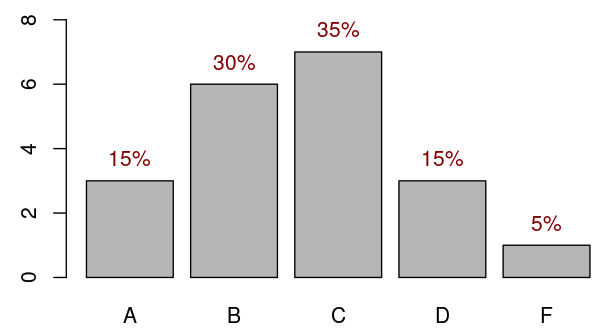
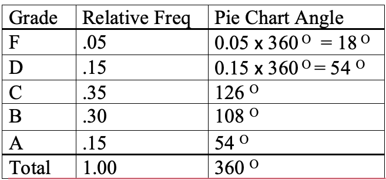
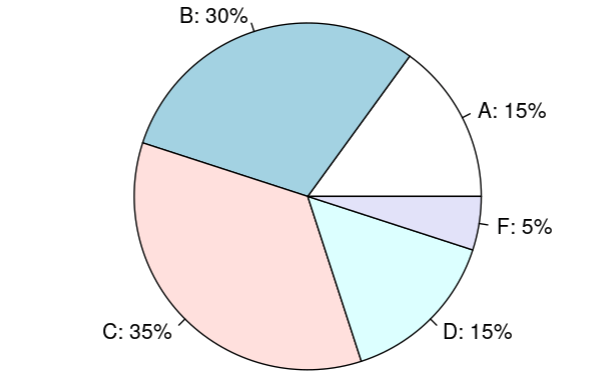

<style type="text/css">

div#TOC li {
    list-style:none;
    background-image:none;
    background-repeat:none;
    background-position:0;
}
h1.title {
  font-size: 24px;
  color: DarkRed;
  text-align: center;
}
h4.author { /* Header 4 - and the author and data headers use this too  */
    font-size: 18px;
  font-family: "Times New Roman", Times, serif;
  color: DarkRed;
  text-align: center;
}
h4.date { /* Header 4 - and the author and data headers use this too  */
  font-size: 18px;
  font-family: "Times New Roman", Times, serif;
  color: DarkBlue;
  text-align: center;
}

h1 { /* Header 3 - and the author and data headers use this too  */
    font-size: 20px;
    font-family: "Times New Roman", Times, serif;
    color: darkred;
    text-align: center;
}
h2 { /* Header 3 - and the author and data headers use this too  */
    font-size: 18px;
    font-family: "Times New Roman", Times, serif;
    color: navy;
    text-align: left;
}

h3 { /* Header 3 - and the author and data headers use this too  */
    font-size: 16px;
    font-family: "Times New Roman", Times, serif;
    color: navy;
    text-align: left;
}


</style>

```{r setup, include=FALSE}
# code chunk specifies whether the R code, warnings, and output 
# will be included in the output files.
if(!require('vembedr')) {
  install.packages('vembedr')
  library('vembedr')
}
if (!require("knitr")) {
   install.packages("knitr")
   library(knitr)
}
# knitr::opts_knit$set(root.dir = "C:/Users/75CPENG/OneDrive - West Chester University of PA/Documents")
# knitr::opts_knit$set(root.dir = "C:\\STA490\\w05")

knitr::opts_chunk$set(echo = FALSE,       
                      warning = FALSE,   
                      result = TRUE,   
                      message = FALSE)
```


# Basic Statistical Terminologies

In this note, we introduce basic terminology of statistics and methods for summarizing a given data set.

## What is statistics?

> Statistics is the science of collecting, organizing, visualizing, analyzing, and interpreting data in order to make decision.

## Population vs Sample

* **Population**: The collection of **all** outcomes, responses, measurements, or counts that are of interest (the right group in the following figure).

* **Sample**: A subset of the population (the left group in the following figure).

```{r fig.align='center', out.width = '60%', fig.cap="Population vs sample"}
include_graphics("week01/popSample.png")
```

* **Parameter**: the numeric characteristic of the population. For example, the average height of **all** students at WCU. Here `all WCU students` is a population.

* **Statistic**: the numeric characteristic of the sample (i.e., a subset of the population). For example, the average height of **subset of** students at WCU. Here `the subset of WCU students` is a sample taken from the population of all WCU students.

## Types Statistics and Data

* **Descriptive Statistics** involves organizing, summarizing, and displaying data. For example, we can use tables, charts, averages, etc.  All topics in this note and next note will focus on descriptive statistics.


* **Inferential Statistics** uses the sample data to make inferences about the underlying population. For example, all topics from week #3 are inferential statistics.


* **Data Types**: There different ways for classifying data in statistics. The following diagram given one of the simple bu widely used methods.

```{r fig.align='center', out.width = '70%'}

```


* **Data Types** examples

  + Nominal Data (also called unordered data): the place of birth, major, eye color, etc.
  + Ordinal Data: Military Rank (private, corporal, etc.), Course Grade (A, B, C, D, F), etc.
  + Discrete (a subset of which is “counting”): Number of children in a family,  Shoe Size, etc.
  + Continuous: Weight, Height, temperature, income, GPA, etc.


# Summarizing Qualitative Data

For a given categorical data, we can use frequency tables and charts to summarize the distribution of the data. Note that the given data set could either be a population or a sample.

## Frequency Tables

Since each distinct data value represents a category, the number of values in each category is the frequency of the category. `An ordinary frequency table` is a two-column table in which the left column lists the category labels and the right column lists the corresponding frequencies. 

There are four types of frequency tables. The other three frequency tables are relative frequency table, cumulative frequency table, cumulative relative frequency table.

`a relative frequency = ordinary frequency / total `

`a cumulative frequeny table` is constructed based on the cumulatively combined categories. See the following example for more detail.

**Example 1**: In a class of 20 students, 3 students received a grade of “A”, 6 students received a “B”, 7 students received a “C”, 3 students received a “D”, and 1 student received an “F”.     These results are summarized, in a variety of ways, in the following table:  (Note that for the ordered categorical variable “Grade” we also create the discrete quantitative variable “Grade-point”.)

**Solution**: The raw data might be in the following form:

```
A,  C,  B,  F,  D,  B,  C,  B,  C,  C,  A,  D,  C,  B,  C,  B,  A,  C,  B,  D
```

The resulting frequency tables is given by

```{r fig.align='center', out.width = '60%'}

```


<font color = "red">**Remarks**</font>:  (1). The cumulative categories are defined to be F, D or below, C or below, etc.  (2). For a nominal data, the cumulative frequency table may not be practically meaningful because the combined categories may not make practical sense.


## Charting Categorical Data

Two major charts are used to characterize the distribution of a given categorical data set: bar chart and pie chart. Both chart are geometric representations of the frequency table discussed earlier.

### Bar Chart

**Example 2:**  We convert the frequency table of the course grade data in the following

```{r fig.align='center', out.width = '60%'}

```


**Remark**: We can rearrange the vertical bars in ascending or descending order to get pare-to chart.

```{r fig.align='center', out.width = '60%'}
include_graphics("week01/paretoChart.png")
```


### Pie Chart

To construct a pie chart manually, we need to calculate the degrees of the central angle of the circle and then slice it based on the degrees of the central angle. 

**Example 3**: we still use the course grade frequency table (relative frequency) to to calculate the degrees of the corresponding central angle in the following table.

```{r fig.align='center', out.width = '50%'}

```


The corresponding pie chart is given by

```{r fig.align='center', out.width = '50%'}

```


# Summary of Numerical Data

There are primarily two methods that are commonly used to summarize a given numerical data: Frequency tables and histograms.

## Frequency Table

A histogram displays numerical data by <font color = "red"><b>grouping data into "bins" of equal width</b></font>. Each bin is plotted as a bar whose height corresponds to how many data points are in that bin. Bins are also sometimes called "intervals", "classes", or "buckets".

There are several steps to follow when creating bins (with equal width):

* Determine the number of bins

* Extend data window (from the smallest to the largest data values) if necessary to get "convenient" end values of the extended window. <font color = "red"><b>Caution:</b></font> never shrink the data window because we must include all data values in one and only one of the bins!

* Find the boundary values (cut-offs) so that all bins have equal width which is equal to **data-window-width/number-of-bins**.

* The number of data values in each bin is the frequency of the bin.


**Example 4 - Length of CD: ** Listed below are the lengths (in minutes) of randomly selected CDs of country, rock, and movie soundtracks.

```
20.5, 29, 32, 32, 32, 33, 36, 37, 38, 39, 39, 43, 47, 48, 49, 49, 49, 
50, 50, 51, 51, 52, 52, 52, 53, 54, 54, 54, 56, 56, 57, 58, 60, 61, 62, 
62, 69, 73, 74, 74.5 
```

**Solution: ** we follow the above suggested steps to define bins illustrated in the following figure.

```{r fig.align='center', out.width = '80%'}
include_graphics("week01/findingBins.png")
```


* The number of bins chosen for this frequency table is 5.

* The original data window is '[20.5, 74.5]'. The two end values are decimals. We extended the data window on both sides and get a an extended window [20, 75].

* The bin width = (75-20)/5 = 11.

* The boundaries of the 5 bins are: 20, 31, 42, 53, 64, 75.

* the five bins are: [20, 31], (31, 42], (42, 53], (53, 64], (64, 75]. Note that the boundary values must be included in one and only one bins. We use `"["` and `")"` to denote <font color = "red"><b>inclusion</b></font> and <font color = "red"><b>exclusion</b></font> respectively.  For example, in the second bin [31, 42), 31 is included in [31, 42) but 42 is NOT included in [31, 42). It is included in [42, 53).

* with the above defined bins, the resulting frequency tables are given by


```{r fig.align='center', out.width = '60%'}
include_graphics("week01/numFreqTable.png")
```


## Histogram

Similar to the bar chart and pie chat, a histogram is also a geometric representation of the frequency table constructed above. Since the bins are defined based on the numerical boundaries, they must be placed on the correct scales when constructing a histogram. This also means that the histogram is different from the bar chart in different perspectives:

* There is no gaps between the adjacent vertical bars because the horizontal axis is a numerical axis.

* We cannot rearrange the vertical bars as we did in a bar chart to make a pareto chart since we cannot shuffle the boundaries on the numerical axis.

**Example 5 - Length of CD (cont'd):**  The histogram based on the frequency table is given in the following.

```{r fig.align='center', out.width = '60%'}

```

\

# Exercises

Summarize the following data sets by using frequency tables (relative frequency, cumulative frequency, etc.) and histogram. You can use `ISLA` to check your work.


**Exercise 1**. Weights of 18- to 24- Year- Old Males. The U. S. National Center for Health Statistics publishes data on weights and heights by age and sex in the document Vital and Health Statistics. The weights shown in the following, given to the nearest tenth of a pound, were obtained from a sample of 18- to 24- year- old males. Use the cut-point grouping to organize these data into frequency and relative- frequency distributions. Use a class width of 20 and a first cut-point of 120.

```
129.2, 132.1, 136.7, 142.8, 145.6, 146.4, 149.9, 150.7, 151.3, 155.2, 158.5, 158.6, 161.0, 161.7, 165.0, 165.8, 167.3, 170.0, 170.1, 172.5, 173.6, 173.7, 175.4, 175.6, 178.2, 178.7, 182.0, 182.5, 185.3, 187.0, 187.5, 188.7, 191.1, 209.1, 214.6, 218.1, 278.8
```
                                
**Exercise 2**. The following are the miles per gallon.
```
22.8, 22.9, 23.3, 23.4, 23.6, 23.7, 23.8, 23.9, 23.9, 24.1, 24.1, 24.2, 24.3, 24.4, 24.5, 24.5, 24.6, 24.6, 24.7, 24.7, 24.7, 24.8, 24.8, 24.9, 24.9, 25.0, 25.0, 25.1, 25.2, 25.3
```

**Exercise 3**. Following are 80 measurements of the iron-solution index of tin-plate specimens, designed to measure the corrosion resistance of tin-plated steel. The original data set has been sorted in an ascending order as: 

```
14,  26,  28,  28,  28,  28,  30,  32,  34,  35,  36,  36,  37,  37,  40, 40,  40,  41,  41,  41,  42,  42,  42,  43,  43,  43,  44,  44,  44,  44,  45, 45,  45,  45,  45,  45,  46,  46,  46,  46,  47,  47,  47,  48,  49,  49,  49, 50,  50,  50,  51,  52,  52,  52,  52,  52,  53,  53,  54,  54,  54,  54,  55, 55,  55,  55,  55,  55,  55,  56,  56,  56,  56,  56,  56,  57,  57,  57,  57, 57,  58,  58,  58,  58,  58,  59,  59,  60,  60,  60,  60,  61,  61,  61,  61, 61,  62,  62,  62,  62,  62,  62,  63,  63,  63,  63,  63,  63,  64,  65,  66, 66,  67,  68,  68,  69,  69,  70,  70,  70,  70,  70,  70,  71,  71,  72,  72, 72,  73,  74,  74,  74,  76,  76,  77,  77,  79,  80,  81,  81,  83,  83,  84, 86,  86,  86,  87,  89,  92,  95
```

**Exercises 4**.  From the 140 children whose urinary concentration of lead were investigated 40 were chosen who were aged at least 1 year but under 5 years. The following concentrations of copper were found.
```
0.70, 0.45, 0.72, 0.30, 1.16, 0.69, 0.83, 0.74, 1.24, 0.77, 0.65, 0.76, 0.42, 0.94, 
0.36, 0.98, 0.64, 0.90, 0.63, 0.55, 0.78, 0.10, 0.52, 0.42, 0.58, 0.62, 1.12, 0.86, 
0.74, 1.04, 0.65, 0.66, 0.81, 0.48, 0.85, 0.75, 0.73, 0.50, 0.34, 0.88
```


**Exercise 5** The following data set represents the shoe sizes of 100 random selected students from a large university. 
```
8.0, 13.0, 8.5, 9.0, 11.0, 9.5, 10.0, 8.0, 11.0, 8.0, 10.0, 11.0, 10.0, 11.0, 6.0, 
9.0, 8.0, 8.0, 12.0, 10.5, 9.5, 11.0, 6.0, 8.0, 10.0, 11.5, 11.0, 7.0, 10.5, 15.0, 
12.0, 8.5, 8.0, 10.0, 8.0, 7.0, 10.5, 10.0, 5.0, 7.0, 10.0, 14.0, 14.0, 8.5, 8.0, 
13.0, 11.0, 6.0, 8.0, 11.5, 8.5, 7.0, 12.5, 8.5, 15.0, 10.0, 6.0, 11.0, 11.0, 10.0, 
10.5, 11.0, 7.5, 7.0, 7.5, 10.5, 10.0, 11.0, 9.5, 11.0, 9.5, 10.5, 7.5, 11.0, 13.0, 
10.0, 9.0, 12.0, 8.0, 8.0, 9.0, 12.0, 8.5, 8.0, 11.0, 9.0, 9.0, 7.0, 9.0, 12.0, 5.5,
9.5, 8.0, 9.0, 12.0, 9.5, 9.0, 11.0, 13.0, 7.5
```

`Caution`: The data values are given in the numeric form, but they are labels shoe sizes. Therefore, this is a categorical data set.


# Use of Technology

In this class,  I created 17 **InteractiveStatsApps** short for **Interactive Statistics Learning Apps (ISLA)** to facilitate your learning of statistical concepts. The next is a short video that demonstrate how to use it to do descriptive statistics covered this week and next week.

\

<center><a href="https://mat121.s3.amazonaws.com/ISLA-DescriptiveStats.mp4"></a>


\


The following screenshot gives the list of the available apps that cover about 90% topics in this class.

```{r fig.align='center', out.width = '30%'}
include_graphics("week01/listApps.png")
```

Next we use the first App to produce the answers to the two examples that we used in this note. The App can be found at <https://wcupeng.shinyapps.io/DescriptiveStats/>. You need to type in data values and relevant information to generate frequency tables and charts.


## Course Grade Data

The following show the frequency table generated from the App using the course letter grades. You can try to generate bar charts and pie charts using this app.


```{r fig.align='center', out.width = '80%'}
include_graphics("week01/cateFreq.png")
```

## Length of CD data

The following show the frequency table generated from the App using the length of CD data in the example. You can try to generate histograms using this app. Please keep in mind the boundary values MUST be provided to obtain the appropriate frequency tables and histograms.

```{r fig.align='center', out.width = '80%'}
include_graphics("week01/numFreq.png")
```


