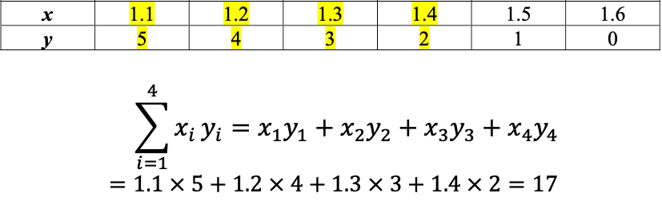
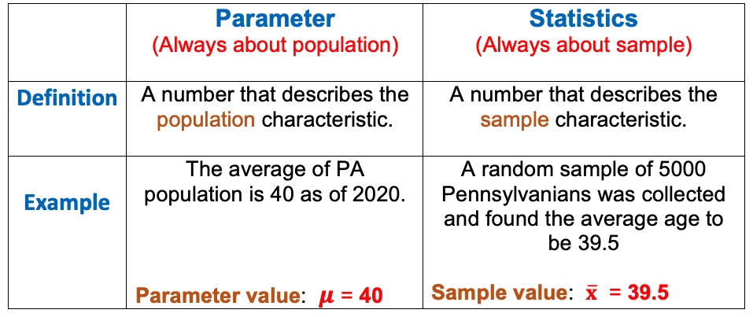
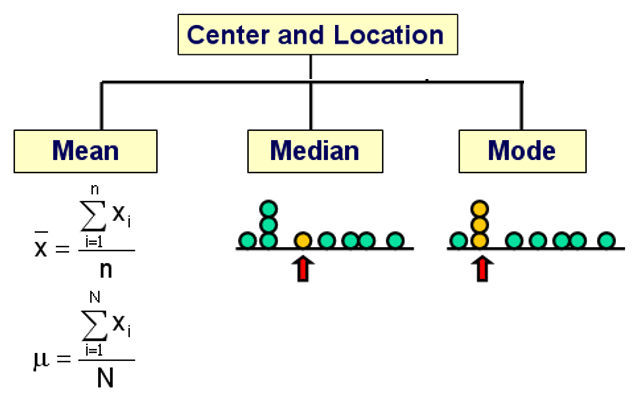
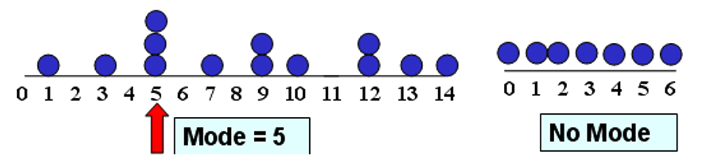
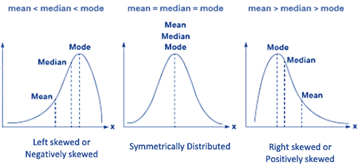
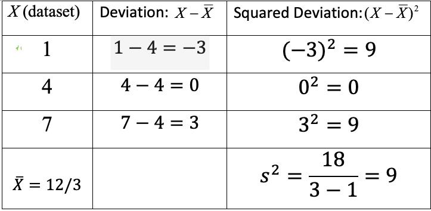
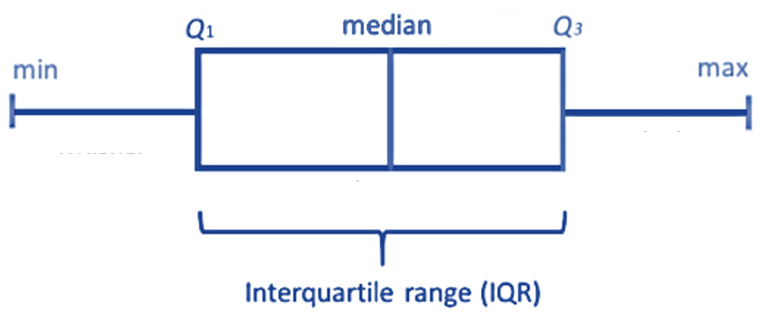
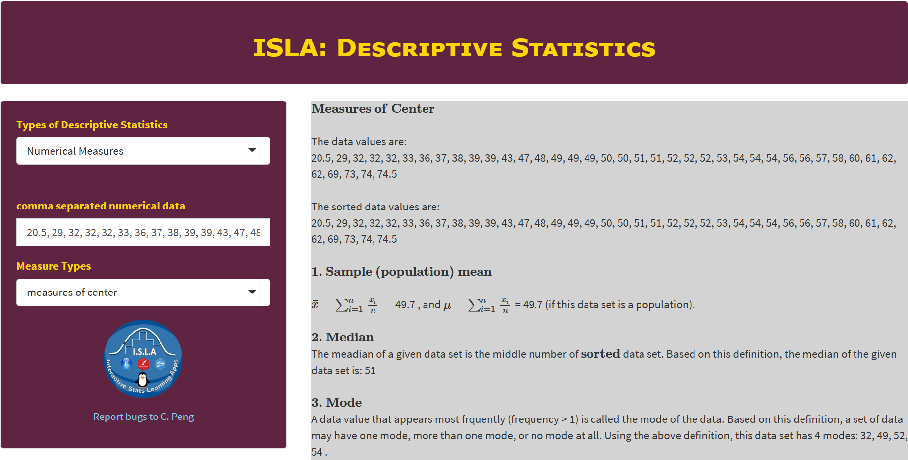

<style type="text/css">

div#TOC li {
    list-style:none;
    background-image:none;
    background-repeat:none;
    background-position:0;
}
h1.title {
  font-size: 24px;
  color: DarkRed;
  text-align: center;
}
h4.author { /* Header 4 - and the author and data headers use this too  */
    font-size: 18px;
  font-family: "Times New Roman", Times, serif;
  color: DarkRed;
  text-align: center;
}
h4.date { /* Header 4 - and the author and data headers use this too  */
  font-size: 18px;
  font-family: "Times New Roman", Times, serif;
  color: DarkBlue;
  text-align: center;
}

h1 { /* Header 3 - and the author and data headers use this too  */
    font-size: 20px;
    font-family: "Times New Roman", Times, serif;
    color: darkred;
    text-align: center;
}
h2 { /* Header 3 - and the author and data headers use this too  */
    font-size: 18px;
    font-family: "Times New Roman", Times, serif;
    color: navy;
    text-align: left;
}

h3 { /* Header 3 - and the author and data headers use this too  */
    font-size: 16px;
    font-family: "Times New Roman", Times, serif;
    color: navy;
    text-align: left;
}

</style>

```{r setup, include=FALSE}
# code chunk specifies whether the R code, warnings, and output 
# will be included in the output files.
if(!require('vembedr')) {
  install.packages('vembedr')
  library('vembedr')
}
if (!require("knitr")) {
   install.packages("knitr")
   library(knitr)
}
# knitr::opts_knit$set(root.dir = "C:/Users/75CPENG/OneDrive - West Chester University of PA/Documents")
# knitr::opts_knit$set(root.dir = "C:\\STA490\\w05")

knitr::opts_chunk$set(echo = FALSE,       
                      warning = FALSE,   
                      result = TRUE,   
                      message = FALSE)
```


# Introduction

This note focuses on using numerical measures to characterize numerical data sets. The numerical measures are used to describe the features such as mean, variance, and percentiles of a given numerical data set. These numeric measures are classified into three categories: central tendency, variation, and locations.

#  Notations Using Greek Letters for Parameters

Every data set has a name. For example, the set of heights of a group of WCU students is a data set that can be named `h` or `height`. We can give each data value has a "generic name" such as $h_1, h_2, \cdots, h_5$, etc. The following figure gives other examples of generic names of values in different data sets. 


```{r fig.align='center', out.width = '60%'}
include_graphics("week02/genericNames.png")
```


## Big Sigma ($\Sigma$) Notation


These "generic names" were used to make compact formulas in some numeric measures. The sum of all data values in the data set with the name <b>x</b> (in the above figure) is given by the following **big sigma** notation.


```{r fig.align='center', out.width = '50%'}
include_graphics("week02/bigSigmaNotation.png")
```
 

**Example 1**: Consider the following two data sets with names **x** and **y**, we want to take the product of the corresponding values and sum up the product of the corresponding values. The following is the **big sigma** notation of the **sum of the cross-product**.

```{r fig.align='center', out.width = '70%'}

```


## Notations for Parameters and Statistics

We use Greek letters to denote the population parameters of populations and English letters to denote statistics from the samples.

```{r fig.align='center', out.width = '70%'}

```

\

# Measures of Center

Three measures are used as the center of a given numeric data set.

```{r fig.align='center', out.width = '60%'}

```


## Mean

The mean of a given data set is defined as the average of all data values. The big sigma notations of sample and population means are given by

```{r fig.align='center', out.width = '50%'}
include_graphics("week02/mean.png")
```

**Remark**: the mean can be affected significantly by outliers (extreme values). For example,


## Median

The middle value of a sorted data set is called the median of the data set. 

* If a data set has an **odd number** of data values, there is a unique "middle" value in the **sorted data** set.

* If a data set has an **even number** of data values, there will be two **middle** values in the **sorted data** set, in this case, the **average** of the two "middle** values is defined to be the median. 


For example, 

*  {2, 6, 7} $\to$ median = 6

*  {1, 2, 6, 7} $\to$  median = (2 + 6) / 2 = 4.


## Mode

The mode(s) is (are) the data value(s) with highest frequency.

*	If there is only one mode, the data set is unimodal.
*	If there are two modes, the data set is bimodal.
* If there are more than two modes, the data is multi-modal.

```{r fig.align='center', out.width = '55%'}

```


## Relationship between Mean, Median, and Mode

The relationship between mean, median, and mode is dependent on the shape of the distribution. The following figure illustrates this relationship.

```{r fig.align='center', out.width = '70%'}

```


# Measures of Variation

Measures of variation are used to characterize the shape of the distribution. There are some different measures used in different situations. We only introduce the variance and the standard deviation in this course. We will also briefly introduce IQR in the applications of numerical measures.

## Variance

Since the definitions of sample and population variances are different, we need to choose an appropriate formula based on whether the data set is a population or a sample. This information is provided to you before you select a formula to calculate the variances. The exact definitions using big sigma notation are given below

* Population Variance

$$
\sigma^2 = \frac{\Sigma_{i=1}^N (x_i-\mu)^2}{N}=\frac{(x_1-\mu)^2 + (x_2-\mu)^2+\cdots+(x_N-\mu)^2}{N}
$$

* Sample Variance


$$
s^2 = \frac{\Sigma_{i=1}^n (x_i-\bar{x})^2}{n-1}=\frac{(x_1-\bar{x})^2 + (x_2-\bar{x})^2+\cdots+(x_n-\bar{x})^2}{n-1}
$$

We can see the only difference is in the denominator of the two definitions.


## Standard Deviation

Once the variance is calculated, we simply take the square root to obtain the standard deviation

* Population standard deviation

$$
\sigma = \sqrt{\frac{\Sigma_{i=1}^N (x_i-\mu)^2}{N}} = \sqrt{\frac{(x_1-\mu)^2 + (x_2-\mu)^2+\cdots+(x_N-\mu)^2}{N}}
$$

* Sample Standard Deviation


$$
s = \sqrt{\frac{\Sigma_{i=1}^n (x_i-\bar{x})^2}{n-1}}=\sqrt{\frac{(x_1-\bar{x})^2 + (x_2-\bar{x})^2+\cdots+(x_n-\bar{x})^2}{n-1}}
$$

## Steps for Calculating Variance

The following are steps for calculating the variance of a data set.

```{r fig.align='center', out.width = '65%'}
include_graphics("week02/calcVariance.png")
```


**Example 2** The following table illustrates how to use the above steps to calculate the variance of a small **sample** toy data set: A = {1,4,7}.   

```{r fig.align='center', out.width = '55%'}

```


Based on the above table, we can see that the standard deviation is $\sqrt{9} = 3$ .


# Measures of Location

Two important types of measures of location will be introduced in this course: z-score and percentiles.

## z-score 

A Z-score of a value of a **sample** data set is a standardized score that is defined by

$$
z = \frac{x - \bar{x}}{s}.
$$

We can easily adjust the above formula for a population as

$$
z = \frac{x - \mu}{\sigma}.
$$
**Example 3**: We still use the same sample toy data, A = {1,4,7}, used in **Example 2** to illustrate how to find z-scores of corresponding data values.  

**Solution: ** We know from **Example 2** that $\bar{x} = 4$ and $s = 3$. Therefore, the z-scores of the corresponding data values are calculated in the following.

$x_1 = 1 \to z_1 = \frac{1 - 4}{3} = -1$

$x_2 = 4 \to z_2 = \frac{4 - 4}{3} = 0$

$x_3 = 7 \to z_3 = \frac{7 - 4}{3} = 1$

That is, the standardized set of z-scores is $\{ -1, 0, 1\}$. Note this is a set of sample z-scores. We can easily verify that the mean and standard deviation of the above three z-scores are 0 and 1 respectively. 


## Percentile

A **percentile** indicates the percentage of scores that fall below a particular value.  

**Example 4** Consider the following PSAT percentile table.

```{r fig.align='center', out.width = '45%'}
include_graphics("week02/percentileChart.png")
```


If you took PSAT and scored 640 in the MATH section, according to the above table, your MATH percentile is 89% meaning that 89% of all examinees scored below 640 in the PSAT. This also means that you did better than 89% of your peers on the PSAT.

**Steps for Calculating Percentiles**

Assume that we have a data set $\{ x_1, x_2, \cdots, x_n \}$. we want to find $k-th$ percentile, denoted by $P_k$.

**Step 1:** Sort the data in ascending order:  $\{ x_{(1)}, x_{(2)}, \cdots, x_{(n)} \}$.

**Step 2:** Calculate the `rough location` of the $k-th$ percentile
$$L = \frac{k}{100}\times n.$$

**Step 3:** The $k^{th}$ percentile is obtained depending on the form of $L$.

* if $L$ is a whole number, then the $k^{th}$ percentile is the average of the number in position $L$ and the number in position $L+1$ in the sorted data set.

* if $L$ is NOT a whole number, round it **up** to the next higher whole number. The $k^{th}$ percentile is the number in the position corresponding to the **rounded-up** value.


**Example 5:** Consider the following data set

```
9, 13, 7, 7, 12, 15, 10, 10, 6, 19, 17, 10, 15, 9, 14, 12, 9, 13, 7, 
7, 4, 8, 19, 5, 18, 20, 14, 1, 23, 10, 10, 7, 22, 9, 1
```

Find $P_{40}$ and $P_{55}$ percentiles respectively.

**Solution** we first sort the data in ascending order.
```
1, 1, 4, 5, 6, 7, 7, 7, 7, 7, 8, 9, 9, 9, 9, 10, 10, 10, 10, 10, 12, 12,
13, 13, 14, 14, 15, 15, 17, 18, 19, 19, 20, 22, 23
```
**To find 40th percentile**, 

$$
L = \frac{40}{100}\times 35 = 14.
$$
Since $L = 14$ is an integer, the 20th percentile is the average of 14th and 15th data values in the sorted data set. That is, (9 + 9)/2 = 9.

**To find 55th percentile**, 

$$
L = \frac{55}{100}\times 35 = 19.25.
$$

Since $L=19.25$ is NOT an integer, we round up L to get **20**. The 55th percentile is the 20th data value in the sorted data set which is 10.


## Applications of Numeric Measures

Three concepts based on the numeric measures will be introduced in the following.


### Five Number Summary 

The five number summary consists of the minimum, 25th, 50th, 75th percentiles, and the maximum. The 25th, 50th, and 75th percentiles are also called the first ($Q_1$), second ($Q_2$) and third quartiles ($Q_3$), respectively.

**Example 6: **  We use the **length of CD** data to show the five-number-summary. The unit of data values is minute. The following is the sorted data.
```
20.5, 29, 32, 32, 32, 33, 36, 37, 38, 39, 39, 43, 47, 48, 49, 49, 49, 
50, 50, 51, 51, 52, 52, 52, 53, 54, 54, 54, 56, 56, 57, 58, 60, 61, 62, 
62, 69, 73, 74, 74.5 
```
**Solution**, The minimum and maximum are 20.5 and 74.5 minutes. The quartiles are calculated in the following.

$Q_1:  L = (25/100) \times 40 = 10$, $Q_1$ is the average of the 10th and 11th data values $= (39+39)/2 = 39$.

$Q_2:  L = (50/100) \times 40 = 20$, $Q_1$ is the average of the 20th and 21st data values $= (51 + 51)/2 = 51$.

$Q_3:  L = (75/100) \times 40 = 30$, $Q_1$ is the average of the 30th and 31st data values $= (56+57)/2 = 56.5$.

Therefore, the five-number-summary is given by

```
     Min      Q1       Q2        Q3        Max
    20.5      39       51       56.5       74.5
```

### Box-plot 

The box-plot is a geometric representation of the five-number-summary given in the following figure

```{r fig.align='center', out.width = '60%'}
include_graphics("week02/boxPlot.png")
```


Box-plots are used to describe the distribution of data. The following three box-plots represent three different types of distributions:

```{r fig.align='center', out.width = '60%'}
include_graphics("week02/interpretationBoxPlot.png")
```

**Example 7:  (Length of CS Continued)**  The box-plot is given by

```{r fig.align='center', out.width = '70%'}
include_graphics("week02/boxPlotExample.png")
```


### Inter-quartile Range (IQR) 

The inter-quartile range of data is defined by $IQR = Q3 - Q1$. IQR is used to measure the variation of the data set. It is NOT sensitive to extremely large and small values since IQR is defined only based on the "middle 50% of data values".

```{r fig.align='center', out.width = '55%'}

```

\

# Use of Technology

We still use the same app that we used in the previous note to find various numerical measures to summarize a given data set. The app can be found at <https://wcupeng.shinyapps.io/DescriptiveStats/>. The next screenshot illustrates the measures of variations in the length of CD data. You can choose to find other numerical measures of the data.

```{r fig.align='center', out.width = '95%'}

```


## Example: Descriptive Statical Analysis of Course Grade

The following are grades of a weekly assignment:

```{}
4.98,  5.98,  6.48,  7.00,  7.49,  7.49,  7.98,  7.98,  7.99,  7.99,  8.00,
8.00,  8.00,  8.02,  8.02,  8.49,  8.49,  8.50,  8.50,  8.50,  8.50,  8.50,
8.50,  8.50,  8.51,  8.51,  8.51,  8.98,  8.99,  8.99,  8.99,  8.99,  9.00,
9.00,  9.00,  9.00,  9.00,  9.01,  9.01,  9.01,  9.01,  9.01,  9.01,  9.01,
9.02,  9.02,  9.02,  9.48,  9.51,  9.98,  9.98,  9.99,  9.99, 10.00, 10.00,
10.00, 10.00
```

The questions we may be interested in are:

1. What is the grade distribution (i.e., frequency or histograms).

2. we also may want to know the class average, median, variance and standard deviation, etc.

3. We may also want to see the 5-number summary and box-plot

4. If my score is 8.65, I want to know my ranking (i.e., my grade is higher than what percentage of all class grades)

5. We can also standardize the grades by z-score transformation and find inter-quartile range (IQR).


The follow video demonstrate how to use the app to answer the above questions.


\

<center><a href="https://mat121.s3.amazonaws.com/w02-LearningStrategies.mp4"></a>


\

## Exercises

The following two exercises are taken from the previous note. Please answer the following two questions manually before using ISLA app to check your answer.

1. Construct a histogram with 5 classes.

2. Find the five numer summary and the corresponding box-plot.


**Problem 1**. Following are 80 measurements of the iron-solution index of tin-plate specimens, designed to measure the corrosion resistance of tin-plated steel. The original data set has been sorted in an ascending order as: 

```
14,  26,  28,  28,  28,  28,  30,  32,  34,  35,  36,  36,  37,  37,  40, 40,  40,  41,  41,  41,  42,  42,  42,  43,  43,  43,  44,  44,  44,  44,  45, 45,  45,  45,  45,  45,  46,  46,  46,  46,  47,  47,  47,  48,  49,  49,  49, 50,  50,  50,  51,  52,  52,  52,  52,  52,  53,  53,  54,  54,  54,  54,  55, 55,  55,  55,  55,  55,  55,  56,  56,  56,  56,  56,  56,  57,  57,  57,  57, 57,  58,  58,  58,  58,  58,  59,  59,  60,  60,  60,  60,  61,  61,  61,  61, 61,  62,  62,  62,  62,  62,  62,  63,  63,  63,  63,  63,  63,  64,  65,  66, 66,  67,  68,  68,  69,  69,  70,  70,  70,  70,  70,  70,  71,  71,  72,  72, 72,  73,  74,  74,  74,  76,  76,  77,  77,  79,  80,  81,  81,  83,  83,  84, 86,  86,  86,  87,  89,  92,  95
```

**Problem 2**.  From the 140 children whose urinary concentration of lead were investigated 40 were chosen who were aged at least 1 year but under 5 years. The following concentrations of copper were found.
```
0.70, 0.45, 0.72, 0.30, 1.16, 0.69, 0.83, 0.74, 1.24, 0.77, 0.65, 0.76, 0.42, 0.94, 
0.36, 0.98, 0.64, 0.90, 0.63, 0.55, 0.78, 0.10, 0.52, 0.42, 0.58, 0.62, 1.12, 0.86, 
0.74, 1.04, 0.65, 0.66, 0.81, 0.48, 0.85, 0.75, 0.73, 0.50, 0.34, 0.88
```
