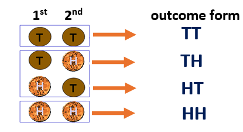
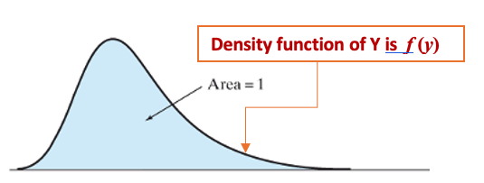
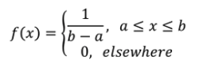
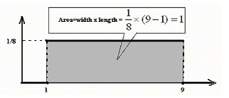

<style type="text/css">

div#TOC li {
    list-style:none;
    background-image:none;
    background-repeat:none;
    background-position:0;
}
h1.title {
  font-size: 24px;
  color: DarkRed;
  text-align: center;
}
h4.author { /* Header 4 - and the author and data headers use this too  */
    font-size: 18px;
  font-family: "Times New Roman", Times, serif;
  color: DarkRed;
  text-align: center;
}
h4.date { /* Header 4 - and the author and data headers use this too  */
  font-size: 18px;
  font-family: "Times New Roman", Times, serif;
  color: DarkBlue;
  text-align: center;
}

h1 { /* Header 3 - and the author and data headers use this too  */
    font-size: 20px;
    font-family: "Times New Roman", Times, serif;
    color: darkred;
    text-align: center;
}
h2 { /* Header 3 - and the author and data headers use this too  */
    font-size: 18px;
    font-family: "Times New Roman", Times, serif;
    color: navy;
    text-align: left;
}

h3 { /* Header 3 - and the author and data headers use this too  */
    font-size: 16px;
    font-family: "Times New Roman", Times, serif;
    color: navy;
    text-align: left;
}

</style>

```{r setup, include=FALSE}
# code chunk specifies whether the R code, warnings, and output 
# will be included in the output files.
if(!require('vembedr')) {
  install.packages('vembedr')
  library('vembedr')
}
if (!require("knitr")) {
   install.packages("knitr")
   library(knitr)
}
# knitr::opts_knit$set(root.dir = "C:/Users/75CPENG/OneDrive - West Chester University of PA/Documents")
# knitr::opts_knit$set(root.dir = "C:\\STA490\\w05")

knitr::opts_chunk$set(echo = FALSE,       
                      warning = FALSE,   
                      result = TRUE,   
                      message = FALSE)
```

\


\

>  **Q**:  Why do we need to study probability?<BR>
   **A**:  We can build a bridge between a sample and its population so that one can make inferences about the population from its samples.


# Introduction

In this note, we introduce the definitions of probability, random variables, and problems associated with a distribution based on a special distribution: uniform distribution.

# Definitions of Probability

We need to use the following concepts to define or approximate the probability of an event.

## Experiment and Event


**An experiment** is any process that generates well-defined outcomes. On any single repetition of an experiment, one and only one of the possible experimental outcomes will occur.


<font color = "darkred"><b>Example 1.</b></font> The following table gives several examples of experiments.

```{r fig.align='center', out.width = '55%'}
include_graphics("week03/experiments.png")
```


**The Sample Space** of an experiment is the set of all possible outcomes. We usually use a capital letter in Greek or English to denote the sample space. For example, $\Omega$, $S$, or $U$.

<font color = "darkred"><b>Example 2.</b></font> Consider the experiment of tossing a balanced coin sequentially for 2 times.  We use H to denote the heads and T to denote the tails. 

```{r fig.align='center', out.width = '40%'}

```


Therefore, the sample space of this experiment is $\Omega = \{ TT, TH, HT, HH \}$.


**An Event** is a subset of outcomes from the sample space. We usually use a capital letter to denote an event.

<font color = "darkred"><b>Example 3.</b></font> We define Event E to be at least one H is observed in the coin tossing example.  

**Solution: ** The outcomes in the subset $\{HT, TH, HH\}$ satisfy the requirement in the definition. Therefore, event E is defined by $E = \{ HT, TH, HH\}$.


# Definition of Probabilities
         
**Notations: **   We use $P$ or $Pr$ to denote the probability and  $A, B, C, \cdot,$ to denote specific events. $P(A)$ is the probability that event A occurs.


## Definitions of Probability

* **Method 1:** Relative Frequency Approximation of Probability.

Conduct or observe an experiment a large number of times and count the number of times that event A occurs. Based on these actual results, P(A) is estimated as follows:
```
            P(A)= (# of times of A being observed) / (# of repeated trials)
```


* **Method 2:** Classical Approach to Probability (Requires Equally Likely Outcomes of the experiment)
```
              P(A) = (# of outcomes in A) / (# of outcome in S) 
```

## Some Examples

<font color = "darkred"><b>Example 4.</b></font> **Guessing Answers on an ACT:** A typical multiple-choice question has 5 possible answers. If you make a random guess on one question, what is the probability that your response is wrong?

**Solution**:  Method 2 classical approach applies to this question since each of the choices is random, that is, each of the 5 letters A, B, C, D, and E are equally likely to be selected as the correct answer.
```
                Pr(wrong answer) = 4 / 5 =0.8
```
\

<font color = "darkred"><b>Example 5.</b></font> **Gender of Children**: Find the probability that a randomly selected couple with 3 children will have exactly 2 boys. Assume that boys and girls are equally likely, and the gender of any child is not influenced by the gender of any other child.

**Solution** Based on the given condition, this is an equally likely experiment. We first use a table to list all possible outcomes in the sample space. Let B = boy and G = girl. Then the following table lists all possible outcomes of this experiment.


```{r fig.align='center', out.width = '40%'}

```


We list the sample space as follows
```
                S = { BBB   BBG   BGB   GBB   GGB   GBG   BGG   GGG }
                E =  having exactly 2 boys = { BBG   BGB   GBB }. 
``` 
The desired probability can be calculated as 
```
                     Pr(E)= #E/#S  = 3 / 8 =0.375.
```


##	Discrete Probabilities on Contingency Tables

Contingency tables classify outcomes in rows and columns. Table cells at the intersections of rows and columns indicate frequencies of both events coinciding.

<font color = "darkred"><b>Example 6.</b></font> The following table displays events for computer sales at a fictional store. 

```{r fig.align='center', out.width = '50%'}
include_graphics("week03/contingencyTable.png")
```


Specifically, it describes the frequencies of sales by the customer’s gender and the type of computer purchased. The cells’ counts represent the number of PCs and Macs purchased by both genders. 

Finding the following probabilities:

(1). Randomly select a female customer, what is the probability that she bought a Mac computer?

(2). Randomly select a customer from those who bought a computer from the store, what is the probability that the customer is a male?

(3).  Randomly select a customer who bought a computer from the store, what is the probability she/he bought a Windows computer?

(4). Randomly select a customer who bought a computer from the store, what is the probability that the customer is female and bought a Mac computer?

**Solution**  (1). $P$(Mac among female) $= 87/117 = 0.744$

(2). $P$(male among customers who bought a computer) $= 106/223 = 0.4753$

(3). $P$(windows among all computers sold) $= 96/223 = 0.4305$

(4). $P$(female & bought a mac computer) $= 87/223 = 0.3901$


# Concepts of Random Variables

**Random Variable (informal description)**:  A random variable is a numerical description of the outcome of an experiment, its value depends on chance. 

<font color = "darkred"><b>Example 7.</b></font> Let Y be a variable denoting the height of WCU students. Before you measure the height of a selected student, Y is unknown. Furthermore, the unknown value is dependent on the chance since selecting a student involves uncertainty! This type of variable is a random variable.


**Characterization of Random Variables**: We study the behavior of a random variable through its probability distribution function.


**Use of Random Variables**: We use random variables to characterize the random behavior of real-world problems to inform statistical decisions using probability distributions.


**Classification of Random Variables**

```{r fig.align='center', out.width = '50%'}

```


## Discrete Random Variable

**Discrete Random Variable:**  A discrete random variable may assume either a finite number of values or an infinite sequence of values such as 1, 2, …, etc.  

<font color = "darkred"><b>Example 8.</b></font> The following table gives several example of discrete random variables.

```{r fig.align='center', out.width = '60%'}
include_graphics("week03/discreteRV.png")
```


We use the probability distribution to characterize a random variable.  For convenience, we use a capital letter (such as $X$) to denote the name of the random variable and a lower-case letter ($x$) to denote the value of the random variable, 

**The probability distribution** of a discrete random variable is a graph, table, or formula that gives the probability for each value of the random variable. For a probability distribution, the following requirements MUST be satisfied.

1.	$\sum P(x) = 1$, where $x$ assumes all possible values of random variable $X$.

2.	$0 \le P(x) \le 1$, for every value of $x$.

**Defining Events Based on Values of A Random Variable**

An event defined based on a discrete random variable is a subset of the collection of all possible values of the discrete random variable! 

\

<font color = "darkred"><b>Example 9.</b></font>. Let's consider the experiment of tossing a balanced coin two times. The sample space $\Omega = \{ TT, TH, HT, HH \}$. We can define a random variable $X=$ number of **heads** observed in an experiment. 


As an illustration, we define several events based on the above random variable based on various values in the following.
```
      E1 = {X = 1} = (TH, HT) ,  then   P(E1) = 2/4 = 0.5
      E2= {X>0} ={TH, HT, HH},   then  P(E2) = 3/4
      E3 = {X !=1} = {HH, TT},   then    P(E3) = 2/4 = 0.5
```

The complete probability distribution is outlined in the following figure.

```{r fig.align='center', out.width = '50%'}
include_graphics("week03/coinTossingRV.png")
```


The top-right table is the probability distribution table, and the bottom right is the probability distribution table (geometric representation of the probability distribution table).


<font color = "darkred"><b>Example 10.</b></font>.  **Gender of Children**  If a couple plans to have 3 children. Let $X =$ the number of sons they may have. What is the probability distribution of $X$?

**Solution:** The possible values of the R.V. X are 0, 1, 2, and 3 which correspond to the four events. Using the definition of class probability, we have Pr(X =0 ) = 1/8, Pr(X = 1) = 3/8, Pr(X = 2) = 3/8 and Pr(X = 3) = 1/8. So, we have the following probability distribution table.


```{r fig.align='center', out.width = '30%'}

```


The probability distribution histogram is given by

```{r fig.align='center', out.width = '40%'}
include_graphics("week03/probHist3Kid.png")
```


\

## Continuous Random Variable and Density Functions

A continuous random variable takes on uncountably infinite values. For example, body temperatures, height, weight, etc.

As opposed to the discrete variables that could be characterized by a probability table or a probability function, for a continuous random variable, we use the probability density function to characterize the distribution.

The probability density function of $Y$, denoted by $f(y)$, MUST satisfy the following two conditions that are analogous to the two requirements in the probability distribution function: 

(1)	a non-negative real-valued function is defined on all the real numbers, and such that 

(2) the area between the curve and the horizontal axis is equal to 1. 

```{r fig.align='center', out.width = '50%'}

```


\

**Definition of Events Using Continuous Variables**


An event defined based on a continuous random variable is one or more intervals of values of the continuous random variable. The probability of the event is equal to the area between the density curve and the interval(s).

The following figure illustrates the definition of an event and its corresponding probability.


```{r fig.align='center', out.width = '50%'}

```


Since the `area` of a line segment is zero, <font color = "darkred"><b>the probability that a continuous random variable exactly equals any value is always zero</b></font>.


# Uniform Random Variable - A Special Continuous Distribution

A uniform distribution, also called a rectangular distribution, is a probability distribution that has constant probability. The general formula for the probability density function (pdf) for the uniform distribution is

```{r fig.align='center', out.width = '30%'}

```

The density curve is given by

```{r fig.align='center', out.width = '55%'}

```


<font color = "darkred"><b>Example 11.</b></font>. Consider the following function defined on interval [1,9].

```{r fig.align='center', out.width = '30%'}
include_graphics("week03/uniformExample01.png")
```

<center></center><br>

Is $f(x)$ a valid density function of the uniform distribution?

**Solution**: We only need to check whether the two requirements of continuous density functions are satisfied.

1. $f(x) \ge 0$ for all $x$;

2. The area between the density curve and the horizontal axis is equal to 1, This is obvious from the following density curve.

<center></center><br>

Therefore, 
<center></center><br>
is a valid density function.


 <font color = "darkred"><b>Example 11.</b></font>. A shuttle train at a busy airport completes a circuit between two terminals every five minutes. Answer the following questions with the assumption that passengers arrive at a stop at any time in a 5-minute time window (we could assume a uniform arrival time).   

1)	 What is the probability that a passenger will wait for less than three minutes for the train?

2)	 What is the probability that a passenger will wait for exactly three minutes for the train?

3)	 What is the probability that a passenger will wait for more than three minutes for a train?
 
**Solution:** The brief answers to these questions are given below.

1).

```{r fig.align='center', out.width = '50%'}

```


2).
```{r fig.align='center', out.width = '50%'}
include_graphics("week03/uniformExample02-2.png")
```


3).
```{r fig.align='center', out.width = '50%'}
include_graphics("week03/uniformExample02-3.png")
```


 

 
 


