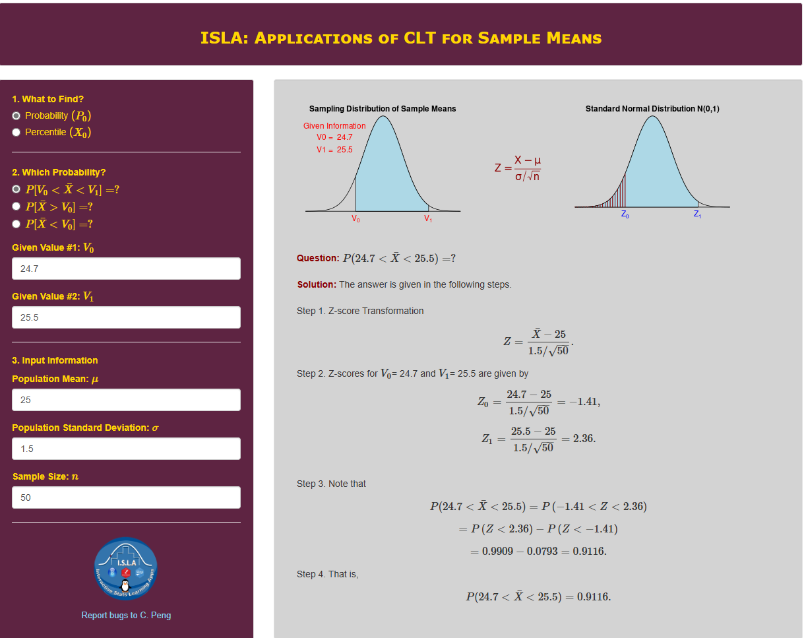
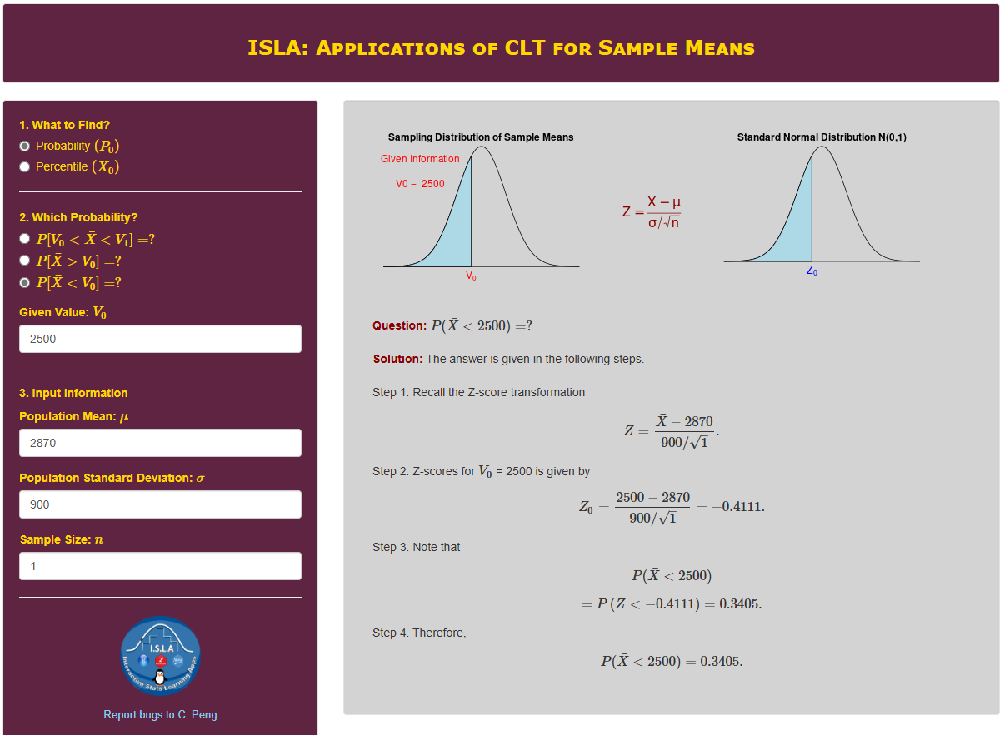
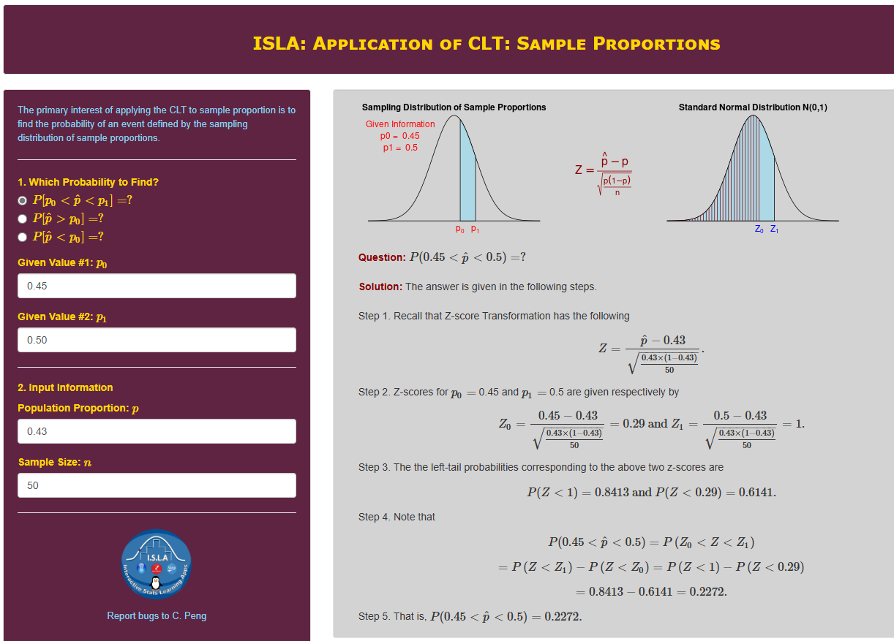
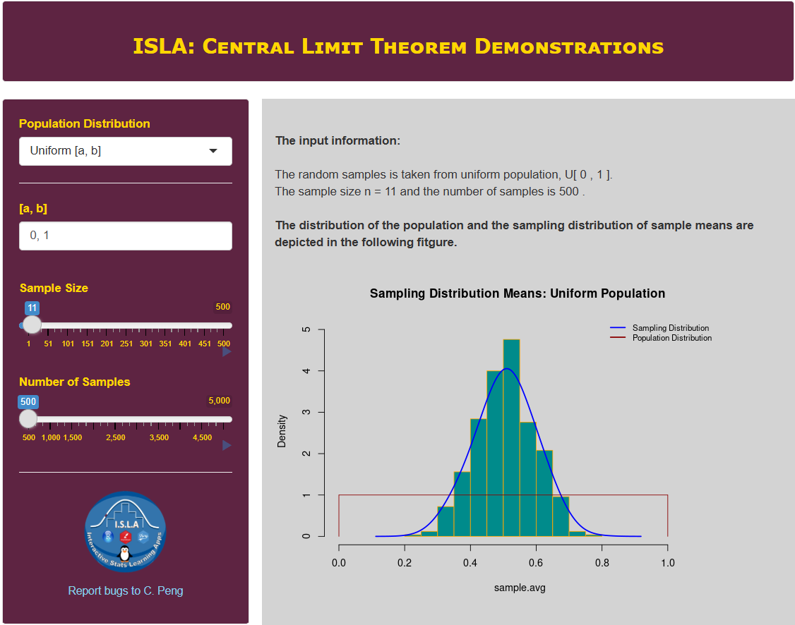
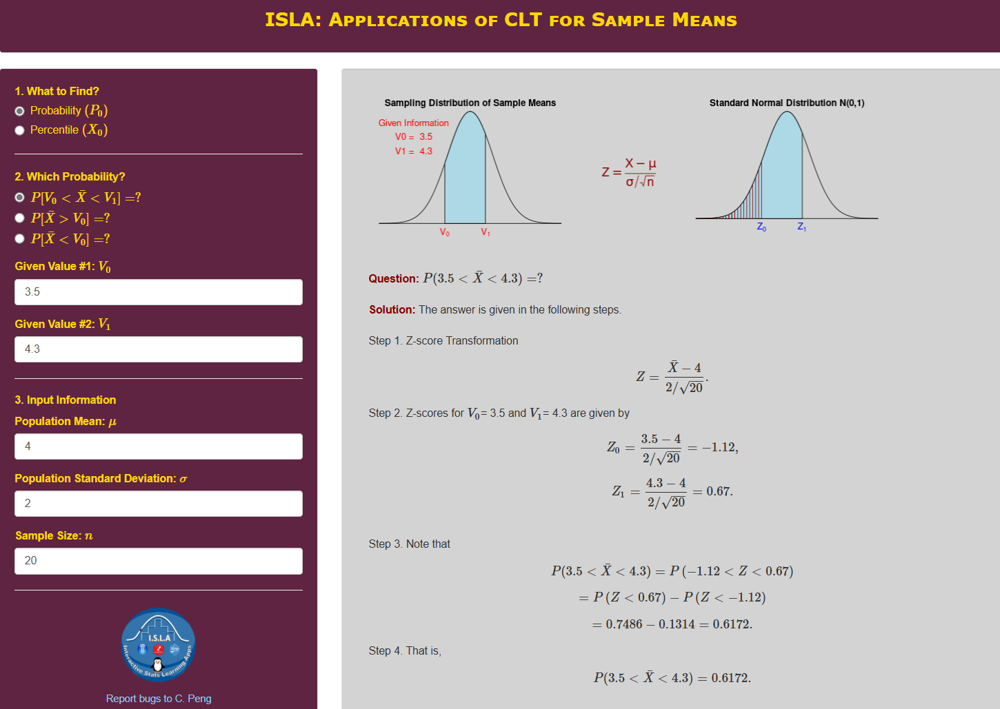
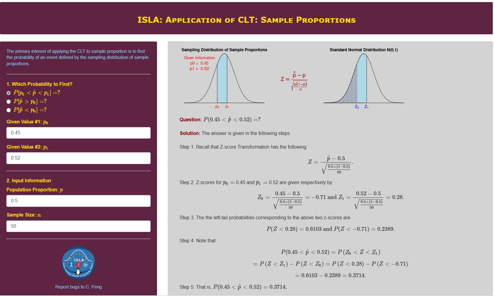

<style type="text/css">

div#TOC li {
    list-style:none;
    background-image:none;
    background-repeat:none;
    background-position:0;
}
h1.title {
  font-size: 24px;
  color: DarkRed;
  text-align: center;
}
h4.author { /* Header 4 - and the author and data headers use this too  */
    font-size: 18px;
  font-family: "Times New Roman", Times, serif;
  color: DarkRed;
  text-align: center;
}
h4.date { /* Header 4 - and the author and data headers use this too  */
  font-size: 18px;
  font-family: "Times New Roman", Times, serif;
  color: DarkBlue;
  text-align: center;
}

h1 { /* Header 3 - and the author and data headers use this too  */
    font-size: 20px;
    font-family: "Times New Roman", Times, serif;
    color: darkred;
    text-align: center;
}
h2 { /* Header 3 - and the author and data headers use this too  */
    font-size: 18px;
    font-family: "Times New Roman", Times, serif;
    color: navy;
    text-align: left;
}

h3 { /* Header 3 - and the author and data headers use this too  */
    font-size: 16px;
    font-family: "Times New Roman", Times, serif;
    color: navy;
    text-align: left;
}

</style>

```{r setup, include=FALSE}
# code chunk specifies whether the R code, warnings, and output 
# will be included in the output files.
if(!require('vembedr')) {
  install.packages('vembedr')
  library('vembedr')
}
if (!require("knitr")) {
   install.packages("knitr")
   library(knitr)
}
# knitr::opts_knit$set(root.dir = "C:/Users/75CPENG/OneDrive - West Chester University of PA/Documents")
# knitr::opts_knit$set(root.dir = "C:\\STA490\\w05")

knitr::opts_chunk$set(echo = FALSE,       
                      warning = FALSE,   
                      result = TRUE,   
                      message = FALSE)
```


\
\

# Introduction

We have discussed both standard normal and general normal distributions as well as associated two types of questions. In this course, we primarily focus on the inference about the population mean means and proportions from random samples. We will use the sample mean and sample proportion (`both are statistics`) to approximate the population mean and proportion (`both are parameters`).

Since both sample mean and proportions are statistics, they are random. We need to discuss the distributions of sample means and sample proportions. 

**Some Terminologies**: We have learned concepts of the population (parameters) and sample (statistics) as well as probability distributions of random variables.  

* **Random Sample** is a subset of values that represents the population of interest. 

* **Sampling Distribution** - the distributions of sample statistics are called sampling distributions.

* **Sampling Distribution of Sample Means** – A theoretical probability distribution of sample means that would be obtained by drawing from the population all possible samples of the same size. 

* **The Standard Error Sample Mean** – The standard deviation of the sampling distribution of the mean.  It describes how much dispersion there is in the sampling distribution of the mean


# Central Limit Theorem (CLT)

> **Central Limit Theorem**: If all possible random samples of size n are drawn from a population with a mean $\mu$ and standard deviation $\sigma$, then as n increases, the sampling distribution of sample means approaches a normal distribution with mean $\mu$ and standard deviation $\sigma/\sqrt{n}$.

**Remarks** 

1. The population distribution is NOT specified in CLT. This implies that the CLT could be used for any population (continuous or discrete).

2. The sample size should be large to guarantee a good approximation of the sample mean to a normal distribution. **How large is large?**  `By convention, in this course, if n > 30, the sample is called "large"`. 

3. The distribution of the sample is **approximately normally distributed**. The mean of the sample means ($\bar{X}$) is equal to the population mean ($\mu$) and the standard deviation of the sample mean is equal to $\sigma/\sqrt{n}$.

In summary, let $\{X_1, X_2, \cdots, X_n \}$ be a sample taken from a population $(\mu, \sigma)$, by convention, if $n > 30$, 

$$
\bar{X} \to N \big(\mu, \frac{\sigma}{\sqrt{n}} \big)
$$
or equivalently,
$$
\frac{\bar{X}-\mu}{\sigma/\sqrt{n}} \to N(0, 1)
$$

The following figure shows how the sample size impacts the variance of the sample mean.

```{r fig.align='center', out.width = '60%'}

```

\

**An Important Fact**

*If the population is normal, then* 
$$
\bar{X} \to N \big(\mu, \frac{\sigma}{\sqrt{n}} \big)
$$
*regardless of the sample size*.


\


<font color = "darkred"><b>Example 1.</b></font> The length of time people spend driving each day is different in different age groups. A previous study shows that drivers aged 15 to 19 drive on average $\mu =$ 25 minutes a day and standard deviation $\sigma =$ 1.5 minutes. A random sample of 50 drivers was selected What is the probability that the average time they spend driving each day is between 24.7 and 25.5 minutes?

**Solution:** Since $n = 50 > 30$, from the Central Limit Theorem, the sampling distribution of sample means is approximately normal with $(\mu, \sigma/\sqrt{n}) = (25, 0.21)$. 

```{r fig.align='center', out.width = '100%'}

```

**Conclusion**: The probability that the average time they spend driving each day is between 24.7 and 25.5 minutes is approximately 0.9116.
\


<font color = "darkred"><b>Example 2.</b></font> A bank auditor claims that **credit card balances are normally distributed**, with a mean of \$2870 and a standard deviation of \$900.

1. What is the probability that a randomly selected credit card holder has a credit card balance of less than \$2500? 

**Solution**: Since the card balances are normally distributed, we convert the general normal distribution to the standard normal distribution to find the probability (see the following figure) 

```{r fig.align='center', out.width = '100%'}

```


Therefore, there is a 34% chance that an individual will have a balance of less than $2500.

\

2. You randomly select 25 credit cardholders. What is the probability that their mean credit card balance is less than \$2500?

**Solution**: Because the population is normal, we use the important fact that the sample mean $\bar{X}$ is normally distributed. 

```{r fig.align='center', out.width = '100%'}
include_graphics("week05/example02-2.png")
```

Therefore, there is only a 2% chance that the mean of a sample of 25 will have a balance of less than $2500 (an unusual event). 


3. Is it possible that the auditor’s claim that the mean is exactly \$2870 is incorrect?

**Solution**

It is impossible since the probability of observing a single value from the population is always zero. 

\


# Sampling Distribution of Sample Proportion $\hat{p}$

As an application of the central limit theorem, we now discuss the sampling distribution of sample proportion ($\hat{p}$).

* In real-world problems, the responses of interest produce counts rather than measurements – gender (male, female), political preference (republican, democrat), and approval of the new proposal (yes, no).

*	Our data will consist of counts or proportions based on the counts. 

*	We want to learn about population proportions based on the information provided from sample proportions.


**A binary population**: contains only two possible distinct values, say "success" and "failure".

**Count**: X = the number of successes in a sample of size n

**Proportion**: $\hat{p} =$ the proportion of successes in a sample of size n


**Sampling Distribution Of A Proportion**: if $np > 5$ and $n(1-p) > 5$, then
$$
\hat{p} \to N\Big( p, \sqrt{\frac{p(1-p)}{n}}\Big)
$$
or equivalently

$$
\frac{\hat{p}-p}{\sqrt{\frac{p(1-p)}{n}}} \to N(0, 1)
$$
**A cautionary note about proportion**: *Whenever working with proportion, we MUST use proportion in the form of decimal in all calculations.*


\


<font color = "darkred"><b>Example 3.</b></font> Suppose it is known that 43% of Americans own an iPhone. If a random sample of 50 Americans were surveyed, what is the probability that the proportion of the sample who owned an iPhone is between 45% and 50%?

**Solution**: We are given that $n = 50$ and $p = 0.43$. Because $np = 50\times 0.43 = 21.5 > 5$ and $n(1-p) = 50 \times (1-0.43) = 28.5 > 5$, we use the above sampling distribution. The following figure gives the steps for finding the probability.

```{r fig.align='center', out.width = '100%'}

```

Therefore, the probability that the proportion of the sample who owned an iPhone is between 45% and 50% is about $0.227 = 22.7\%$.

\

# Use of Technology

Three **IntroStatsApps** were created to illustrate the central limit theorem (CLT) and its applications. The solutions of the above examples were produced using ** IntroStatsApps**.

## CLT Demo

**IntroStatsApps-Central Limit Theorem Demo** illustrates the CLT with various populations including the normal population. You can click the link (https://wcupeng.shinyapps.io/CLTdemo/) to explore the CLT under different populations. See the following screenshot of the demo.

```{r fig.align='center', out.width = '100%'}

```

The following short video explains how to use this demo appdata:image/png;base64,iVBORw0KGgoAAAANSUhEUgAAABIAAAASCAYAAABWzo5XAAAAWElEQVR42mNgGPTAxsZmJsVqQApgmGw1yApwKcQiT7phRBuCzzCSDSHGMKINIeDNmWQlA2IigKJwIssQkHdINgxfmBBtGDEBS3KCxBc7pMQgMYE5c/AXPwAwSX4lV3pTWwAAAABJRU5ErkJggg==

<center><a href="https://mat121.s3.amazonaws.com/CLT-Demo.mp4"></a>


## CLT for Mean and Proportion.

When the sampling distribution is normal (the cases of CLT or normal population), we can use this application to answer questions of probability and percentile. The link to this application is at: https://wcupeng.shinyapps.io/AppsCLT4Means/.

```{r fig.align='center', out.width = '100%'}

```

For the sampling distribution of sample proportion, we use the following application to answer the questions about probability and percentile. The link to the applications is at: https://wcupeng.shinyapps.io/AppsCLT4Prop/.

```{r fig.align='center', out.width = '100%'}

```

The video demonstrated how to use the apps to solve the problems related to sampling distribution of sample means ($\bar{x}$) and sample proportions $\hat{p}$. 

<center><a href="https://mat121.s3.amazonaws.com/SamplingDistribution.mp4"></a>


\

# Practice Exercises


1.	The U.S. National Center for Health Statistics publishes information on the length of stay by patients in short-stay hospitals in Vital and Health Statistics. According to that publication, the mean stay of female patients in short-stay hospitals is 5.8 days and the standard deviation is 4.3 days. Let $\bar{x}$ denote the mean length of stay for a sample of discharged female patients.

  A). For a sample size of 81, find the mean and standard deviation of the sample mean. Interpret your results in words.

  B). Repeat part A) with n = 144. Find the percentage that the mean stay of those 144 female patients in short-stay hospitals is less than 5 days.

\

2.	According to the U.S. Census Bureau publication Current Construction Reports, the mean price of new mobile homes is \$43,800. The standard deviation of the prices is \$7200. Let $\bar{x}$ denote the mean price of a sample of new mobile homes.

  A). For a sample of 49 randomly selected mobile homes, find the mean and standard deviation of the sample mean.

  B). Repeat part A) with n =100. Compare the results you obtained in A).

  C ). For a sample of 64 randomly selected mobile homes, find the probability that the mean is greater than \$45,000.

  D). For a sample of 64 randomly selected mobile homes, find the probability that the mean is exactly \$45,000. 

\

3. 	Suppose that the ages $X$ of a certain population are normally distributed, with mean $\mu = 27.0$ years, and standard deviation $\sigma = 12.0$ years, i.e., $X \to N(27,12)$.  

Find the probability that the mean age of a single sample of $n = 16$ randomly selected individuals is less than 30 years.


\


4. Fifty-one percent of adults in the U.S. whose New Year resolved to exercise more achieved their resolution. You randomly select 65 adults in the U.S. whose resolution was to exercise more and ask each if he or she achieved that resolution. What is the probability that the sample proportion is greater than 50%?


