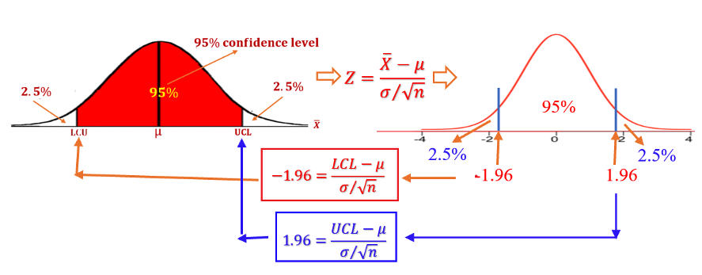
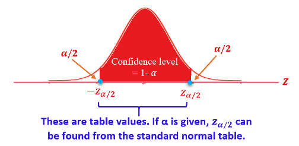

<style type="text/css">

div#TOC li {
    list-style:none;
    background-image:none;
    background-repeat:none;
    background-position:0;
}
h1.title {
  font-size: 24px;
  color: DarkRed;
  text-align: center;
}
h4.author { /* Header 4 - and the author and data headers use this too  */
    font-size: 18px;
  font-family: "Times New Roman", Times, serif;
  color: DarkRed;
  text-align: center;
}
h4.date { /* Header 4 - and the author and data headers use this too  */
  font-size: 18px;
  font-family: "Times New Roman", Times, serif;
  color: DarkBlue;
  text-align: center;
}

h1 { /* Header 3 - and the author and data headers use this too  */
    font-size: 20px;
    font-family: "Times New Roman", Times, serif;
    color: darkred;
    text-align: center;
}
h2 { /* Header 3 - and the author and data headers use this too  */
    font-size: 18px;
    font-family: "Times New Roman", Times, serif;
    color: navy;
    text-align: left;
}

h3 { /* Header 3 - and the author and data headers use this too  */
    font-size: 16px;
    font-family: "Times New Roman", Times, serif;
    color: navy;
    text-align: left;
}

</style>

```{r setup, include=FALSE}
# code chunk specifies whether the R code, warnings, and output 
# will be included in the output files.
if(!require('vembedr')) {
  install.packages('vembedr')
  library('vembedr')
}
if (!require("knitr")) {
   install.packages("knitr")
   library(knitr)
}
# knitr::opts_knit$set(root.dir = "C:/Users/75CPENG/OneDrive - West Chester University of PA/Documents")
# knitr::opts_knit$set(root.dir = "C:\\STA490\\w05")

knitr::opts_chunk$set(echo = FALSE,       
                      warning = FALSE,   
                      result = FALSE,   
                      message = FALSE)
```


\

# Introduction

We will discuss the general framework of confidence intervals of population means and proportions. In the next few sections, we learn how to **estimate the population parameters** such as mean, standard deviation, and proportion from a random sample and build a confidence interval (also called interval estimate) to show how good the estimate is, and finally, we should be able to interpret the estimate.


# A General Framework 

This section dedicates the basic framework to estimating population means using confidence intervals.

## Some Technical Terms

The following is a list of several basic terms to use when discussing the estimate of population parameters.

* An **estimate** is *a specific value* or *range of values* obtained from a random sample that is used to approximate a population parameter. 

*	A **point estimate** is a single value (obtained from the random sample) that is used to approximate a population parameter.


<font color = "darkred"><b>Example 1.</b></font>  The sample mean, denoted by $\bar{x}$, is the best point estimate of the population mean $\mu$.

<font color = "darkred"><b>Example 2.</b></font> The sample variance, denoted by $s^2$ is the best point estimate of the population variance $\sigma^2$.

*	The **bias of the point estimate** is equal to the difference between the estimate and the true parameter. For example, the bias of the sample mean is $\bar{x} -\mu$. The bias of an estimate measures *the accuracy of the estimate*.

*	Since the point estimate of a parameter is obtained from an underlying random sample, it is a random variable. The variance of the point estimate measures the precision of the point estimate of the corresponding population parameter.

* **The goodness of an estimate** – *no bias and small variance*.

\

## Issues of A Point Estimate and the Logic for Developing A Solution

For a point estimate, we can only say that it is close to the true population parameter. Three questions remain to answer:

1). How close is “close”?  

2). How confident is your statement?

3). How precise is the estimate?

We use the following artificial example to explain the above issues about a **point estimate** of the population mean.

<font color = "darkred"><b>Example 3. </b></font>  Assume that the true mean height of WCU student population is 69 inches. To estimate the true mean, we randomly select a sample of 50 students and measure their heights to get a random sample of 50 heights. Assume that the sample average of 68.5 inches. 

Now the question: **Is 68.5 close to 69? **

Apparently, we cannot provide an objective answer to the above question with a single sample mean without any additional information.

To address the issue, let's pretend sampling is free. We could take as many samples of the same size using the same protocol as we wish. Then we get many sample means. For example, pretending we obtained 100 sample means from 100 random samples taken from the WCU student population with the same size of 50.

```
68.2 68.3 68.3 68.4 68.4 68.5 68.6 68.6 68.6 68.6 68.6 68.7 68.7 68.7 68.7 68.7 
68.7 68.7 68.8 68.8 68.8 68.8 68.8 68.8 68.8 68.8 68.8 68.8 68.8 68.8 68.8 68.8 
68.9 68.9 68.9 68.9 68.9 68.9 68.9 68.9 68.9 68.9 68.9 68.9 69.0 69.0 69.0 69.0
69.0 69.0 69.0 69.0 69.0 69.0 69.0 69.1 69.1 69.1 69.1 69.1 69.1 69.1 69.1 69.1 
69.1 69.1 69.1 69.2 69.2 69.2 69.2 69.2 69.2 69.2 69.2 69.2 69.2 69.3 69.3 69.3 
69.3 69.3 69.3 69.4 69.4 69.4 69.5 69.5 69.5 69.5 69.5 69.5 69.6 69.6 69.6 69.6
69.7 69.7 69.7 69.9
```

With these sample means, we make a histogram in the following

```{r fig.align='center', out.width = '60%'}
include_graphics("week06/example03.png")
```

We use the definition of percentile to find 2.5% and 97.5% percentiles to be 68.3, and 69.7 respectively (shown in the above figure). This means that 95% of the sample means are within interval: [68.3, 69.7]. Clearly, 69 is inside the interval.

With the above interval, address the aforementioned three issues:

* **All values inside the interval are considered to be close to the true mean of 69.**

* The interval contains 95% of the sample means. If a sample mean is in the interval, we are 95% confident that the sample mean is close to the true mean of 69.

* The width of the interval ($69.7 - 68.3 = 1.4$) reflects the precision of the estimate. 

Therefore, this interval contains all desired information, but what is more important is that **the interval was constructed from the distribution of sample means**. 

<font color = "red">**Definition 1: ** </font> The area of $0.95 = 95\%$ of the middle region in the above figure is called ** 95% Confidence Level**.


<font color = "red">**Definition 2: ** </font> *The above interval is called the 95% confidence interval of the average height of WCU student population*. <font color = "blue">Furthermore, **68.3** is called lower confidence limit (LCL) and **69.7** is called upper confidence limit (UCL).</font>


The above interval was found based on the histogram of 100 sample means. In real-world applications, taking multiple samples could be very costly. <font color = "red">**The new and practical question is** </font> <font color = "blue">*how to find an interval similar to the above one without taking multiple samples*.</font>

\

## General Framework of Confidence Intervals

The key information needed to find the confidence interval of a population mean ($\mu$) is to know the distribution of the sample mean ($\bar{X}$). The distribution of $\bar{X}$ is also called the sampling distribution of the sample mean.

We have discussed the sampling distribution of sample $\bar{X}$ in the previous note.

* If the sample size $n > 30$, by the CLT, the distribution of the sample mean ($\bar{X}$) is *approximately* normal with the mean and standard deviation specified below

$$
\bar{X} \to N\Big( \mu, \frac{\sigma}{\sqrt{n}} \Big)
$$

* If the population is normally distributed as $N(\mu, \sigma)$, the 

$$
\bar{X} \to N\Big( \mu, \frac{\sigma}{\sqrt{n}} \Big)
$$

regardless of the sample size.

* For a binary population with success probability $p$, the sampling distribution of sample proportion ($\hat{p}$) is

$$
\hat{p} \to N\Big(p, \sqrt{\frac{p(1-p)}{n}} \Big)
$$

\
**Thought Process of Obtaining A Confidence Interval of Population Mean**
\

With the above sampling distribution, we can find the confidence interval without taking multiple samples. Next, we use the sampling distribution based on the CLT to illustrate the logic for obtaining the confidence interval of the population mean ($\mu$).

* when $n > 30$, 

$$
\bar{X} \to N\Big(\mu, \frac{\sigma}{\sqrt{n}}\Big)
$$


```{r fig.align='center', out.width = '60%'}
include_graphics("week06/samplingConfLimits.png")
```


 For the given `95% confidence level` (the area of the middle region in the above figure), we cannot find the `confidence limits LCL and UCL` directly from the normal table since $\bar{X}$.

* However, we can use z-score transformation to transform the sampling distribution of $\bar{X}$ to the standard normal distribution in the following. 
$$
Z = \frac{\bar{X}-\mu}{\sigma/\sqrt{n}} \to N(0, 1)
$$


```{r fig.align='center', out.width = '60%'}
include_graphics("week06/stdNormConfLimits.png")
```

When the area of the middle region in the above standard normal curve is given to be 0.95, we can find the 2.5% and 97.5% percentiles (-1.96 and 1.96 respectively) from the normal table directly.  

<font color = "red">**Definition 3: ** </font> The percentiles $\pm 1.96$ are called **critical values (CV)** of 95% confidence level for the standard normal distribution. <font color = "blue">The two critical values are symmetric to the origin! </font>

\

* Relationship between Critical Values and Confidence Limits

The critical values corresponding to the 95% confidence level are $\pm 1.96$. Using the z-score transformation, we have the following relationship.
$$
-1.96 = \frac{LCL - \mu}{\sigma/\sqrt{n}}
$$
and
$$
1.96 = \frac{UCL - \mu}{\sigma/\sqrt{n}}
$$
We can solve the confidence limits

$$
LCL = \mu - 1.96\times \frac{\sigma}{\sqrt{n}}, \ \ \ \ \  UCL =  \mu + 1.96\times \frac{\sigma}{\sqrt{n}}
$$

* If we replace $\mu$ and $\sigma$ with sample mean $\bar{X}$ and sample standard deviation $s$, then LCL and UCL will be completely dependent on the sample data. Then 95% confidence interval can be written as 

$$
(LCL, UCL) = (\bar{X} - 1.96\times \frac{s}{\sqrt{n}}, \ \ \ \ \ \bar{X} + 1.96\times \frac{s}{\sqrt{n}})
$$

* Since the confidence interval is constructed based on the random sample, it is random. We can interpret the confidence interval: **there is a 95% chance that the confidence interval [68.3, 69.7] contains the true population mean ($\mu$).**

\
The above thought process is summarized in the following chart

```{r fig.align='center', out.width = '80%'}

```


\

<font color = "darkred"><b>Example 4.</b></font> Suppose we want to estimate, with 95% confidence level, the mean (average) length of all walleye fingerlings in a fish hatchery pond. A random sample of 100 fingerlings was selected. The average length is 7.5 inches and the standard deviation is 2.3 inches. That is,  $\bar{x} = 7.5$, $s = 2.3$, and $n = 100$.

**Solution**: Since $n = 100 > 30$, by the central limit theorem, the sample mean is approximately distributed. The 95% critical values are $\pm 1.96$ (using normal table). Based on the above discussion, the lower and upper confidence limits are
$$
(LCL, UCL) = (7.5 - 1.96\times 2.3/\sqrt{100}, \ \ 7.5 + 1.96\times 2.3/\sqrt{100}) = (7.05, \ 7.95)
$$
That is, interval $(7.05, \ 7.95)$ has a 95% chance of containing the true population mean length of all walleye fingerlings in a fish hatchery pond.

\

# Formal Steps For Constructing C.I.

We now formulate the steps for constructing a CI based on the above framework and introduce a few new concepts.


**Step 1**:  Identify the confidence level. If it is NOT given, our default confidence level $1 - \alpha = 0.95$ should be used in this class. 

**Step 2**: Based on the confidence level to find the critical value from the normal table.

**Step 3**: Evaluate the margin of error, denoted by E and defined to be
$$
E = CV \times \frac{s}{\sqrt{n}}
$$
**Step 4**: Write out the confidence interval explicitly in the following form
$$
\bar{x} \pm E = (\bar{x} - E, \ \bar{x} + E)
$$

**Step 5**: Interpretation of the confidence interval: Two versions of interpretations

    Version #1: We are 95% confident that the interval contains the population mean
    
    Version #2: There is a 95% chance that the interval contains the population means.

\

**Some Remarks**: <font color = "blue"> The following important general facts of confidence intervals can be visualized using **IntroStatsApps: Normal Confidence Interval** at: https://wcu-peng.shinyapps.io/NormalCI4MeanProp/ </font>      


* By convention, we use $1 - \alpha$ to denote the confidence level (i.e., the area of the middle symmetric region on the density curve). This means that $\alpha$ is the sum of the two tail areas. In other words, both left and right tail areas are equal to $\alpha / 2$.

```{r fig.align='center', out.width = '60%'}

```

* The margin of error, E, is equal to half of the width of the interval.

* Since sample size, n, is in the denominator of E, as sample size increases, E decreases. This implies that as the sample size increases, the interval gets narrower (See the following formula). 

```{r fig.align='center', out.width = '60%'}
include_graphics("week06/ciFormula.png")
```


* As the level of confidence increases, the critical value (CV) increases. This implies that the width of the confidence interval increases as the confidence level increases (see the above formula for this relationship).


\

<font color = "darkred">**Example 5.**</font>  Assume that we collect 81 measurements of the iron-solution index of tin-plate specimens, designed to measure the corrosion resistance of tin-plated steel. Assume that the sample mean is 57 and the sample standard deviation is 15. Construct a 95% confidence interval of the iron-solution index.

**Solution** We will follow the 5-step procedure to construct the confidence interval.

**Step 1**: The confidence level $1 - \alpha = 0.95$, this means that $\alpha/2 = 0.025$.

**Step 2**: The critical value is $CV = Z_{0.025} =  1.96.$

**Step 3**: The margin of error
$$
E = CV\times \frac{s}{\sqrt{n}} = 1.96\times \frac{15}{\sqrt{81}} = 3.27.
$$

**Step 4**: The explicit expression of the 95% CI is given by
$$
57 \pm E = (57 - 3.27, \ 57 + 3.27) = (53.73, \ 60.27).
$$

**Step 5**: The interpretation of CI.
We are 95% confident that the interval (53.73, \ 60.27) contains the true population mean of the iron-solution index.

\

 <font color = "darkred">**Example 6** (continuation of Example 5).</font> If we change the confidence level from 95% to 90% and 99% respectively, how will be the corresponding **margin of error** and **confidence interval** changed? 
 
 
**Solution**. We follow the first four of the same 5-step procedure to calculate the margin of error and construct the confidence interval corresponding to the three significant levels and summarize the results in the following figure. 
 
```{r echo = FALSE,  eval = F, fig.align='center',  fig.height=4,  fig.width=8, results= F}
invisible({capture.output({
conf.level = c(0.95, 0.975, 0.995)
CVs = round(qnorm(conf.level),3)
E = round(CVs*(15/sqrt(81)),2)
LCL = round(57 - E,1)
UCL = round(57 + E,1)
##
xlimit = c(48, 65)
ylimit = c(0, 4)
Elab.x = c(" ", "90%", "95%", "99%", " ")
Elab.y = 

##
par(mfrow=c(1,2))
plot(NULL, xlim=c(0,4), ylim=c(0,5), axes = FALSE,
     ylab="Margin of Error", xlab = "")
title("Margin of Errors")
axis(1, at =0:4, labels=Elab.x )
axis(2)
segments(1:3, rep(0,3), 1:3, E, lwd = 3, col = "navy")
text(1:3, E+0.3, as.character(E), col = "blue", cex=0.8)

###
plot(NULL, xlim=xlimit, ylim=ylimit, axes = FALSE,
           ylab="Confidence Level", xlab = "")
title("Confidence Intervals")
axis(1, at=seq(48, 65, by=2), labels=seq(48, 65, by=2))
axis(2, at=0:4, labels=c(" ", "90%", "95%", "99%", " "))
##
segments(LCL, 1:3, UCL, 1:3, lwd = 3, col="darkred")
segments(LCL, (1:3)-0.1, LCL, (1:3)+0.1, lwd=3, col="darkred")
segments(UCL, (1:3)-0.1, UCL, (1:3)+0.1, lwd=3, col="darkred")
text(rep(57,3), (1:3)+0.3, paste("[", LCL, ", ", UCL, "]"), col = "blue", cex=0.7)
})})

```

```{r fig.align='center', out.width = '80%'}

```


We can see the same patterns outlined earlier. as the confidence level increases, the margin of error gets bigger (the left panel in the above figure), hence, the corresponding confidence interval gets wider (the right panel of the figure).


\

# Use of Technology

I also created an interactive application to generate confidence intervals for population mean and proportion based on the assumption of large samples. The app is at: https://wcu-peng.shinyapps.io/NormalCI4MeanProp/

\

The following two examples show the manual work and how to use the app to verify the manual work. Please make sure you have clear understanding of the following concepts and notations associated with confidence intervals


* Confidence Level $1 - \alpha$. The right-hand tail area $\alpha/2$.

* Margin of error: $\sigma_)$ = population **standard deviation**, $s = $ sample **standard deviation**.

$$
E = CV\times \frac{s \text{ or} (\sigma_0)}{\sqrt{n}}
$$

* The form of confidence interval: $(\bar{x} - E, \bar{x} + E)$.

* The interpretation of the confidence interval.


## Example 1


<center><a href="https://mat121.s3.amazonaws.com/Z-CI-Example01.mp4"></a>


## Example 2


<center><a href="https://mat121.s3.amazonaws.com/Z-CI-Example02.mp4"></a>


