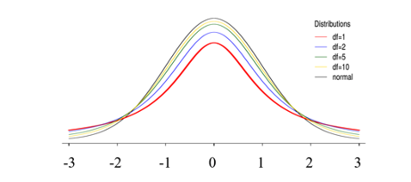
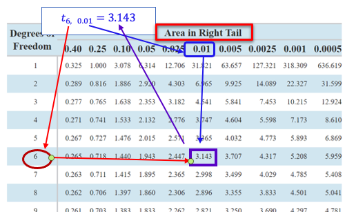

<style type="text/css">

div#TOC li {
    list-style:none;
    background-image:none;
    background-repeat:none;
    background-position:0;
}
h1.title {
  font-size: 24px;
  color: DarkRed;
  text-align: center;
}
h4.author { /* Header 4 - and the author and data headers use this too  */
    font-size: 18px;
  font-family: "Times New Roman", Times, serif;
  color: DarkRed;
  text-align: center;
}
h4.date { /* Header 4 - and the author and data headers use this too  */
  font-size: 18px;
  font-family: "Times New Roman", Times, serif;
  color: DarkBlue;
  text-align: center;
}

h1 { /* Header 3 - and the author and data headers use this too  */
    font-size: 20px;
    font-family: "Times New Roman", Times, serif;
    color: darkred;
    text-align: center;
}
h2 { /* Header 3 - and the author and data headers use this too  */
    font-size: 18px;
    font-family: "Times New Roman", Times, serif;
    color: navy;
    text-align: left;
}

h3 { /* Header 3 - and the author and data headers use this too  */
    font-size: 16px;
    font-family: "Times New Roman", Times, serif;
    color: navy;
    text-align: left;
}

</style>

```{r setup, include=FALSE}
# code chunk specifies whether the R code, warnings, and output 
# will be included in the output files.
if(!require('vembedr')) {
  install.packages('vembedr')
  library('vembedr')
}
if (!require("knitr")) {
   install.packages("knitr")
   library(knitr)
}
# knitr::opts_knit$set(root.dir = "C:/Users/75CPENG/OneDrive - West Chester University of PA/Documents")
# knitr::opts_knit$set(root.dir = "C:\\STA490\\w05")

knitr::opts_chunk$set(echo = FALSE,       
                      warning = FALSE,   
                      result = TRUE,   
                      message = FALSE)
```

\


# Introduction

We have developed the steps for constructing confidence intervals for population means based on large samples with which the central limit theorem can be used to find the sampling distribution of the sample mean.

```{r fig.align='center', out.width = '60%'}
include_graphics("week07/ciFormulaReCap.png")
```


As a review, we present the following example to highlight the importance of the steps for constructing a confidence interval.

<font color = "darkred"><b>Example 1. </b></font> Market researchers use the number of sentences per advertisement as a measure of readability for magazine advertisements. The following represents a random sample of the number of sentences found in 50 advertisements. (Source: Journal of Advertising Research)
```
9  20   18  16  9  9  11  13   22  16    5  18   6    6   5   12   25
17  23  7  10   9   10   10    5   11  18   18   9  9   17  13  11  7
14  6   11   12  11   6   12   14  11    9   18  12  12   17  11   20
```
The summarized statistics are given in the following table.

```{r fig.align='center', out.width = '60%'}
include_graphics("week07/example01DataSummary.png")
```

Based on the above data, construct a 95% confidence interval of the mean number of sentences (µ) in all magazine advertisements. 

**Solution** We are going to use the 5-step procedure to construct the confidence interval in the following.

**Step 1**: We are given a confidence level of 95%. 

**Step 2**: Since the sample size $n = 50 > 30$, using the CLT, we claim that the sample mean is approximately normally distributed. The critical value based on the standard normal distribution should be used. The critical value was found and labeled in the following figure.  

```{r fig.align='center', out.width = '60%'}
include_graphics("week07/example01CV.png")
```

**Step 3**: Find the margin of error E in the following
$$
E = Z_{\alpha/2}\times \frac{s}{\sqrt{n}} \approx 1.96\times \frac{5.0}{\sqrt{50}} \approx 1.4.
$$

**Step 4**: The explicit form of the confidence interval is given by
$$
(\bar{X} - E, \ \bar{X} - E) = (12.4 - 1.4, \ 12.4 + 1.4) = (11.0, 13.8).
$$

**Step 5**: The confidence interval (11,13.8,) has a 95% chance to include the true average number of sentences in all magazine advertisements.

\

# Confidence Interval of Proportion

Recall that the sample proportion ($\hat{p}$) is approximately normally distributed if both $n\hat{p}$ and $n(1-\hat{p})$ are large. To be more specific, in this course, if $n\hat{p} \ge 5$ and $n(1-\hat{p}) \ge 5$, we have 
$$
\hat{p} \to N\Big(p, \sqrt{\frac{p(1-p)}{n}}  \Big),
$$

which is equivalent to

$$
\frac{\hat{p} - p}{\sqrt{\frac{p(1-p)}{n}}} \to N(0, 1).
$$

Therefore, we can use the same 5-step procedure as used previously in constructing the confidence interval of the population mean for the large sample. The only difference is that the form of the margin of error involves the sampling error of the sample proportion. The following annotated formula explains the components of the confidence interval of the proportion.

```{r fig.align='center', out.width = '60%'}
include_graphics("week07/ciPropotionFormula.png")
```

Next, we use an example to illustrate the 5-step procedure for constructing the confidence interval of proportion.

<font color = "darkred"><b>Example 2.</b></font> In a survey of 1219 U.S. adults, 354 said that their favorite sport to watch is football. Construct a 95% confidence interval for the proportion of adults in the United States who say that their favorite sport to watch is football. 

**Solution**: First of all, the sample proportion $\hat{p} = 354/1219 \approx 0.29$ and sample size $n = 1219$.

**Step 1**: The confidence level is $1 - \alpha = 0.95$. $\alpha/2 = 0.025$.

**Step 2**: Since $n\hat{p} = 354 > 5$ and $n(1-\hat{p}) = 1219 \times 0.71 = 865 > 5$, the sampling distribution of $\hat{p}$ is normally distributed. The critical value corresponding to 95% confidence level is $Z_{0.025} = 1.96$ (from the normal table).

```{r fig.align='center', out.width = '60%'}
include_graphics("week07/example01CV.png")
```


**Step 3**: The margin of error for the confidence interval of population proportion is given by
$$
E = Z_{\alpha/2}\times\sqrt{\frac{\hat{p}(1-\hat{p})}{n}} = 1.96\times \sqrt{\frac{0.29(1-0.29)}{1219}} \approx 0.025.
$$

**Step 4**: The explicit form of the confidence interval is given by
$$
(\hat{p} - E, \ \hat{p} + E) = (0.29 - 0.025, \ 0.29 + 0.025) = (0.365, \ 0.315).
$$

**Step 5**: The confidence interval (0.265, 0.315) has a 95% chance to include the true proportion of adults who say football is their favorite sport.


\

# t - Confidence Interval for Mean ($\mu$) 

We have constructed confidence intervals based on the CLT that require a large sample size. When we construct a confidence interval based on small samples, we need to make stronger assumptions about the population so that we have enough information for the interval.


## t-distribution and t-Table

We have pointed out that 
$$
\frac{\bar{X} - \mu}{\sigma/\sqrt{n}} \to N(0, 1)
$$
if the sample is from a normal population regardless of the sample size. However, if the population is unknown, we need to use the sample standard deviation to estimate the population standard deviation. In this case,

$$
\frac{\bar{X} - \mu}{s/\sqrt{n}} \not \rightarrow N(0, 1)
$$
**if the sample size is small!** The correct distribution is called t-distribution with $n-1$ degrees of freedom.

The difference between standard normal and t-distributions are depicted in the following figure.

```{r fig.align='center', out.width = '80%'}

```

We can see from the above figure that t-distributions are also bell-shaped. As the degrees of freedom increase, the t-distributions approach the standard normal distribution! **However**, when the degree of freedom is small, the t-distribution and the standard normal distribution are VERY different. 


This implies that when a small sample from a normal population with unknown population variance, we should NOT use the normal critical value to construct the confidence interval for the unknown population mean. Instead, we MUST use the t-critical value that can be found in the t-table!

<font color = "darkred"><b>Example 3.</b></font> Find the critical value for a 95% confidence when the sample size is 15.

**Solution** since sample size $n = 15$, the degrees of freedom $df  = n -1 = 14.$ We use the notation $t_{df, \alpha/2}$ to denote the critical value based on the t-distribution. The following figure shows the location of the CV on the density curve.

```{r fig.align='center', out.width = '40%'}
include_graphics("week07/t-CV.png")
```

The critical value $CV = t_{14, 0.025} = 2.145$ which is found from the t-distribution table. The following table illustrates the structure of the t-table and how to use the t-table to find the critical value.

```{r fig.align='center', out.width = '70%'}

```


## t-confidence Interval

The steps for constructing t-confidence intervals are identical to those in the normal confidence intervals except for the critical value that is found in the t-table. We will use an example to show the steps for constructing a t-confidence interval.

<font color = "darkred"><b>Example 4.</b></font> . Estimating Car Pollution - In a sample of seven cars, each car was tested for nitrogen-oxide emissions (in grams per mile) and the following results were obtained: ` 0.06, 0.11, 0.16, 0.15, 0.14, 0.08, 0.15` (based on data from the Environmental Protection Agency). Assuming that this sample is representative of the cars in use. Further, the amounts of nitrogen-oxide emission for all cars are normally distributed.  Construct a 98% confidence interval estimate of the mean amount of nitrogen-oxide emission for all cars


**Solution**: We first calculate the sample mean and sample standard deviation using the formulas introduced in the note of descriptive statistics.
$$
\bar{x} = 0.1214, \ \ \ s = 0.0389.
$$

**Step 1**: The confidence level for the t-confidence interval is $1-\alpha = 0.98$. The right-tailed area of the t-density curve is $\alpha/2 = 0.01$ 


**Step 2**: We need to use the t-critical value to calculate the confidence interval: CV = $t_{6, 0.01} = 3.143$. The density curve and the table below.

```{r fig.align='center', out.width = '70%'}

```

```{r fig.align='center', out.width = '70%'}

```

**Step 3**:  The margin of error
$$
E = t_{n-1, \alpha/2} \times \frac{s}{\sqrt{n}} = 3.143\times\frac{0.0398}{\sqrt{7}} \approx 0.0462.
$$

**Step 4**: Therefore, the 98% confidence interval estimate of the population mean is   
            $(\bar{x} - E, \bar{x} + E)= (0.1214-0.0462, 0.1214+0.0462) = (0.075, 0.168)$.

**Step 5**: The interval (0.075, 0.168) has a 98% chance to include the true average amount of nitrogen-oxide emission of all cars in use.


## Normal or t-Confidence Interval: A Summary

When a normal or t confidence interval should be constructed is dependent on the given amount of information. The following brief flow chart summarizes the selection of the two types of confidence intervals based on different conditions.

```{r fig.align='center', out.width = '60%'}

```


\

# Use of Technology

Two **IntroStatsApps** can be used to generate solutions to most of the problems. You can these apps to check your work and make sure you correctly understand the concepts and steps for finding the confidence intervals of either population mean or proportion.


## Review of Normal CI

<center><a href="https://mat121.s3.amazonaws.com/ZCI-review.mp4"></a>

## **IntroStatsApps**: Normal CI - Proportion

<center><a href="https://mat121.s3.amazonaws.com/pCI.mp4"></a>

## **IntroStatsApps**: t-CI

The following apps generate solutions for t-confidence intervals. The direct link is at: https://wcu-peng.shinyapps.io/Student-t-CI/

<center><a href="https://mat121.s3.amazonaws.com/tCI.mp4"></a>


## **IntroStatsApps**: t-Table

For convenience, I also create an interactive t-table that provides the correct probability or percentile based on the provided information. The direct link is at: https://wcu-peng.shinyapps.io/t-Table/

The following screenshot is the solution to **Example 3**.


```{r fig.align='center', out.width = '90%'}
include_graphics("week07/appsT-Table.png")
```


\

\

# Practice Exercises

\
Please do the following problems manually and then use the **IntroStatsApps** to check your work.


\

1. A team of efficiency experts intends to use the mean of a random sample of size n =150 to estimate the average mechanical aptitude of assembly-line workers in a large industry (as measured by a certain standardized test) and found that the sample mean is 19.9 minutes, and the sample standard deviation is 5.73 minutes. Construct a 95% confidence interval for the average mechanical aptitude of assembly line workers in the given industry.

2. A college admissions director wishes to estimate the mean age of all students currently enrolled. In a random sample of 20 students, the mean age is found to be 22.9 years. From past studies, the standard deviation is known to be 1.5 years, and the population is normally distributed. Construct a 90% confidence interval of the population mean age.


3. Suppose you are interested in investigating the factors that affect the prevalence of tuberculosis among intravenous drug users. In a group of 97 individuals who admit to sharing needles, 24.7% had a positive tuberculin skin test result. Construct 95% confidence intervals for the population proportions.


4. Find the confidence interval for average SAT score for women given that n =15, the sample mean is 496, and the sample standard deviation is 108. Assume that the SAT scores are normally distributed.


