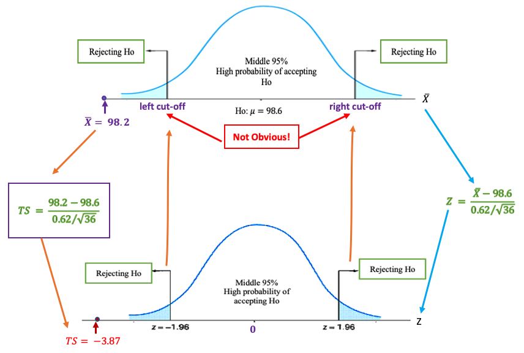

<style type="text/css">

div#TOC li {
    list-style:none;
    background-image:none;
    background-repeat:none;
    background-position:0;
}
h1.title {
  font-size: 24px;
  color: DarkRed;
  text-align: center;
}
h4.author { /* Header 4 - and the author and data headers use this too  */
    font-size: 18px;
  font-family: "Times New Roman", Times, serif;
  color: DarkRed;
  text-align: center;
}
h4.date { /* Header 4 - and the author and data headers use this too  */
  font-size: 18px;
  font-family: "Times New Roman", Times, serif;
  color: DarkBlue;
  text-align: center;
}

h1 { /* Header 3 - and the author and data headers use this too  */
    font-size: 20px;
    font-family: "Times New Roman", Times, serif;
    color: darkred;
    text-align: center;
}
h2 { /* Header 3 - and the author and data headers use this too  */
    font-size: 18px;
    font-family: "Times New Roman", Times, serif;
    color: navy;
    text-align: left;
}

h3 { /* Header 3 - and the author and data headers use this too  */
    font-size: 16px;
    font-family: "Times New Roman", Times, serif;
    color: navy;
    text-align: left;
}

</style>

```{r setup, include=FALSE}
if (!require("knitr")) {
   install.packages("knitr")
   library(knitr)
}
knitr::opts_chunk$set(echo = FALSE,       
                      warning = FALSE,   
                      result = TRUE,   
                      message = FALSE)
```


\

# Introduction

We have introduced how to construct confidence intervals to estimate the population means and proportion under various assumptions. We now introduce a new inference that justifies a statement about a population mean or proportion - **Testing Hypotheses**.

*	In statistics, a hypothesis is a claim or statement about a property of a population.  A hypothesis test is a process that uses sample statistics to test a claim about the value of a population parameter.  

*	The fundamental idea is to let data speak truthfully.

*	**Rare Event Rule for Inferential Statistics**

    Under a given assumption (e.g., the null hypothesis is correct), if the probability of an observed event is exceptionally small, we conclude that the assumption (the null hypothesis) is probably not correct.

<font color = "darkred"><b>Example 1. </b></font> If someone claims that the average height of WCU student population is at least 80 inches. To justify the claim, we take a random sample of 100 students (a set of representatives of the WCU student population). Assume that the sample mean is 68 inches and the standard deviation 15 inches.

\


# Steps for Hypothesis Testing: Some Analogies

To better understand the logic and steps for conducting a statistical hypothesis and the types of inevitable errors in the decision process, we use the two analogies that are familiar to us. 


```{r fig.align='center', out.width = '100%'}
include_graphics("week08/analogyHT.png")
```

No matter what decision will be made, there are two possible errors:

1.	**Type I Error**: the patient has a disease, but the doctor claims NO disease.

2.	**Type II Error**: the patient has NO disease, but the doctor claims a disease.


\

# Components of Testing Hypothesis

The approach to formulating the process of hypothesis testing in this course is divided into three blocks: a practical claim (also called a practical hypothesis), steps for statistical hypothesis testing, and a conclusion addressing the claim.

The following chart depicts the process for testing a hypothesis.

```{r fig.align='center', out.width = '85%'}
include_graphics("week08/blocksHT.png")
```

Next, we introduce the components of hypothesis testing based on the above chart.


##  The claim (or practical hypothesis) 


A claim (or a practical hypothesis) is a statement about the population parameter of interest such as population mean (µ) and proportion (p). It has six possible distinct forms. Using population mean ($\mu$) as an example, we have the following six possible claims.

```{r fig.align='center', out.width = '35%'}
include_graphics("week08/possibleClaims.png")
```

where $\mu_0$ is the claimed value. Three of them involve an equal sign ($=, \ge, \le$) and the other three do not have an equal sign ($\ne, >, <$). <font color = "red"><b> For a given problem, we need to identify the claim and write it explicitly.</b></font>

Some of the keywords are helpful for identifying the claim:

**at most** is equivalent to **less than or equal to**, i.e., $\le$;

**at least** is equivalent to **greater than or equal to**, i.e., $\ge$;

**differs** implies $\ne$;

**majority** implies that proportion is greater than 0.5, i.e., $p > 0.5$.

\

<font color = "darkred">**Example 1. **</font>  A water faucet manufacturer announces that the mean flow rate of a certain type of faucet is at most 2.5 gallons per minute.  

What is the claim about the population mean flow rate of the type of faucet?

**Solution**: we see the keyword **at most** in the claim. Therefore, the claim is $\mu \le 2.5$.

\

<font color = "darkred">**Example 2. **</font> A cereal company advertises that the mean weight of the contents of its 20-ounce size cereal boxes is more than 20 ounces.

What is the claim about the population mean?

**Solution**: We see the statement has keyword **more than**, the claim is $\mu > 20$.

\

<font color = "darkred">**Example 3. **</font> A university publicizes that the proportion of its students who graduate in 4 years is 82%. 

What is the claim about the population proportion?

**Solution**: Key word **is** implies that the claim is: $p = 0.82$. <font color = "blue"><b>Caution:</b> The proportion MUST be written as a decision in all formulas.</font>

\

<font color = "red">**A Cautionary Note:** </font> <font color = "blue"> If the claim in the problem is vague, we have to choose an explicit claim in order to set up the null and alternative hypotheses. </font>

\
<font color = "darkred">**Example 4. **</font> A bakery machine fills boxes with crackers, averaging 454 grams (roughly one pound) of crackers per box. The quality control manager wants to know whether the production process still maintains the quality standard. What is the claim about the mean weight of crackers per box?

**Solution**: The **claim** is vague. The manager only wants to know whether the production line still maintains the same quality over time. Therefore, the claim could be either $\mu =454$ or $\mu \ne 454$. <font color = "red">No matter what claim is used, we eventually draw a conclusion to justify it.</font>

\

## Null and Alternative Hypotheses


**Definition 1**: *Null Hypothesis* - The null hypothesis (H0) is a statement about a single value of a population parameter (such as the mean). It MUST take one of the following forms:

$$H_0:   \mu = \mu_0 ,  \ \ \ \ \       H_0:  \mu \ge \mu_0,    \ \ \ \ \ \       H_0: \mu \le \mu_0$$

  where $\mu_0$ is the value in the claim to be justified.  

  **Important Observation**: "=" must be included in $H_0$.


**Definition 2**: *Alternative Hypothesis*: The alternative hypothesis ($H_a$ or $H_1$) is the statement that must be true if the null hypothesis is false. That is, the corresponding alternative hypothesis of each of the above three null hypotheses must be:

$$H_a:   \mu \ne \mu_0 ,  \ \ \ \ \       H_a:  \mu < \mu_0,    \ \ \ \ \ \       H_a: \mu > \mu_0$$

**Important Observation**: $H_a$ must NOT have "="!


**Relationship between $H_0$ and $H_a$**

The null and alternative hypotheses are mutually complementary. This means that only one of the hypotheses is correct.
For example, if we reject $H_0$, then we must accept $H_a$, and vice versa.

Because of the relationship between $H_0$ and $H_a$, there are ONLY three possible pairs of NULL and alternative hypotheses. Next, we use population mean as an example to explicitly write these three possible pairs of $H_0$ and $H_a$.

$$
H_0: \mu = \mu_0  \ \ v.s. \ \ H_a: \mu \ne \mu_0 \ ,
$$
$$
H_0: \mu \ge \mu_0  \ \ v.s. \ \ H_a: \mu < \mu_0,
$$

and

$$
H_0: \mu \le  \mu_0  \ \ v.s. \ \ H_a: \mu > \mu_0.
$$
The above relationship is depicted in the following.


```{r fig.align='center', out.width = '75%'}

```

\

**Relationship between the claim and $H_a$**. 

The following table illustrates the relationship.

```{r fig.align='center', out.width = '85%'}

```


<font color = "darkred">**Example 5. **</font>  A bakery machine fills boxes with crackers, averaging 454 grams (roughly one pound) of crackers per box

(a). If the management of the bakery is concerned about the possibility that the actual average is different from 454 grams, what null hypothesis and what alternative hypothesis should it use to put this to test?

(b). If the management of the bakery is concerned about the possibility that the actual average is at most 454 grams, what null hypothesis and what alternative hypothesis should it use to put this to test?

**Solution**: We use the relationship between claim, null and alternative hypotheses.

(a).  The original claim: "the actual average is different from 454 grams”, i.e., $\mu \ne 454$. Since claim $\mu \ne 454$ doesn't have an "=" sign, it is used as $H_a$. Therefore, the null and alternative hypotheses are specified in the following.
$$ H_0: \mu = 454  \ \ v.s. \ \ H_a: \mu \ne 454.$$

(b). The original claim: " the actual average is at most 454 grams”, i.e., $\mu \le 454$. Since the "=" sign is contained in the claim, the claim $\mu \le 454$ is used as $H_0$. Therefore, the null and alternative hypotheses are specified in the following.              

$$H_0:   \mu \le 454   \ \   v.s  \ \  H_a:  \mu >  454$$
**Exercises** Read examples 1 - 4 and set up the null and alternative hypotheses for these examples.

\

## Test Statistic

Some characteristics of test statistics. 

* The **test statistic** is a value computed from the sample data that is used to decide whether <font color = "red">**null hypothesis**</font> is rejected. 

*	The **test statistic** converts the sample statistic (such as sample mean) to a score (such as z-score, t-score, etc.) with the assumption that the null hypothesis is true. 

*	When we test the claims about a population mean ($\mu$) in a large sample case, we can use the central limit theorem (CLT) to derive the distribution of the **test statistic**.

In other words, a test statistic is an **information aggregator** that consolidates information from multiple sources. For example, the following **test statistic** is used to test a population mean $\mu$.

$$
TS = \frac{\bar{x} - \mu_0}{s/\sqrt{n}}.
$$

The above **test statistic** contains information from the sample ($\bar{x}$, $s$, and sample size $n$) and the hypotheses (the claimed population mean $\mu_0$).


<font color = "red">**Recall that**</font> the above **test statistic** is an approximate standard normal distribution if the sample size is large (n > 30 in our course).

<font color = "red">**An Intuitive Interpretation of TS:**</font>  TS is a standardized “distance” that measures the discrepancy between the observed value ($\bar{x}$) and the claimed value ($\mu_0$). 

For example, if the above test statistic is used to test 

$$ H_0: \mu = \mu_0  \ \ v.s. \ \ H_a: \mu \ne \mu_0.$$

If TS is close to $0$, the observed value and the claimed value are close to each other implying that the sample evidence supports the null hypothesis ($H_0$) and rejects the alternative hypothesis ($H_a$). Otherwise, if TS is NOT close to $0$, there is a difference between the observed value and the claimed value implying that the sample evidence **does not** support the null hypothesis ($H_0$) but supports the alternative hypothesis ($H_a$).

<font color = "red">**A natural question:**</font>   *how close* is called close? 

\

<font color = "darkred">**Example 6. **</font> We use the body temperature data collected by the researchers at the University of Maryland with characteristics: $n=36$,  $\bar{x} = 98.20^0F$, $s=0.62^0F$. Find the value of the test statistic for the claim that the population mean is $\mu = 98.6^0F$.

**Solution**: Based on the given information and the formula, we calculate the test statistic in the following
$$
\frac{\bar{x} - \mu_0}{s/\sqrt{n}} = \frac{98.2 - 98.6}{0.62/\sqrt{36}} = -3.87.
$$

<font color = "red">**The "closeness" question:**</font>   Is $TS = -3.87$ close to $0$? 

```{r fig.align='center', out.width = '75%'}
include_graphics("week08/closenessTS.png")
```

We can see from the above figure that TS is not close to $0$ since it is located far away from the center. The next question is how to find a threshold that can tell **closeness**. The threshold is called **critical value**.


\

## Significance Level and Critical Value(s)


* The **Rejection Region (RR)** is the set of all values of the score converted from the statistic that causes us to reject the **null hypothesis**. The cut-off value(s) is(are) called Critical Value(s). 


* The **significance level** (denoted by $\alpha$) is the probability that the test statistic will fall into the critical region while the null hypothesis is true. This $\alpha$ is the same $\alpha$ in confidence level $1-\alpha$ used in constructing confidence intervals.

\

<font color = "darkred">**Example 7. (continuation of Example 6) **</font>  Assume we null and alternative hypotheses are
$$ H_0: \mu = 98.6  \ \ v.s. \ \ H_a: \mu \ne 98.6.$$
we have found that $TS = - 3.87$. Under Ho, we have the following density curve

```{r fig.align='center', out.width = '80%'}
include_graphics("week08/example06BodyTempRR.png")
```

Since left and right cut-offs are unknown, we still cannot tell whether $\bar{X} = 98.2 ^0F$ is close to $H_0: \ \mu_0 = 98.6^0F$. However, we can easily see from the standardized test statistic on the density curve of the standard normal curve is NOT close to 0 (see the following figure).

```{r fig.align='center', out.width = '99%'}

```

As we have discussed in the confidence interval, all numbers in interval $(-1.96, 1.96)$ are considered to be close to $0$. Therefore, $TS = -3.87$ is NOT close to 0. This implies that $\bar{x} = 98.2^0F$ is NOT close to $H_0: \ \mu_0 = 98.6^0F$. Since the bottom panel of the above figure is independent of the specific normal distribution, we use the distribution of TS to define rejection region(s) and critical value(s) for a given significance level. In other words, for testing 

$$ H_0: \mu = 98.6  \ \ v.s. \ \ H_a: \mu \ne 98.6.$$
at **significance level** $\alpha = 0.05$,

**Rejection Region (RR): ** consists of two tail regions.

**Critical Values (CV): ** are the values that are defined in such a way that both tail areas are equal to $\alpha/2 = 0.05/2 = 0.025.$  That is, the critical value for this testing hypothesis is $CV = \pm 1.96$ which can be found in the normal table.

\

## Statistical Decision on <font color = "red">**Ho**</font>

Once we found the critical value and the value of the test statistic, we can make a statistical decision using the following rule:

* If TS falls into the rejection region (RR), we <font color = "red"> **reject** null hypothesis **Ho**</font>;

* If TS does NOT fall into the rejection region (RR), we <font color = "red"> **fail to reject** null hypothesis **Ho**</font>.

\

## Conclusion about the Claim

We use the relationship between **the claim**, **null hypothesis**, and **alternative hypothesis** to conclude the claim (supporting or rejecting the claim.)

\

<font color = "darkred">**Example 8. (continuation of Example 6) **</font> The claim is *the population mean is $\mu = 98.6^0F$*. Recall that null and alternative hypotheses are
$$ H_0: \mu = 98.6  \ \ v.s. \ \ H_a: \mu \ne 98.6.$$
and 
$$
TS = -3.87.
$$

For this specific hypothesis test. The rejection region (RR) has two parts located on each tail (see the figure below).


```{r fig.align='center', out.width = '90%'}

```

Apparently, the test statistic $TS = -3.87$ falls into the rejection. Therefore, we reject the null hypothesis $H_0: \ \mu = 98.6$. Since the null hypothesis and the claim are identical, the sample does not have evidence to support the claim.

\

# Formal Steps for Hypothesis Testing

Based on the components discussed in the previous section, we formulate the following <font color = "red">**six-step procedure**</font> for testing the hypothesis about the mean or proportion of a population.

**Step 1**: Identify the claim about a population parameter such as the population mean or proportion.

**Step 2**: Set up null and alternative hypotheses.

**Step 3**: Evaluate the test statistic.

**Step 4**: Find the critical value(s) based on the given significance level ($\alpha$) and specify the rejection region (RR).

**Step 5**: Make a statistical decision: reject or fail to reject $H_0$.

**Step 6**: Draw a conclusion about the population parameter in the claim.

These steps will be used in all examples of hypothesis testing problems throughout the course.


# Types of Hypothesis Tests

In examples 6 - 8, we test the null hypothesis $H_0: \ \mu_0 = 98.6$.  This means that the null hypothesis should be rejected if the test statistic $TS$ is far from zero (in either a positive or negative direction), the rejection region has two parts: one on the left tail and one on the right tail. This type of test is called the **two-tailed** test.

The form of the alternative hypothesis tells the type of test. For example, for a two-tailed test, the alternative hypothesis test takes the form of $H_0: \ mu \ne \mu_0$. Note that $\ne$ means either $>$ or $<$. That is, <font color = "blue">**the direction of the inequality sign points to the location of the rejection region (RR)**</font>. 


## Two-tailed Test

The following figure shows the locations of the rejection regions of a two-tailed test. The form of the alternative hypothesis $H_a: \mu \ne \mu_0$ implies that $TS$ is not close to $0$. Therefore, the rejection region of $H_0$ is **evenly** split into right and left sub-rejection-regions.  

```{r fig.align='center', out.width = '80%'}
include_graphics("week08/twoTailedTest.png")
```

<font color = "blue"> both tail areas in the density curve are equal to half of the significance level. </font>


## Right-tailed Test

When the alternative hypothesis takes the form of $H_a: \ \mu > \mu_0$, the corresponding test is called a **right-tailed test** with the inequality sign in $H_a$ pointing to the right.  <font color = "red">Consequently, there is only **one** critical value on the right tail of the density curve.</font>

```{r fig.align='center', out.width = '80%'}

```

This is intuitive since the null hypothesis of a right-tailed test takes the form of $H_0: \mu \le \mu_0$. This implies that $H_0$ is supported if the observed **test statistic** is far left. Otherwise, we reject the null hypothesis $H_0$. <font color = "red">Consequently, there are **two** critical values: one on the right tail and one on the left tail of the density curve.</font>

<font color = "blue">The right tail area of the density curve is equal to the significance level. </font>


## Left-tailed Test

When the alternative hypothesis takes the form of $H_a: \ \mu < \mu_0$, the corresponding test is called a **left-tailed test** with the inequality sign in $H_a$ pointing to the left. <font color = "red">Consequently, there is only **one** critical value on the left tail of the density curve.</font>


```{r fig.align='center', out.width = '80%'}
include_graphics("week08/leftTailedTest.png")
```

Similarly, the null hypothesis of a right-tailed test takes the form of $H_0: \mu \ge \mu_0$. This implies that $H_0$ is supported if the observed **test statistic** is far right. Otherwise, we reject the null hypothesis $H_0$. 

<font color = "blue">The left tail area of the density curve is equal to the significance level. </font>

\

<font color = "darkred">**Example 9.**</font> A professor wants to investigate the effectiveness of a new pedagogical method. Assume the average score for the mean population is 80 before the experiment. With a new training method, the professor believes that the score might change. Professor tested randomly 36 students’ scores. The average score of the sample is 88 and the standard deviation is 10. With a 5% significance level, is there enough evidence to suggest the average score changed?

\
**Solution**: We follow the 6-step procedure to perform the hypothesis to answer the above question.

**Step 1**: Since the statement **'professor believes the mean score *might change*' ** does not specifically mention the direction of the change, we can take either one of the two forms: $\mu = 80$ or $\mu \ne 80$.

In this solution, we take the form: $\mu \ne 80$.

**Step 2**: Since the claim $\mu \ne 80$ has no '=' in it, it will be the alternative hypothesis and the opposite of it will be the null hypothesis. More specifically, 
$$H_0: \ \mu = 80 \ \ v.s. \ \ H_a: \mu \ne 80  $$

This is a two-tailed test. Therefore, there will be two rejection regions.

**Step 3**: The test statistic is defined by
$$TS = \frac{\bar{x} - \mu_0}{s/\sqrt{n}} = \frac{88 - 80}{10/\sqrt{36}} = 4.8.$$


**Step 4**: Since $n = 36 > 30$, by the central limit theorem (CLT), the test statistic is approximately normally distributed. We use the given confidence level $\alpha = 0.05$ and the normal table to find the two critical values: $\pm z_{0.05/2} = \pm z_{0.025} \pm 1.96$. All above information is labeled in the following figure.

```{r fig.align='center', out.width = '80%'}
include_graphics("week08/example09.png")
```


**Step 5**: Since $TS = 4.8$ is in the rejection region (right-hand side), the null hypothesis is rejected.

**Step 6**: We conclude that the population score has changed after the training program. 

\

**Critical values of Z-tests with commonly used significance level**: Three commonly used significance levels are $\alpha = 0.10, 0.05$ and $0.01$. Their corresponding critical values associated with different types of tests are summarized in the following table.

\

```{r fig.align='center', out.width = '80%'}
include_graphics("week08/example09.png")
```

\

<center><a href="https://mat121.s3.amazonaws.com/HTframework.mp4"></a>

\

# Use of Technology

The Stats Apps you can use for generating the solution to Example 09 is at <https://wcu-peng.shinyapps.io/oneMean-z-Test/>. The following example shows how to use the app to check your manual work.


\

<center><a href="https://mat121.s3.amazonaws.com/HTexampleApp.mp4"></a>


