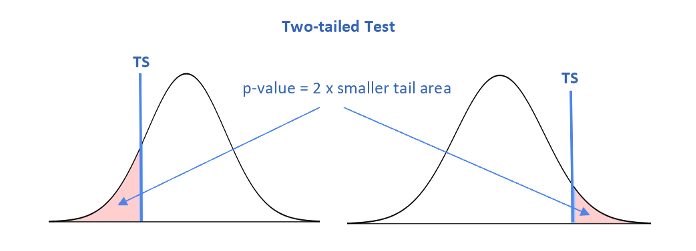

<style type="text/css">

div#TOC li {
    list-style:none;
    background-image:none;
    background-repeat:none;
    background-position:0;
}
h1.title {
  font-size: 24px;
  color: DarkRed;
  text-align: center;
}
h4.author { /* Header 4 - and the author and data headers use this too  */
    font-size: 18px;
  font-family: "Times New Roman", Times, serif;
  color: DarkRed;
  text-align: center;
}
h4.date { /* Header 4 - and the author and data headers use this too  */
  font-size: 18px;
  font-family: "Times New Roman", Times, serif;
  color: DarkBlue;
  text-align: center;
}

h1 { /* Header 3 - and the author and data headers use this too  */
    font-size: 20px;
    font-family: "Times New Roman", Times, serif;
    color: darkred;
    text-align: center;
}
h2 { /* Header 3 - and the author and data headers use this too  */
    font-size: 18px;
    font-family: "Times New Roman", Times, serif;
    color: navy;
    text-align: left;
}

h3 { /* Header 3 - and the author and data headers use this too  */
    font-size: 16px;
    font-family: "Times New Roman", Times, serif;
    color: navy;
    text-align: left;
}

</style>

```{r setup, include=FALSE}
# code chunk specifies whether the R code, warnings, and output 
# will be included in the output files.
if(!require('vembedr')) {
  install.packages('vembedr')
  library('vembedr')
}
if (!require("knitr")) {
   install.packages("knitr")
   library(knitr)
}
# knitr::opts_knit$set(root.dir = "C:/Users/75CPENG/OneDrive - West Chester University of PA/Documents")
# knitr::opts_knit$set(root.dir = "C:\\STA490\\w05")

knitr::opts_chunk$set(echo = FALSE,       
                      warning = FALSE,   
                      result = TRUE,   
                      message = FALSE)
```

\


\

# Introduction

This note focuses on the normal tests for the population means and proportions using the central limit theorem. We have formulated a general six-step testing procedure **for all hypothesis tests** in the previous topic. Also introduced was the critical value method for making a statistical decision on $H_0$. For normal tests using the normal table, we can also use another method of statistical decision: the p-value method. 

We will use the same six-step procedure with both p-value and critical value methods to test the population means and proportions. 

## Recall the 6-step procedure of testing hypotheses


**Step 1**: Identify the claim about a population parameter such as the population mean or proportion.

**Step 2**: Set up null and alternative hypotheses.

**Step 3**: Evaluate the test statistic.

**Step 4**: Find the critical value(s) based on the given significance level ($\alpha$) and specify the rejection region (RR).

**Step 5**: Make a statistical decision: reject or fail to reject $H_0$.

**Step 6**: Draw a conclusion about the population parameter in the claim.

## A Review Example

<font color = "darkred">**Example 1.** </font>  According to the salary survey by the National Association of Colleges and Employers, the average salary offered to computer science majors who graduated in May 2002 was \$50,352.  Suppose this result is true for all computer science majors who graduated in May 2002. A random sample of 200 computer science majors who graduated this year showed that they were offered a mean salary of \$51,750 with a standard deviation of \$5240. Use significance level 5%, can you conclude that the mean salary of this year’s computer science graduates is **higher than** \$50,352?


**Solution**  Note that sample statistics given in the above story problem are: $n = 200$, $\bar{x} = 51750$, and $s = 5240$. We are also given the significance level $\alpha = 0.05$. Next, we explicitly write out the 6-step procedure for this hypothesis test.

**Step 1**:  Since the last sentence contains the keyword *higher than*, the original claim takes the form $\mu > 50352$.

**Step 2**:  Based on the above claim, the null and alternative hypotheses are given by
$$H_0:  \ \mu \le 50352    \  \ vs.  \  \ H_a: \  \ \mu > 50352.$$

The form of $H_a$ indicates that this is a right-tailed test with a rejection region on the right-hand side tail. We 

**Step 3**: Evaluate the test statistic for testing the population mean in the following
$$TS = \frac{\bar{x} - \mu_0}{s/\sqrt{n}} = \frac{51750 - 50352}{5240/\sqrt{200}} \approx 3.773$$

**Step 4**: Since $n = 200 > 30$, by the central limit theorem (CLT), TS approximately follows the standard normal distribution. For the given significance level, we go to the standard normal distribution table to find the critical value (i.e., 95th percentile) on the right tail: $CV = z_{0.05} = 1.645.$. The above information is labeled in the following figure.

**Step 5**: Statistical decision on <font color = "red">**Ho**</font> (<font color = "blue"> always on Ho </font>).<br>
Since the test statistics $TS = 3.773$ is in the rejections, <font color = "blue"> we **REJECT** the null hypothesis **Ho: ** $\mu \le 50352$ and **CONCLUDE** the alternative hypothesis **Ha: ** $\mu > 50352$. </font>


**Step 6**: The sample evidence supports the claim that the mean salary is **higher than** \$50352.

\


```{r fig.align='center', out.width = '90%'}
include_graphics("week09/Screenshot4Example01.png")
```


<!--center><a href="https://mat121.s3.amazonaws.com/ZtestReview-CV.mp4"></a-->
\

# Testing Population Means Using P-value Method

We first introduce the method of p-value method for testing population means.

## What is P-value?

In the critical value method, the decision rule is simple: if the test statistic TS is inside the rejection region (RR) defined by the critical value(s), we reject the null hypothesis (**Ho**); otherwise we fail to reject the null hypothesis (**Ho**). 

Next we use the <font color = "red">**right-tailed test** </font>in the above example to demonstrate an equivalent decision rule. First of all, once we obtained the value of the test statistic, we can use the normal table to find the area to <font color = "red">**the right-hand side of the tail region**</font>. In the above example, the right-tailed area is 0.000079 (see the following figure). 

```{r fig.align='center', out.width = '50%'}
include_graphics("week09/definitionPValue.png")
```

The area to the right of the test statistic for the right-tailed test is called <font color = "blue">**p-value**</font>.


**Important Observations**: 

1. If the test statistic is in the reject region, the <font color = "blue">**p-value**</font> is **less than** the significance level $\alpha = 0.05$. That is, if the <font color = "blue">**p-value**</font> is **less than** the significance level, we REJECT **Ho**;

2. If the test statistic is outside the rejection region, the <font color = "blue">**p-value**</font> (<font color = "red">*area to the right of the test statistic*</font>) is **greater than** the significance level $\alpha = 0.05$. That is, if the <font color = "blue">**p-value**</font> is **greater than** the significance level, we FAIL TO REJECT **Ho**.

The above observations established a general decision method – the p-value method:

* If the p-value is less than $\alpha$, $H_0$ is REJECTED.
* If the p-value is greater than $\alpha$, $H_0$ is concluded.  

The p-value defined above is based on the right-tailed test. The general definition of the p-value for all three types of tests.

\

## Definitions of P-values

The p-value is defined based on the type of tests. The following figures **show** the p-value of the three types of tests. 

1. For a right-tailed test, the p-value is defined to be the area to the **right** of the test statistic **TS**. 

```{r fig.align='center', out.width = '60%'}
include_graphics("week09/rightTailedPVal.png")
```


2. For a left-tailed test, the p-value is defined to be the area to the **left** of the test statistic **TS**;

```{r fig.align='center', out.width = '60%'}
include_graphics("week09/leftTailedPVal.png")
```


3. For a two-tailed test, the p-value is defined as the smaller tail area times two (i.e., double the smaller tail area).

```{r fig.align='center', out.width = '65%'}

```


## Summary of p-Value

We can see from the above discussion that the definition of p-value requires

1. The sampling distribution of the test statistic;

2. The value of the test statistic.


In terms of changes in the testing procedure, (1) instead of finding the critical value in **step 4**, we will find the **p-value**; (2) the decision rule in **step 5** will be changed from the **critical value** method to **p-value** Method.


In this course, we only use the p-value method when the sampling distribution is normal.

\

<font color = "darkred">**Example 2.** </font> [p-value Method] A manufacturer of salad dressings uses machines to dispense liquid ingredients into bottles that move along a filling line. The machine that dispenses salad dressings is **working properly when 8 ounces are dispensed**. Suppose that the average amount dispensed in a particular sample of 36 bottles is 7.91 ounces with a variance of 0.04 ounces. Is there evidence that the machine should be stopped for repairs? 

**Solution**: We use the p-value method to answer this question.

**Step 1**: The question "*Is there evidence that the machine <font color = "blue">should be stopped </font> for repairs?* " implies that the claim is $\mu \ne 8$. 


**Step 2**: The null and alternative hypotheses are 
$$H_o \    \mu = 8  \ \  v.s.  \ \  Ha: \mu \ne 8 $$
The form of the alternative hypothesis indicates that this is a two-tailed test.

**Step 3**: The test statistic is evaluated below
$$
TS = \frac{\bar{x} - \mu_0}{s/\sqrt{}n} = \frac{7.91 - 8}{0.2/\sqrt{36}} = -2.7  
$$

**Step 4**: Since the sample size $n = 36$, by the CLT, the sampling distribution of $TS$ is a standard normal distribution. Since this is a two-tailed test, the p-value is equal to the smaller tail area times 2. That is, p-value = $2 \times 0.0035 = 0.007$.  The following figure shows the way of finding the p-value. 


**Step 5**: Decision rule. Since the p-value = 0.007 < 0.05 (default significance), we reject $H_o: \  \mu = 8$.    

**Step 6**: Based on the decision made in **step 5** and the relationship between the claim in **step 1** and the hypotheses in **step 2**, the sample evidence supports the claim. This implies that the machine should be stopped for repairs.

\


```{r fig.align='center', out.width = '90%'}

```

\

# Testing Hypotheses About Population Proportions

We have discussed the sampling distribution of sample proportions. 

$$
\hat{p} \to N\Big(p, \sqrt\frac{p(1-p)}{n} \Big)
$$

when $np > 5$ and $n(1-p) > 5$. We standardize the above sampling distribution to get
$$
Z = \frac{\hat{p}-p}{\sqrt{\frac{p(1-p)}{n}}} \to N(0,1)
$$

The above equation measures the "distance" between the observed proportion from the sample ($\hat{p}$) and the true proportion of the population. Therefore, for testing $H_0: \ p = p_0$, we use the following test statistic
$$
TS = \frac{\hat{p}-p_0}{\sqrt{\frac{\hat{p}(1-\hat{p})}{n}}} \to N(0,1)
$$
when the same conditions, $np_0 > 5$ and $n(1-p_0) > 5$, are satisfied.

Note that, another more commonly used test statistic is given by

$$
TS = \frac{\hat{p}-p_0}{\sqrt{\frac{p_0(1-p_0)}{n}}} \to N(0,1)
$$

From theory, both are valid test statistics, and both have an approximate standard normal distribution when the above two conditions are satisfied. The latter one was used in Stats Apps and examples.


With the above test statistic and its sampling distribution, we can perform hypothesis testing about population proportion using the same 6-step procedure as we used in testing population means. The only difference is the form of the test statistic and the conditions of the sampling distribution of the test statistic.

Next, we use an example to illustrate the steps for the hypothesis test.


<font color = "darkred">**Example 3.** </font> Suppose the previous example is stated a little bit differently. The CEO claims that at least 80 percent of the company's customers are very satisfied. To justify the CEO’s claim, 166 customers are surveyed using simple random sampling and found that 73 percent are very satisfied. Based on these results, should we accept or reject the CEO's claim? Assume a significance level of 0.05.

**Solution**: We use the p-value method to perform this test.

**Step 1**: The claim is clearly given in the statement "*The CEO claims that at least 80 percent of the company's customers are very satisfied. *":   $p \ge 0.8$ (the proportion MUST be written in the decimal form).

**Step 2**: The claim contains an "=" sign, it is used as the null hypothesis and its opposite is the alternative hypothesis.
$$H_0: \ p \ge 0.8  \ \  v.s.  \  \  H_a: \  p < 0.8.$$
This means that this is a left-tailed test. 


**Step 3**: The test statistic is evaluated below using the following form

$$
TS = \frac{\hat{p}-p_0}{\sqrt{\frac{p_0(1-p_0)}{n}}}  =  \frac{0.73-0.8}{\sqrt{\frac{0.8\times (1-0.8)}{166}}} \approx -2.255.
$$

**Step 4**: Since this is a left-tailed test, the p-value is the left-tailed area labeled in the following density curve. Note also that $166\times 0.73 = 122 > 5$ and $166 \times (1 - 0.73) = 45 > 5$, therefore, the test statistic is normally distributed.

The p-value is equal to the left-tail area = 0.0122.

**Step 5**: Since the p-value is less than the significance level of 0.05, we reject the null hypothesis.

**Step 6**: Based on the decision in **Step 5**, the same evidence supports the CEO's claim that at least 80 percent of the company’s customers are very satisfied.

**Remark** We can change steps 4 and 5 to use the critical value method.

\
```{r fig.align='center', out.width = '90%'}

```


\


# Use of Technology

We can use the Stats Apps to perform the **normal tests** for population means and proportion.

## Normal Test for Means

The App for a normal test of the population mean is at: (https://wcu-peng.shinyapps.io/oneMean-z-Test/). We use the app to generate the solution of Example 2 (see the following screenshot). We need to provide information on the left navigation panel.

\
<!--center><a href="https://mat121.s3.amazonaws.com/ZTest-Pval.mp4"></a-->


<font color = "red">Note that the App requires the **standard deviation of the sample**. If you are given the sample variance, you need to take square root of it to get the standard deviation.</font>

\

## Normal Test for Proportion

The App for a normal test of the population proportion is at: (https://chpeng.shinyapps.io/oneProp-z-testR/). We next generate the solution of example 3.


<!--center><a href="https://mat121.s3.amazonaws.com/Ztest-Proportion.mp4"></a-->


\

# Practice Exercises

Please do the following exercises manually first and then check your answers using ISLA Apps.

1. An industrial company claims that the mean pH level of the water in a nearby river is 6.8. You randomly select 31 water samples and measure the pH of each. The sample mean and standard deviation are 6.7 and 0.24, respectively. Is there enough evidence to reject the company’s claim at $\alpha = 0.05$? Assume the population is normally distributed.

\

2. A used car dealer says that the mean price of a 2005 Honda Pilot LX is at least \$23,900. You suspect this claim is incorrect and find that a random sample of 36 similar vehicles has a mean price of \$23,500 and a standard deviation of \$1250. Is there enough evidence to reject the dealer’s claim at $\alpha = 0.05$?

\

3. The mayor of a large city claims that the average net worth of families living in this city is at least \$300,000. A random sample of 100 families selected from this city produced a mean net worth of \$288,000 with a standard deviation of $80,000. Using the 2.5% significance level, can you conclude that the mayor’s claim is false?

\

4. In an advertisement, a pizza shop claims that its mean delivery time is less than 30 minutes. A random selection of 36 delivery times has a sample mean of 28.5 minutes and a standard deviation of 3.5 minutes. Is there enough evidence to support the claim at $\alpha = 0.01$?

\

5. Survey of Voters In a survey of 1002 people, 701 said that they voted in the recent presidential election (based on data from ICR Research Group). Use a 0.05 significant level to test the claim that when surveyed, the proportion of people who say that they voted is equal to 0.61.

