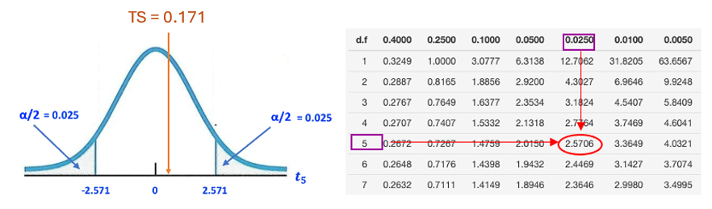
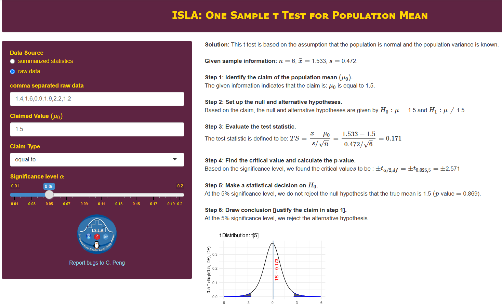
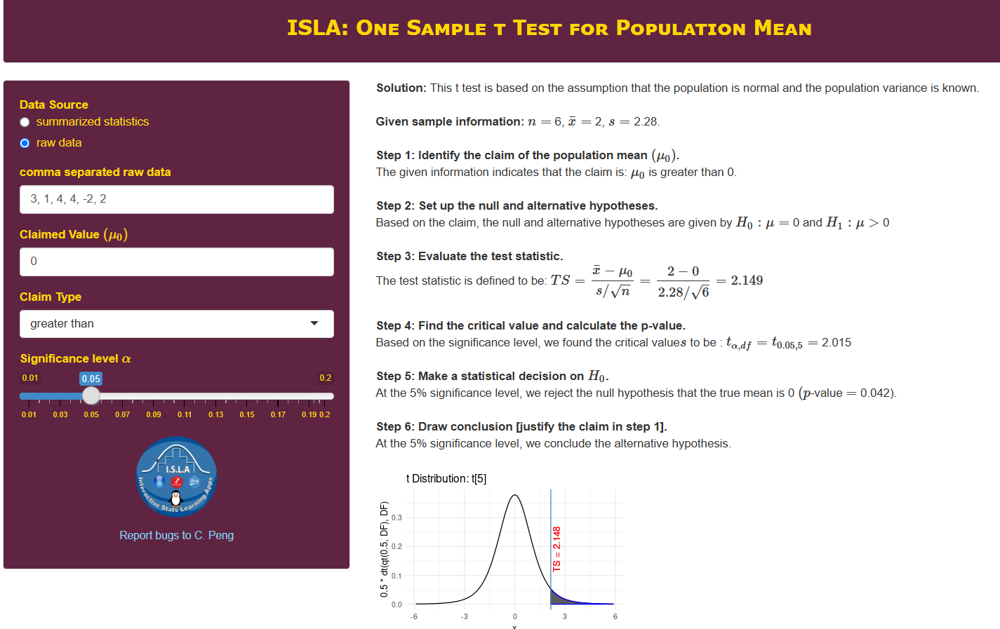
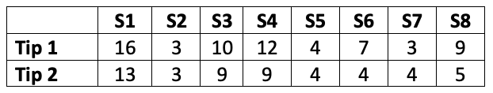

<style type="text/css">

div#TOC li {
    list-style:none;
    background-image:none;
    background-repeat:none;
    background-position:0;
}
h1.title {
  font-size: 24px;
  color: DarkRed;
  text-align: center;
}
h4.author { /* Header 4 - and the author and data headers use this too  */
    font-size: 18px;
  font-family: "Times New Roman", Times, serif;
  color: DarkRed;
  text-align: center;
}
h4.date { /* Header 4 - and the author and data headers use this too  */
  font-size: 18px;
  font-family: "Times New Roman", Times, serif;
  color: DarkBlue;
  text-align: center;
}

h1 { /* Header 3 - and the author and data headers use this too  */
    font-size: 20px;
    font-family: "Times New Roman", Times, serif;
    color: darkred;
    text-align: center;
}
h2 { /* Header 3 - and the author and data headers use this too  */
    font-size: 18px;
    font-family: "Times New Roman", Times, serif;
    color: navy;
    text-align: left;
}

h3 { /* Header 3 - and the author and data headers use this too  */
    font-size: 16px;
    font-family: "Times New Roman", Times, serif;
    color: navy;
    text-align: left;
}

</style>

```{r setup, include=FALSE}
# code chunk specifies whether the R code, warnings, and output 
# will be included in the output files.
if(!require('vembedr')) {
  install.packages('vembedr')
  library('vembedr')
}
if (!require("knitr")) {
   install.packages("knitr")
   library(knitr)
}
# knitr::opts_knit$set(root.dir = "C:/Users/75CPENG/OneDrive - West Chester University of PA/Documents")
# knitr::opts_knit$set(root.dir = "C:\\STA490\\w05")

knitr::opts_chunk$set(echo = FALSE,       
                      warning = FALSE,   
                      result = TRUE,   
                      message = FALSE)
```

\


\


# Introduction

In this note, we discuss the hypothesis test of the means of **normal populations** with the assumption that the population variances are unknown. Unlike the normal test we discussed earlier, the sampling distribution of the sample means is NOT a normal distribution. We will introduce a new distribution to characterize the random behavior of the test statistic.

As an application, we also introduce a special procedure to test the difference between paired samples based on the t-test.


# t-test for Normal Population Means

In the previous topic, we test means of unspecified populations based on large samples using the central limit theorem to derive the normal distribution of the test statistic. When the population is normal and population variance is unknown, then the test statistic

$$
TS = \frac{\bar{x} - \mu}{s/\sqrt{n}} \to t_{n-1}
$$

We introduced t-distribution when we constructed confidence intervals for normal population means in an earlier topic. The critical value(s) used to define rejection region(s) are found from the t-table.

Next, we use a numerical example to show the steps for a t-test.

<font color = "darkred">**Example 1.** </font> The yield of alfalfa from a random sample of six test plots is 1.4, 1.6, 0.9, 1.9, 2.2 and 1.2 tons per acre. Assume that the random sample comes from a normal population. Test at the 0.05 level of significance whether this supports the contention that the average yield for this kind of alfalfa is 1.5 tons per acre.

**Solution**: We are given a small raw data set of alfalfa yields $\{ 1.4, 1.6, 0.9, 1.9, 2.2, 1.2 \}$. To perform the test, we calculate the sample statistics from the sample. $n = 6$, $\bar{x} = (1.4 + 1.6 + 0.9 + 1.9 + 2.2 + 1.2)/5 = 1.533$, and $s = 0.472$.

**Step 1**: The claim is clearly specified in the question **" the average yield for this kind of alfalfa is 1.5 tons per acre"**, that is, $\mu = 1.5$.        


**Step 2**:  The null and alternative hypotheses are given by
$$
H_0: \ \mu = 1.5 \ \ v.s. \  \  H_a: \ \mu \ne 1.5.
$$
This is a two-tailed test. There are two rejection regions.

**Step 3**: The test statistic is given below

$$
TS = \frac{\bar{x}-1.5}{s/\sqrt{n}} = \frac{1.533 - 1.5}{0.472/\sqrt{6}} \approx 0.171. 
$$

**Step 4** Since $n = 6$ and the population is normal with an unknown variance. The above test statistic is a t distribution with 5 degrees of freedom. We use the t-table to find the critical values: $CV = \pm t_{0.05/2, 6-1} = \pm t_{0.025, \ \ 5}= \pm 2.571$


```{r fig.align='center', out.width = '100%'}

```

**Step 5**: Since the test statistic $TS = 0.156$ is NOT in the rejection region, we fail to reject the null hypothesis $H_0: \ \mu = 1.5$.

**Step 6**: We do not have enough evidence to reject the null hypothesis that the mean yield of the given kind of alfalfa is 1.5 tons. The data tend to support the contention.

\

**Remarks**: Here are some remarks about the t-test.

1. The steps of the t-test are identical to those in the normal test except for the distribution table used in the test.

2. If the sample size is large, the t-test and the normal test based on the central limit theorem will yield essentially the same result.

3. If the sample size is small and the normal population variance is unknown, we must use the t-test.

4. If the small size is small and the population is NOT normal, we cannot perform any test in this course.

\

<center><a href="https://mat121.s3.amazonaws.com/t-test.mp4"></a>

\


# t-test for Paired Samples

This is a special hypothesis test that involves two samples. The general two-sample tests will be discussed later as a new topic. We can also use the one-sample t-test to generate the solution to the paired t-test.

\

## What Are Paired Samples?

Paired samples are samples taken from the set of subjects under two different conditions such that each observation in one sample can be paired with an observation in the other sample. 

To understand the idea of the paired sample, let's consider a hypothetical example. A pharmaceutical manufacturer is developing a new blood pressure drug that requires the FDA's evaluation of safety and effectiveness. To show FDA's review panel the effectiveness of the potential new drug, the clinical trial team recruits a group of subjects following the regulatory requirements.  For example, the team selected 4 subjects to participate in the clinical trial. **BEFORE** they receive the new drug, the team took the blood pressure readings from the group of subjects $S_1 = \{x_1, x_2, x_3, x_4 \}$ and took another blood pressure readings **AFTER** they received the new drug denoted by $S_2 = \{y_1, y_2, y_3, y_4 \}$. 

```{r fig.align='center', out.width = '50%'}
include_graphics("week10/pairedSample.png")
```

$S_1$ and $S_2$ are called paired samples because $x_1$ and $y_1$, $x_2$ and $y_2$, $x_3$ and $y_3$, $x_4$ and $y_4$ are paired. These paired readings were taken from the same subjects **before** and **after** receiving the treatment.


The paired sample method is widely used in many real-world applications. 


\

## The Logic of Paired t-test

The object of the paired t-test is to compare the mean measurement between two groups under different conditions in which each observation in one sample can be paired with an observation in the other sample.

<font color = "blue">If the "before" and "after" means are equal to each other, the drug has no treatment effect.</font> This implies that we assess the treatment effect by comparing the two means of "before" and "after" sample means. For paired samples, we can convert this "two-sample" problem to a one-sample problem and use the regular t-test to compare the two means.

The following figure depicts the structure and notations related to the paired data and the testing procedure.


```{r fig.align='center', out.width = '50%'}
include_graphics("week10/pairedDataNotation.png")
```

Recall that our primary interest is test a claim related to $(\mu_{before} - \mu_{after})$ to see the difference between the two means. With the above notation and fact that $\Delta = \mu_{before} - \mu_{after}$, we only need to test claims associated with $\Delta$.

For example, testing the following hypotheses

$$
H_0 \ (\mu_{before} - \mu_{after}) = 0 \  \  v.s. \ \ H_a: \ (\mu_{before} - \mu_{after}) \ne 0
$$

is equivalent to testing

$$
H_0: \ \Delta = 0 \ \ v.s. \ \ H_a: \ \Delta \ne 0.
$$

However, the test based on $\Delta$ only needs to use the single sample data of differences between the paired measurements in the "before" and "after" samples. Therefore, we can use the regular t-test introduced earlier to perform the paired t-test.

\

## Steps for Paired t-test

The steps for paired t-test are the same as those we used before except for the data preparation step added to the 6-step procedure. Due to the nature of the design of the paired sample problems, the size of the sample is usually small. We need to assume the differences of paired measurements, $\{d_1, d_2, d_3, \cdots, d_n \}$, are normally distributed. 

In the initial step of data preparation, we need to calculate the mean and standard deviation of the data:

$$D=\frac{d_1 + d_2 + \cdots + d_n}{n}, \ \ s_d = \sqrt{\frac{(d_1 - D)^2 + (d_2 - D)^2 + \cdots + (d_n - D)^2}{n-1}}$$

We will use the following example to illustrate the paired t-test.


<font color = "darkred">**Example 2.** </font> To determine whether applying a protective coating to the exterior of a printer increases its operating temperature, 6 printers were selected, and the operating temperature was recorded before and after treatment.

```{r fig.align='center', out.width = '40%'}
include_graphics("week10/coatingData.png")
```
Assuming that the temperatures are normally distributed. Does the data support the theory that the coating increases the mean operating temperature?  $\alpha = 0.05$.


**Solution**: We first calculate the mean and standard deviation of the differences (the last column in the following table).
```{r fig.align='center', out.width = '40%'}
include_graphics("week10/coatingDataDIff.png")
```
After some algebra (using the given formulas), we have $\bar{d} =2$ and $s_d=2.28$. We use Greek letter $\Delta$ to denote the population difference between after and before coating populations. The next are steps for the formal testing hypothesis.

**Step 1**. The claim is that *coating increases the mean operating temperature*. That is  $\Delta$ = coating. temp – no-coating.temp > 0.


**Step 2**.  Setting up the null and alternative hypotheses

$$H_0: \ \Delta  \le 0  \  \  versus   \    \    H_a: \ \Delta > 0$$
 This is a right-tailed test.
 
**Step 3**. The test statistic is defined by
$$
TS = \frac{\bar{d} - 0}{s_d/\sqrt{n}} = \frac{2-0}{2.28/\sqrt{6}} \approx 2.15.
$$

**Step 4**. The critical value of this right-tailed test is given by
$CV =t_{5,0.05} = 2.015$.  This means that the rejection region is $RR = (2.015,\infty)$. All information is summarized in the following figure.

```{r fig.align='center', out.width = '70%'}

```

**Step 5**. Since the test statistic is in the rejection region, we **reject** the null hypothesis $H_0: \ \Delta \le 0$ and **conclude** the alternative hypothesis $H_a: \ \Delta > 0$.

**Step 6**. We conclude that the protective coating on the exterior of a printer increases its operating temperature.

\

<center><a href="https://mat121.s3.amazonaws.com/paired-t-test.mp4"></a>

\


<font color = "red">**A Cautionary Remark**</font>. When calculating the differences in paired measurements, we take the form of either *before - after* or *after-before*. However, the form of the difference will impact the form of the claim. In the above example, the claim is **coating increases the mean operating temperature**,  if <font color = "red">*d = coating - no.coating*,</font>  the form of the claim is $\Delta > 0$; if <font color = "blue"> *d = no.coating - coating*,</font> the form of the claim is $\Delta < 0$.


\


# Use of Technology

Stats App *one sample t-test* is available at: (https://wcu-peng.shinyapps.io/oneMean-ttest/). You can use this app to check your work.

## One-sample t-test

We use the Apps to generate the solution of the above **Example 1**. Since we have raw data (i.e., individual data values), we need to type in all values with adjacent values separated by a comma.

```{r fig.align='center', out.width = '100%'}

```

The generated solution is essentially the same as the manual solution except for small rounding-up errors. 

## Paired t-test

Before using this for paired t-test, we first calculate the difference. Then based on the form of the difference specified in the claim and provide this information to the app. To illustrate this application, we generate the solution of the above example 2. 

Recall the claim and the form of difference used in example 2: D = coating. temp – no-coating.temp > 0. The set of differences is $\{3, 1, 4, 4, -2, 2 \}$ and will be typed in the raw data input box.

```{r fig.align='center', out.width = '100%'}

```


\

# Practice Exercises

Practice the following exercises and use the app to check your work.

1. We have the potato yield from 12 different farms. We know that the standard potato yield for the given variety is $\mu=20$. Test if the potato yield from these farms is significantly better than the standard yield using the following random sample.

    21.5, 24.5, 18.5, 17.2, 14.5, 23.2, 22.1, 20.5, 19.4, 18.1, 24.1, 18.5


\

2. Two different tips are available for a hardness-testing machine.  The machine operates by pressing the tip into a metal specimen and then measuring the depth of the resulting depression.  Eight metal specimens are chosen, and each specimen is tested with both tips.  Assuming that depths are normally distributed, and the resulting depths are shown below (coded). At level $\alpha = 0.05$, is there any difference between the two tips?
```{r fig.align='center', out.width = '50%'}

```

\

3. A golf club manufacturer claims that golfers can lower their scores by using the manufacturer’s newly designed golf clubs. Eight golfers are randomly selected, and each is asked to give his or her most recent score. After using the new clubs for one month, the golfers are again asked to give their most recent score. The scores for each golfer are shown in the table. Assuming the golf scores are normally distributed, is there enough evidence to support the manufacturer’s claim at $\alpha = 0.10$? 
```{r fig.align='center', out.width = '55%'}
include_graphics("week10/ex02Data.png")
```


4. To assess whether or not a certain training program can increase the max vertical jump (in inches) of college basketball players, we recruit a simple random sample of 20 college basketball players and measure each of their max vertical jumps and then have each player use the training program for one month. At the end of the month, we measure their max vertical jump again. The following table records the measurements.
```{r fig.align='center', out.width = '40%'}
include_graphics("week10/ex03Data.png")
```


5. A professor wants to know whether the average scores of quiz 1 and quiz 2 are different. The scores of the two quizzes are given below.
```{r fig.align='center', out.width = '20%'}
include_graphics("week10/ex04Data.png")
```
