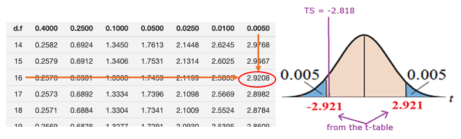
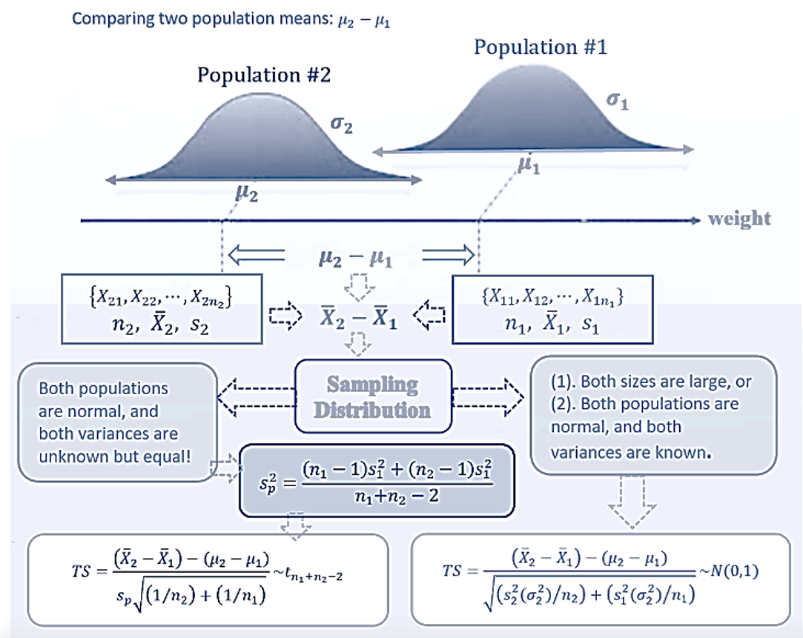
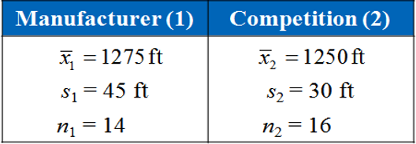
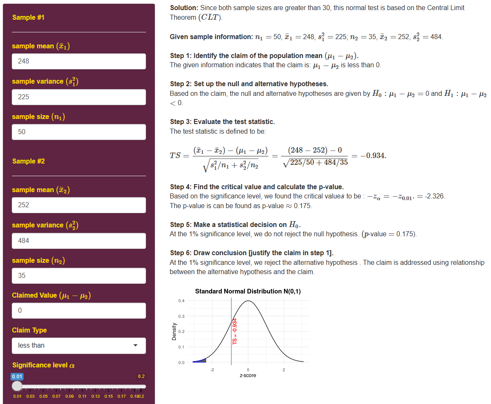
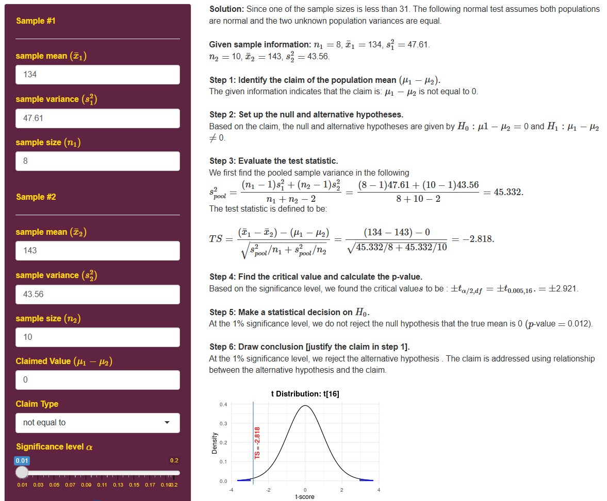

<style type="text/css">

div#TOC li {
    list-style:none;
    background-image:none;
    background-repeat:none;
    background-position:0;
}
h1.title {
  font-size: 24px;
  color: DarkRed;
  text-align: center;
}
h4.author { /* Header 4 - and the author and data headers use this too  */
    font-size: 18px;
  font-family: "Times New Roman", Times, serif;
  color: DarkRed;
  text-align: center;
}
h4.date { /* Header 4 - and the author and data headers use this too  */
  font-size: 18px;
  font-family: "Times New Roman", Times, serif;
  color: DarkBlue;
  text-align: center;
}

h1 { /* Header 3 - and the author and data headers use this too  */
    font-size: 20px;
    font-family: "Times New Roman", Times, serif;
    color: darkred;
    text-align: center;
}
h2 { /* Header 3 - and the author and data headers use this too  */
    font-size: 18px;
    font-family: "Times New Roman", Times, serif;
    color: navy;
    text-align: left;
}

h3 { /* Header 3 - and the author and data headers use this too  */
    font-size: 16px;
    font-family: "Times New Roman", Times, serif;
    color: navy;
    text-align: left;
}

</style>

```{r setup, include=FALSE}
# code chunk specifies whether the R code, warnings, and output 
# will be included in the output files.
if(!require('vembedr')) {
  install.packages('vembedr')
  library('vembedr')
}
if (!require("knitr")) {
   install.packages("knitr")
   library(knitr)
}
# knitr::opts_knit$set(root.dir = "C:/Users/75CPENG/OneDrive - West Chester University of PA/Documents")
# knitr::opts_knit$set(root.dir = "C:\\STA490\\w05")

knitr::opts_chunk$set(echo = FALSE,       
                      warning = FALSE,   
                      result = TRUE,   
                      message = FALSE)
```

\
\

# Introduction

In practice, we may want to compare some characteristics of two populations. Two-sample tests are used for this purpose. In the previous topic, we introduced a special two-sample test - paired t-test in which the two populations are defined based on the same group of subjects, but measurements are taken under different conditions. In this note, we discuss two independent samples that are taken from two independent populations. For example, we want to know whether the percentages of STEM majors at WCU and Bloomsburg University
are different. We take a random sample for WCU and one from Bloomsburg. There is no way to pair observations from WCU with those from Bloomsburg.

```{r fig.align='center', out.width = '70%'}

```

The objective of this topic is to test various hypotheses about the difference between the two population means based on both large sample and small sample scenarios. 

\

# Testing Two Populations Means: Large Samples

The general 6-step procedure will be used in the two-sample test. Before we use examples to illustrate the steps, we need to know how to define the test statistic and what is the sampling distribution of the test statistic.

## Test Statistic and Its Sampling Distribution

The claimed the difference $\mu_1 - \mu_2$ can be estimated by $\bar{x}_1 - \bar{x}_2$. In order to define the test statistic, we need the variance of $\bar{x}_1 - \bar{x}_2$ which has form $\frac{\sigma_1^2}{n_1} + \frac{\sigma_2^2}{n_2}$.  In practice, population variances $\sigma_1^2$ and $\sigma_2^2$ are estimated by their corresponding sample variances $s_1^2$ and $s_2^2$, respectively. 

The test statistic for testing $\mu_1 -\mu_2 = 0$ can be defined to be of the following form

$$
TS = \frac{(\bar{x}_1 - \bar{x}_2) -0}{\sqrt{\frac{s_1^2}{n_1} + \frac{s_2^2}{n_2}}} \to N(0, 1)
$$


## Steps for Testing Two Means

The 6-step procedure for testing the difference between two population means. The next example shows the detailed steps for the two-sample test based on large samples.

\

<font color = "darkred">**Example 1.** </font> The American Automobile Association claims that the average daily cost for meals and lodging for vacationing in Texas is less than the same average cost for vacationing in Virginia. The table shows the results of a random survey of vacationers in each state. The two samples are independent. At $\alpha = 0.01$, is there enough evidence to support the claim?
```{r fig.align='center', out.width = '30%'}
include_graphics("week11/example01Data.png")
```


**Solution**: We follow the 6-step to perform the hypothesis testing.

**Step 1**: The statement *" the average daily cost for meals and lodging for vacationing in Texas ($\mu_1$) is less than the same average cost for vacationing in Virginia ($\mu_2$)."* Therefore, the claim is $\mu_1 - \mu_2 < 0$.

**Step 2**: The null and alternative hypotheses are given by
$$
H_0: \ \mu_1 - \mu_2 \ge 0    \  \  v.s. \  \  H_a: \ \mu_1 - \mu_2 < 0.
$$

The alternative hypothesis indicates that this is left tailed test.

**Step 3**: The test statistic is defined to be
$$
TS = \frac{(\bar{x}_1 - \bar{x}_2) -0}{\sqrt{\frac{s_1^2}{n_1} + \frac{s_2^2}{n_2}}} = \frac{(248 - 252) -0}{\sqrt{\frac{15^2}{50} + \frac{22^2}{35}}}= -0.934
$$

**Step 4**: Since the test statistic is normally distributed. The critical value of this left-tailed test is $CV = -z_{0.01} = -2.33$
```{r fig.align='center', out.width = '70%'}
include_graphics("week11/example01.png")
```

We can also find the p-value $=P(Z < -0.934) \approx 0.1752.$

**Step 5**: Both critical value and p-value methods indicate that the null hypothesis is NOT rejected. This implies that the alternative hypothesis is supported.

**Step 6**: The sample evidence *does not* support the claim that the average daily cost for meals and lodging for vacationing in Texas is less than the same average cost for vacationing in Virginia.

\
**Remark**: For all two-sample tests of the difference between two population means, we need to keep the form of difference of the two means consistent in (1) claim; (2) null and alternative hypotheses; and (3) the test statistic.


\

<center><a href="https://mat121.s3.amazonaws.com/2sampleZtest.mp4"></a>

\


# Two-sample t-tests

In the previous section, we test the difference between two population means based on a large sample assumption so that the test statistic is approximately normally distributed.

Now, we want to test the difference of means of <font color = "blue">**two normal populations with unknown but equal variances**. </font> Since the two population variances are assumed to be equal, we need to combine the two samples to estimate the common variance. 
$$
s_{pool}^2 = \frac{(n_1-1)s_1^2 + (n_2-1)s_2^2}{n_1 + n_2 -2}
$$

The test statistic is defined by
$$
TS = \frac{(\bar{x}_1 -\bar{x}_2)-0}{\sqrt{s_{pool}^2/n_1 + s_{pool}^2/n_2}} \to t_{n_1+n_2-2}
$$

The sampling distribution of $TS$ is t-distribution with $n_1+n2-2$ degrees of freedom. We next perform the two-sample t-test using the above test statistic and its sampling distribution with a numerical example.

\

<font color = "darkred">**Example 2.** </font> The braking distances of 8 Volkswagen GTIs and 10 Ford Focuses were tested when traveling at 60 miles per hour on dry pavement. The results are shown below. Can you conclude that there is a difference in the mean braking distances of the two types of cars? Use $\alpha = 0.01$. Assume the populations are normally distributed and the population variances are equal. 
```{r fig.align='center', out.width = '25%'}
include_graphics("week11/example02Data.png")
```

**Solution**: The 6-step procedure is given below.

**Step 1**: The claim *there is a <font color = "red">difference</font> in the mean braking distances of the two types of cars* implies that $\mu_{GTI} - \mu_{Ford} \ne 0$.

**Step 2**: The null and alternative hypotheses are given below.
$$
H_0: \ \mu_{GTI} - \mu_{Ford} = 0 \ \ v.s.  \ \ H_a: \ \mu_{GTI} - \mu_{Ford} \ne 0
$$

This is a two-tailed test.

**Step 3**: The pooled sample variance is calculated as follows
$$
s_{pool}^2 = \frac{(n_1-1)s_1^2 + (n_2-1)s_2^2}{n_1 + n_2 -2} = \frac{(8-1)6.9^2 + (10-1)6.6^2}{8 + 10 -2}=45.33.
$$
The test statistic is given by 
$$
TS = \frac{(\bar{x}_1 -\bar{x}_2)-0}{\sqrt{s_{pool}^2/n_1 + s_{pool}^2/n_2}} = \frac{(134 -143)-0}{\sqrt{45.33/8 + 45.33/10}} \approx -2.818.
$$

**Step 4**: The t-critical value of this two-tailed test with 16 degrees of freedom is $CV = \pm 2.921$.

```{r fig.align='center', out.width = '70%'}

```


**Step 5**: Since the test statistic is NOT inside the rejection, we fail to reject the null hypothesis. That is, we reject the alternative hypothesis.

**Step 6**:  There is no enough sample evidence to support the claim that there is a <font color = "red">difference</font> in the mean braking distances of the two types of cars.

**Remarks**: (1). If one of the sample sizes is small, we have to assume both populations to be normal and variance are unknown but equal; (2). If any of the assumptions are not satisfied, we cannot perform any two-sample test in this class.


\

<center><a href="https://mat121.s3.amazonaws.com/2sampleTtest.mp4"></a>

\

# Two-sample Test Workflow: Summary

The following flow chart shows the workflow of two-sample tests.

```{r fig.align='center', out.width = '70%'}

```

\

# Practice Exercises

1. Suppose we have a dataset containing 130 observations of body temperature, along with the gender of each individual and his or her heart rate. Is there a significant difference between the mean body temperatures for men and women? Summarized sample statistics are:

```
        	n	      Mean	      Stdev
Women	  65   	   98.105        0.699
Men    	  65	   98.395	      0.743
```

\

2. A consumer education organization claims that there is a difference in the mean credit card debt of males and females in the United States. The results of a random survey of 200 individuals from each group are shown below. The two samples are independent. Do the results support the organization’s claim? Use $\alpha = 0.05$.


```{r fig.align='center', out.width = '30%'}
include_graphics("week11/ex02.png")
```

\

3. A manufacturer claims that the calling range (in feet) of its 2.4-GHz cordless telephone is greater than that of its leading competitor. You perform a study using 14 randomly selected phones from the manufacturer and 16 selected similar phones from its competitor. The results are shown below. At $\alpha = 0.05$, can you support the manufacturer’s claim? Assume the populations are normally distributed and the population variances are equal.


```{r fig.align='center', out.width = '30%'}

```

\

# Use of Technology

The Stats Apps for the two-sample test is at: (https://chpeng.shinyapps.io/twoSampleTests/).

## Two-sample Test: Large Samples 

```{r fig.align='center', out.width = '100%'}

```


## Two-sample t-test

```{r fig.align='center', out.width = '100%'}

```


