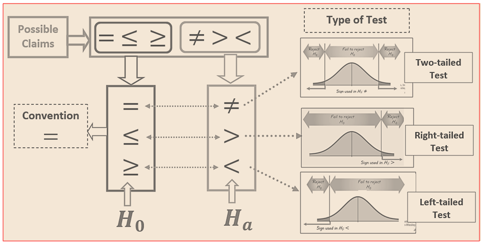
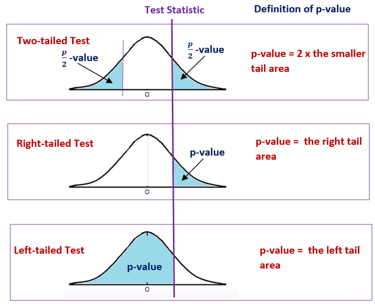
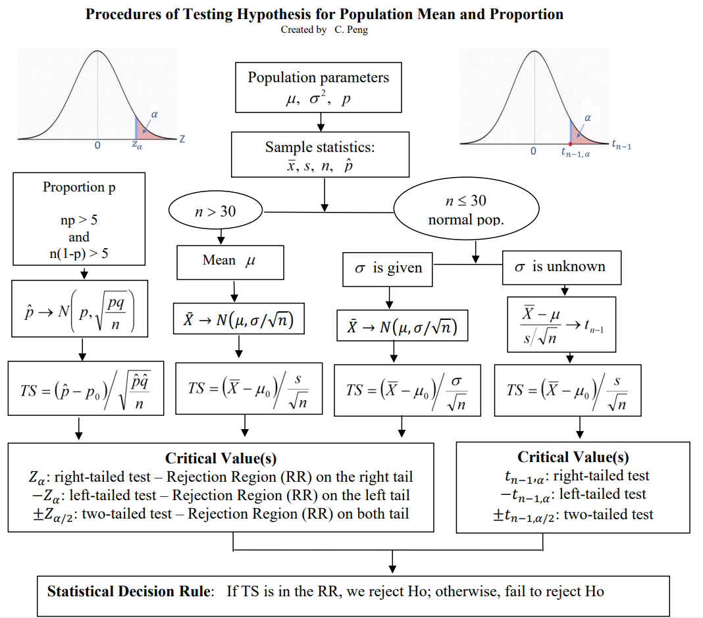
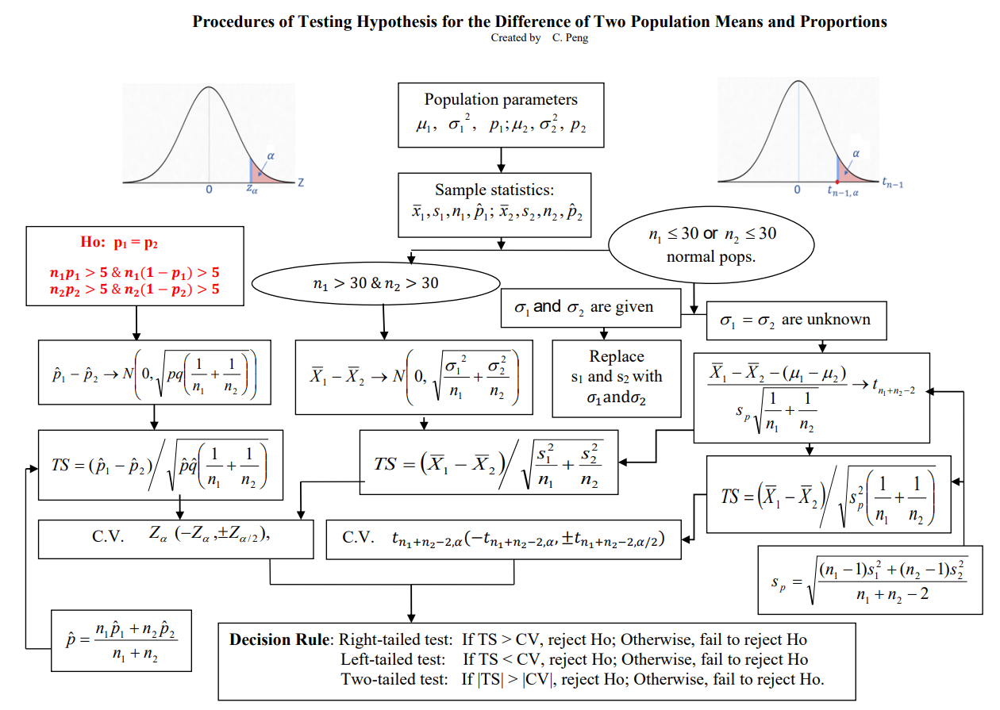
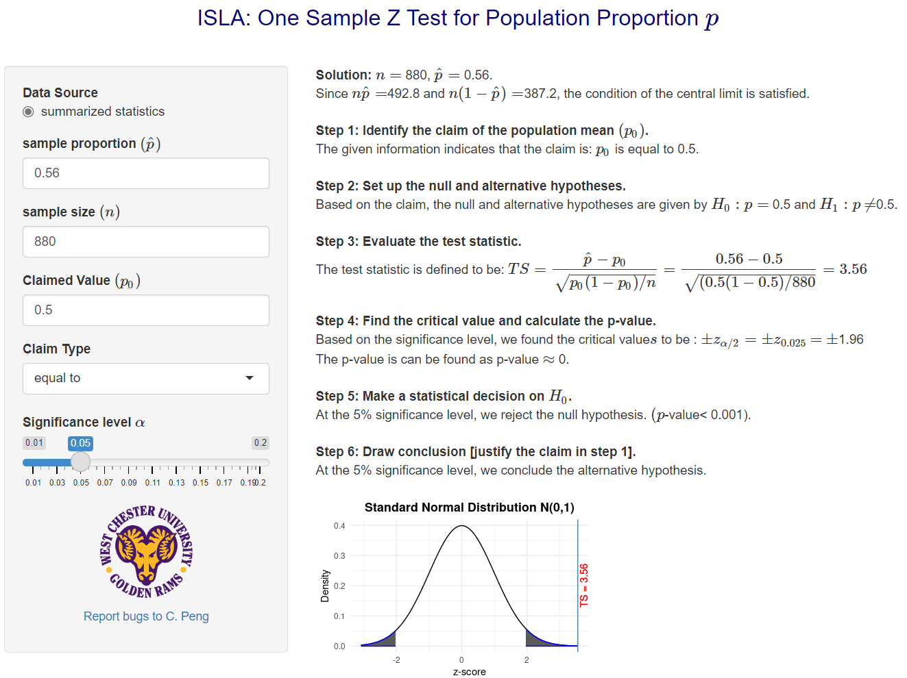
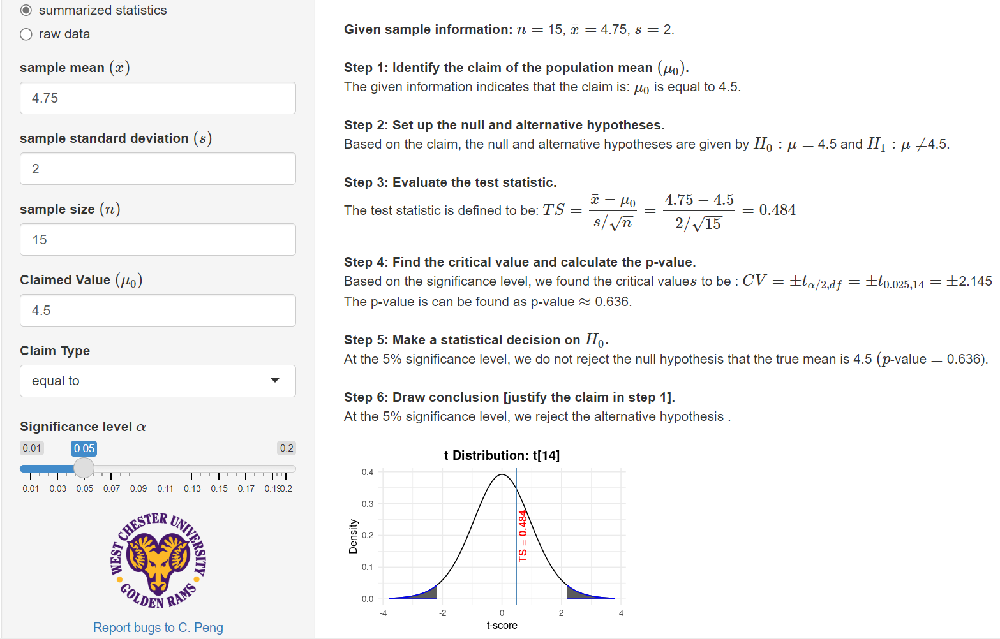
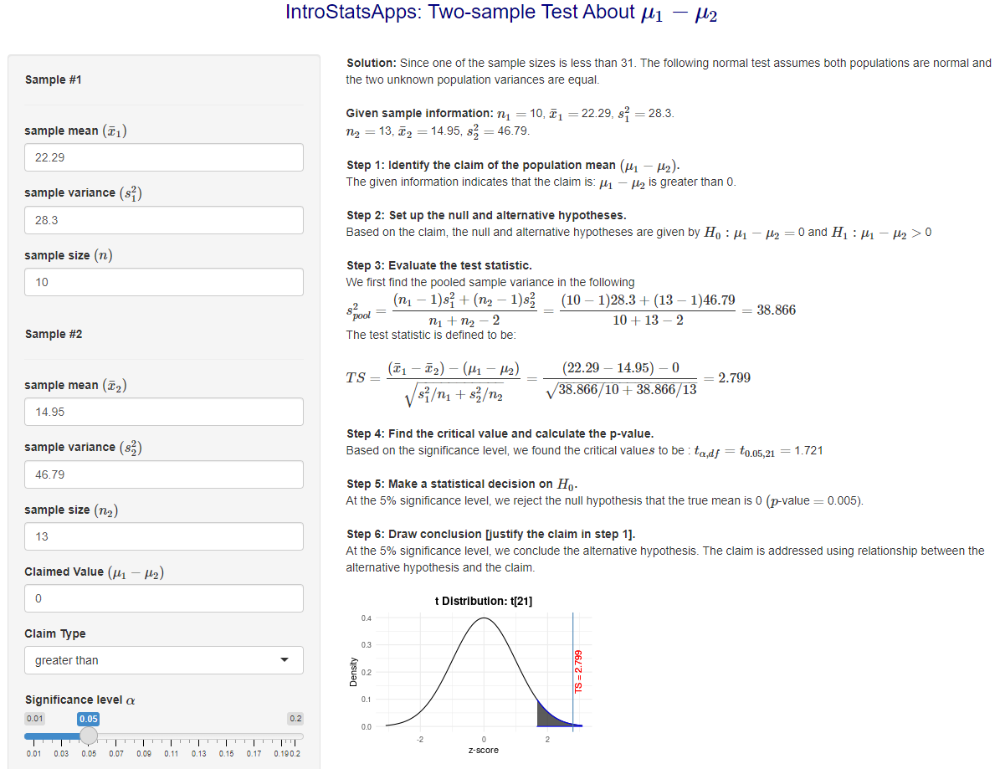
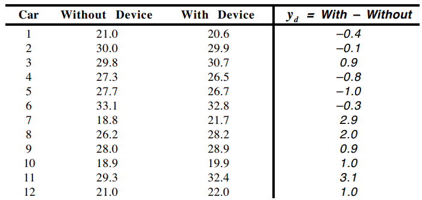
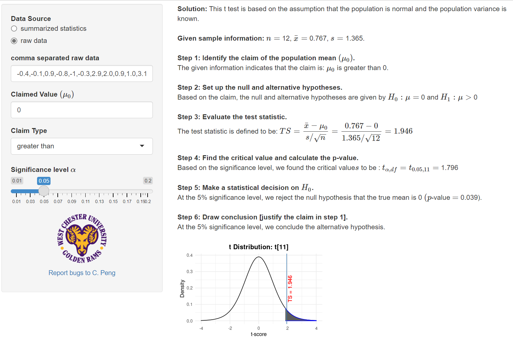

<style type="text/css">

div#TOC li {
    list-style:none;
    background-image:none;
    background-repeat:none;
    background-position:0;
}
h1.title {
  font-size: 24px;
  color: DarkRed;
  text-align: center;
}
h4.author { /* Header 4 - and the author and data headers use this too  */
    font-size: 18px;
  font-family: "Times New Roman", Times, serif;
  color: DarkRed;
  text-align: center;
}
h4.date { /* Header 4 - and the author and data headers use this too  */
  font-size: 18px;
  font-family: "Times New Roman", Times, serif;
  color: DarkBlue;
  text-align: center;
}

h1 { /* Header 3 - and the author and data headers use this too  */
    font-size: 20px;
    font-family: "Times New Roman", Times, serif;
    color: darkred;
    text-align: center;
}
h2 { /* Header 3 - and the author and data headers use this too  */
    font-size: 18px;
    font-family: "Times New Roman", Times, serif;
    color: navy;
    text-align: left;
}

h3 { /* Header 3 - and the author and data headers use this too  */
    font-size: 16px;
    font-family: "Times New Roman", Times, serif;
    color: navy;
    text-align: left;
}

</style>

```{r setup, include=FALSE}
# code chunk specifies whether the R code, warnings, and output 
# will be included in the output files.
if (!require("knitr")) {
   install.packages("knitr")
   library(knitr)
}
# knitr::opts_knit$set(root.dir = "C:/Users/75CPENG/OneDrive - West Chester University of PA/Documents")
# knitr::opts_knit$set(root.dir = "C:\\STA490\\w05")

knitr::opts_chunk$set(echo = FALSE,       
                      warning = FALSE,   
                      result = TRUE,   
                      message = FALSE)
```

\


# Introduction

This additional note reviews the frame framework and procedure for testing the hypothesis.


# Frame Work and Procedure of Hypothesis Testing

A testing hypothesis procedure has three components: 

**A CLAIM OF POPULATION**: This class only focuses on the population mean ($\mu$) and proportion ($p$). We use population mean, $\mu$, as an example, there are 6 possible claims about the population means $\mu = (\ne, \ge, \le, >, <)  \mu_0$.

**FOUR-STEP STATISTICAL HYPOTHESIS TESTING**: the following steps are actual statistical hypothesis testing.

* **Setting up null and alternative hypotheses.** After the null and alternative hypotheses are correctly set up (the null hypothesis *must* have "=" in it), we can easily find the information in the following figure.

```{r fig.align='center', out.width = '80%'}

```

* **Evaluating test statistic**:
  - One-sample test for population mean $TS = (\bar{x}-\mu_0)/(s/\sqrt{n})$ or $TS = (\bar{x}-\mu_0)/(\sigma/\sqrt{n})$.
  - One-sample test for population proportion $TS = (\hat{p}-p_0)/\sqrt{\hat{p}(1-\hat{p})/n}$ or $TS = (\hat{p}-p_0)/\sqrt{p_0(1-p_0)/n}$,
  - Two-sample test for difference of means with large sample sizes: $TS=(\bar{x}_1-\bar{x}_2)/\sqrt{s_1^2/n_1+s_2^2/2}$.
  - Two-sample t-test with equal variance $TS=(\bar{x}_1-\bar{x}_2)/\sqrt{s_{pool}^2/n_1+s_{pool}^2/2}$, where $s_{pool}^2=[(n_1-1)s_1^2 + (n_2-1)s_2^2]/(n_1+n_2-2)$.
  
* **Finding CV or p-value.** Both CV and p-value are based on the type of the test.
  - CV: from either Z-table or t-table depending on the sample size and population distribution(s).
  - p-value: the definition is given in the following figure.
  
```{r fig.align='center', out.width = '80%'}

```  
  
* **Statistical decision on the null hypothesis Ho.** 
  - CV Method: Critical value defines rejection region(s) **RR** based on the type of test and the significance level $\alpha$. If TS is in **RR**, **Ho** is rejected, otherwise **Ho** concluded.
  - p-value Method: if the p-value is less than the significance level $\alpha$, **Ho** is rejected, otherwise **Ho** is concluded.
  
**CONCLUSION**: This step justifies the claim of the population in the initial step.


# One-sample Tests

**One-sample tests** are used to test a claim about the population mean or proportion under various assumptions about the sample and the population. The following flow chart summarizes these tests using the CV method.

```{r fig.align='center', out.width = '95%'}

``` 

# Two-sample Tests  

Similar to one-sample tests, we also created a flow chart for two-sample tests. Note that the two-sample test of the difference of two population proportions is not covered in this class. 

```{r fig.align='center', out.width = '95%'}

``` 

Note that the paired t-test is a special two-sample problem which is converted to a one-sample t-test. 

# Examples

**Example**: A survey of $n=880$ randomly selected adult drivers showed that 56% (or $\hat{p} = .56$) of those responded admitted to running red lights. Find the value of the test statistic for the claim that the **majority** (i.e., > 0.5) of all adult drivers admit to running red lights.

```{r fig.align='center', out.width = '95%'}

``` 

**Example 2.** An organization reported that teenagers spent 4.5 hours per week, on average, on the phone. *The organization thinks that, currently, the mean is higher.* Fifteen randomly chosen teenagers were asked how many hours per week they spend on the phone. The sample mean was 4.75 hours with a sample standard deviation of 2.0. Conduct a hypothesis test with a 5% significance level.

```{r fig.align='center', out.width = '95%'}

``` 

**Example 3**. One way to measure a person’s fitness is to measure their body fat percentage. It is believed that the body fat percentage of females is higher than that of males. To justify this belief, one random sample data is taken from a group of men and women who did workouts at a gym three times a week for a year. Then, their trainer measured the body fat. The table below shows the data. Does the data support the belief at a 5% level of significance?  
  
| Group | 	Sample Size (n)| 	Average ($\bar{x}$)|	Standard deviation (s) |
|-------|------------------|---------------------|-------------------------|
| Women	|10	|22.29 |	5.32|
| Men	  |13	|14.95 |	6.84|
  
```{r fig.align='center', out.width = '95%'}

```  
  
  
**Example 4**.  In a test of the effectiveness of a device that is supposed to *increase* gasoline mileage in automobiles, 12 cars were run, in random order, over a prescribed course both with and without the device in random order. The mileage (mpg) is given below. Is there evidence that the device is effective? (Use $\alpha = 0.01$.)

```{r fig.align='center', out.width = '65%'}

``` 

```{r fig.align='center', out.width = '95%'}

``` 


