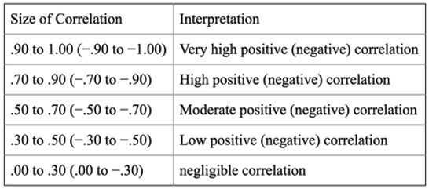
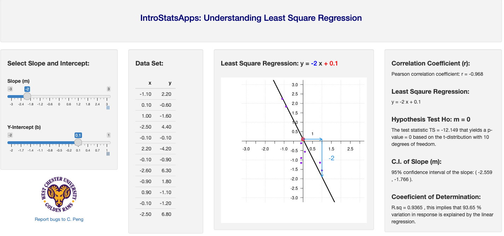
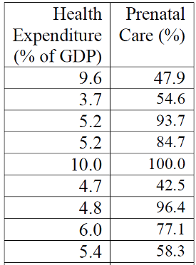

<style type="text/css">

div#TOC li {
    list-style:none;
    background-image:none;
    background-repeat:none;
    background-position:0;
}
h1.title {
  font-size: 24px;
  color: DarkRed;
  text-align: center;
}
h4.author { /* Header 4 - and the author and data headers use this too  */
    font-size: 18px;
  font-family: "Times New Roman", Times, serif;
  color: DarkRed;
  text-align: center;
}
h4.date { /* Header 4 - and the author and data headers use this too  */
  font-size: 18px;
  font-family: "Times New Roman", Times, serif;
  color: DarkBlue;
  text-align: center;
}

h1 { /* Header 3 - and the author and data headers use this too  */
    font-size: 20px;
    font-family: "Times New Roman", Times, serif;
    color: darkred;
    text-align: center;
}
h2 { /* Header 3 - and the author and data headers use this too  */
    font-size: 18px;
    font-family: "Times New Roman", Times, serif;
    color: navy;
    text-align: left;
}

h3 { /* Header 3 - and the author and data headers use this too  */
    font-size: 16px;
    font-family: "Times New Roman", Times, serif;
    color: navy;
    text-align: left;
}

</style>

```{r setup, include=FALSE}
# code chunk specifies whether the R code, warnings, and output 
# will be included in the output files.

if (!require("knitr")) {
   install.packages("knitr")
   library(knitr)
}
# knitr::opts_knit$set(root.dir = "C:/Users/75CPENG/OneDrive - West Chester University of PA/Documents")
# knitr::opts_knit$set(root.dir = "C:\\STA490\\w05")

knitr::opts_chunk$set(echo = FALSE,       
                      warning = FALSE,   
                      result = TRUE,   
                      message = FALSE)
```

\

\

# Introduction

\
In this note, we focus on the relationship between continuous numeric variables. There are different types of relationships between two numeric variables. The relationship we are interested in is the linear relationship. Two specific topics to be covered in this note are 

*	**Correlation coefficient** - determining if there is a relationship between these two variables. 

*	**Linear regression** - Describing how the values of one variable change when the corresponding changes in the other variable.

\

# Correlation Coefficient

\

A correlation exists between two numeric variables when one of them is related to the other in some ways. To visualize the relational pattern, we use a graphic tool - scatter plot (or scatter diagram), which is a graph of the paired (x, y) data with a horizontal x-axis and a vertical y-axis. 

\
```{r fig.align='center', out.width = '40%'}
include_graphics("week12/scatterPlot.png")
```

## Linear Correlations

We now look at a few scatter plots that demonstrate different general relationships.

* A relationship is **linear** when the points on a scatter plot follow a somewhat straight-line pattern. 

  + **Positive linear association**: The scatter plot has points that incline upwards to the right: As x values increase, y values increase. As x values decrease, y values decrease. <br><br>
\
```{r fig.align='center', out.width = '25%'}
include_graphics("week12/linearPos.png")
```
  + <font color = "darkred"> **Example 1**.</font> There's a positive **correlation** between height and weight. In general, as the weight increases, the height increases. 
\ <br><br>
  + **Negative linear association**: The scatter plot has points that decline down to the right. As x values increase, y values decrease. As x values decrease, y values increase. 
\
<br><br>
  + <font color = "darkred"> **Example 2**.</font> There exist a negative correlation between absence and the scores obtained by the student in the exams, i.e., the more lectures a student missed, the lower the scores he/she will obtain in the exam.


```{r fig.align='center', out.width = '25%'}
include_graphics("week12/linearNeg.png")
```

* **Non-linear Relationships** have an apparent pattern, just not linear. The following two figures represent a quadratic relationship between two numeric variables. <br><br>
\
```{r fig.align='center', out.width = '60%'}
include_graphics("week12/curveLinear.png")
```
\
  + <font color = "darkred"> **Example 3**.</font> Non-linear relationship is everywhere in the real world. For example, the following figure based on real-world data shows two special non-linear relationships. *Left Panel*: the relationship between age and death rate worldwide in 2007. *Right Panel*: the US infant mortality rate and maternal age.<br><br>
\ 
```{r fig.align='center', out.width = '80%'}

```  
\
* When two variables have **no relationship**, there is no straight-line relationship or non-linear relationship. When one variable changes, it does not influence the other variable.<br><br>
\
```{r fig.align='center', out.width = '25%'}
include_graphics("week12/uncorrelated.png")
```

  + <font color = "darkred"> **Example 4**.</font> The amount of coffee that individuals consume and their shoe sizes have no relationship with each other.
\


\


## Linear Correlation Coefficient

\
The above visual representations and examples demonstrate the various relationship between two numeric variables. To quantify the **strength** and **direction** of the relationship between two variables, we use the **linear** correlation coefficient that can be estimated from sample data using the following formula
$$
r = \frac{\sum_{i=1}^n(x_i-\bar{x})(y_i-\bar{y})}{\sqrt{\sum_{i=1}^n(x_i-\bar{x})^2}\sqrt{(y_i-\bar{y})^2}}
$$
The structure of data used in estimating the correlation coefficient is something like the following data which will be used in the following Example 5.

```{r fig.align='center', out.width = '20%'}
include_graphics("week12/correlationData.png")
```

We can think about **Height(cm)** and **Weight(kg)** to be $X$ and $Y$. The components in the formula of the correlation coefficient are important `sum of squares which are used in the parameters in the simple linear regression (with only one independent variable).

$$
SS_{xx} = \sum_{i=1}^n(x_i-\bar{x})^2, \ \  \  \  \ SS_{yy} = \sum_{i=1}^n(y_i-\bar{y})^2, \ \ \ \ and \  \  \  \  \   SS_{xy} = \sum_{i=1}^n(x_i-\bar{x})(y_i-\bar{y}). 
$$

With the above notation, we can re-express the correlation coefficient as

$$
r = \frac{SS_{xy}}{\sqrt{SS_{xx}}\sqrt{SS_{yy}}}
$$

The calculation of the sum of squares is not difficult but could be time-consuming.   


<font color = "darkred"> **Example 5**.</font> Let's consider the relationship between height and weight. A sample data set is given in the above data table. Make a scatter plot and calculate the correlation coefficient.

**Solution**: We first make the scatter plot in the following.
```{r fig.align='center', out.width = '40%'}

```

Using the above formula, we calculate the coefficient of correlation between weight and height and obtain $r = 0.789$. You can use IntroStatsApps (https://chengpeng.shinyapps.io/correlation-reg/) to calculate the correlation coefficient on any other data. This data was used in the App as a default example. 

The interpretation of the correlation coefficient is summarized in the following table.

\
```{r fig.align='center', out.width = '60%'}

```

\

<center><a href="https://mat121.s3.amazonaws.com/correlation.mp4"></a>

\

**Important Remarks**

1. Correlation coefficient is defined to measure the strength of the **linear** correlation between two numeric variables. Therefore, the correlation coefficient should never be used to measure the non-linear relationship between two numeric variables.

2. In general, a linear correlation does not necessarily imply causation. 

3. If we use notation **corr(X, Y)** to denote the correlation coefficient between X and Y, then $cor(X, Y) = cor(Y, X)$.


# Least Square Regression Lines

The linear correlation coefficient provides us with the strength and the direction of the association between two numeric variables. However, it does not tell how the change of one variable is impacted by the change of the other variable. For example, in the following figure, if we increase x by one unit, the change of y in the left plot is less than the change in y in the right plot. However, the correlation coefficients of the two variables are the same.

\
```{r fig.align='center', out.width = '60%'}

```

\


## Linear Regression and Interpretations

The equation of the linear regression line is, in general, given by
$$
y = b + m x
$$
It gives the explicit relationship between two variables. $b$ is the intercept and $m$ is the slope.  Variable $x$ is called a predictor or explanatory variable that explains the other variable $y$ called the response or dependent variable. 


* If $m > 0$, $x$ and $y$ are positively (linearly) correlated. 

* If $m < 0$, $x$ and $y$ are negatively (linearly) correlated. 

* If $m = 0$, $x$ and $y$ are NOT **linearly** correlated. 


Note that both $b$ and $m$ are estimated from the. Once their estimated values are obtained, the estimated regression model is written in the following form
$$
\hat{y} = \hat{b} + \hat{m} x
$$
where 

* $\hat{y}$ = predicted (or fitted) value.

* $\hat{b}$ and $\hat{m}$ are estimated intercept and slope.

The following figure shows the concepts given above.


```{r fig.align='center', out.width = '50%'}
include_graphics("week12/linearRegStructure.png")
```


<font color = "darkred"> **Example 6**.</font>  A hydrologist creates a model to predict the volume flow for a stream at a bridge crossing with a predictor variable of daily rainfall in inches.

$$
\hat{y} = 1.6 + 29x.
$$
The **y-intercept** $b = 1.6$ can be interpreted this way: On a day with no rainfall, there will be 1.6 gal. of water/min. flowing in the stream at that bridge crossing. 

The **slope** $m = 29$ tells us that if it rained one inch that day the flow in the stream would increase by an additional 29 gal./min. If it rained 2 inches that day, the flow would increase by an additional 58 gal./min.

**Prediction**: What would be the average stream flow if it rained 0.45 inches that day?

$\hat{y} = 1.6 + 29x = 1.6 + 29(0.45) =14.65$  gal./min.


## Estimating Regression Coefficients

The structure of the data set for the regression is the same as the one used in calculating the correlation coefficient (see the Weight and Height data set). In fact, we can use the **sum of squares** introduced above to estimate the regression coefficients in the following.
$$
m = \frac{SS_{xy}}{SS_{xx}}  \ \ \ \  and \ \ \ \ b = \bar{y} - m \bar{x}
$$

With the above explicit expression of the regression coefficient, we can estimate the intercept and slope from given data sets.

<font color = "darkred"> **Example 7**.</font>  **Determining If There Is a Relationship**:  Is there a relationship between the alcohol content and the number of calories in 12-ounce beer? To determine if there is one a random sample was taken of beer’s alcohol content and calories and the data is in the following table.

```{r fig.align='center', out.width = '60%'}
include_graphics("week12/example07Data.png")
```


**Solution**: The objective of least square regression is to find the intercept $b$ and the slope $m$ to uniquely determine the regression line based on the data set and then use the fitted regression equation to answer the questions. 

We use the following table to calculate the sum of squares that are used to estimate the regression coefficients.

```{r fig.align='center', out.width = '60%'}

```

Based on the sum of squares in the above table and the formulas for the regression coefficients, we have 
$$
\hat{m} = \frac{SS_{xy}}{SS_{xx}} = \frac{327.667}{12.45} \approx 26.3.
$$
$$
\hat{b} = \bar{y} - \hat{m}\bar{x} = 170.222 -26.3 \times 5.51667 \approx 25.0
$$
Therefore, the estimated (also called fitted) regression line is given by
$$
\hat{y} = 25 + 26.3 x.
$$
The above regression indicates that if we increase the alcohol content by 1 unit, the corresponding number of calories increases by 26.3 units. The above regression equation can also be used as a prediction model when a new 


## Coefficient of Determination

The coefficient of determination assesses the goodness of the regression line by measuring the amount of variation in the response captured by the regression model. To develop a formula to calculate the coefficient of determination, we need the following sum of squares of errors depicted in the following figure.

```{r fig.align='center', out.width = '40%'}

```

where

*	**The sum of squares of total variability about the mean (SST)**: $SST = \sum_{i=1}^n(y_i-\bar{y})^2$ measures the difference between the observed and the mean. 
*	**the sum of squares due to regression (SSR)**:  $SSR = \sum_{i=1}^n(\hat{y}_i-\bar{y})^2$ represents the variability `explained by the regression line`. 
*	**the sum of squares due to error (SSE)**: $SSE = \sum_{i=1}^n(y_i-\hat{y})^2$ represents the prediction errors.


Note that, **Total Variation (SST) = Explained Variation (SSR) + Unexplained Variation (SSE)**

Therefore, we have the following definition of the coefficient of determination
$$
R^2 = \frac{Variation \ \ Explained}{Total \ \ Variation} = \frac{SSR}{SST}
$$

**Interpretation of $R^2$**: The percentage of total variation (in the response) by the regression. 

**Relationship between the correlation coefficient ($r$) and the coefficient of determination ($R^2$)**:  $R^2 = r^2$


## Inference of Regression Coefficients

Two major applications of regression models are association analysis and predictive analysis. The inference will focus on these two applications. Although the following discussions are valid for more general regression models, we restrict our discussion to simple linear regression: $y = b + mx$. 

* **Association Analysis**: The goal of association analysis is to assess the relationship between the two numeric variables through slope coefficient(s). As usual, confidence intervals and testing hypotheses are inferential tools for analyzing regression coefficients.

  + **Confidence Interval Method**: The confidence intervals we discussed in this class are called two-sided confidence intervals. We can also construct two-sided confidence intervals for slope $m$ in the above regression model. 
     + if $0$ is inside the confidence interval, $x$ and $y$ do NOT have a significant linear correlation. 
     + if $0$ is NOT in the confidence interval, $x$ and $y$ have a significant linear correlation. To explore the direction of the linear correlation, one-sided confidence intervals are needed. This is not covered in this course.
     
  * **Testing Hypothesis**: By default, computer programs test $H_0: m = 0$ v.s. $H_a: m \ne 0$ and report the p-value for a statistical decision on whether the two variables are correlated. For testing the positive/negative correlation between $x$ and $y$, we need to redefine the p-value based on the output from computer programs.


\

<center><a href="https://mat121.s3.amazonaws.com/regression.mp4"></a>

\


\


# Use of Technology

Two StatsApps were created for studying the linear relationship between two numeric variables.


## Understanding Correlation and Linear Regression - Simulation

This simulation demonstrates the correlation between $x$ and $y$ through simulated data sets. The app is at (https://chpeng.shinyapps.io/LSE-Reg/). The following is the screenshot of the simulator. You can click the **arrows** under the slider bar to automatically select different intercepts and slopes as well as the random *y-values*. 

```{r fig.align='center', out.width = '100%'}

```

You can watch the animation in the video.

 (https://github.com/pengdsci/MAT121/raw/main/notes/video/MAT121-corRegDemo.mp4)


## Interactive Apps

This app analyzes user input data. You can click this link <https://chengpeng.shinyapps.io/correlation-reg/> to use it. The following screenshot of the app.

```{r fig.align='center', out.width = '100%'}
include_graphics("week12/corRegAnalyzer.png")
```

\

# Practice Exercises

1. When an anthropologist finds skeletal remains, they need to figure out the height of the person. The height of a person (in cm) and the length of their metacarpal bone (in cm) were collected and are in the following table.
```{r fig.align='center', out.width = '20%'}

```


2. The World Bank collected data on the percentage of GDP that a country spends on health expenditures ("Health expenditure," 2013) and also the percentage of women receiving prenatal care ("Pregnant woman receiving," 2013).  The part of the data for the countries where this information is available for the year 2011 is in the following table. 
```{r fig.align='center', out.width = '20%'}

```

(1). Create a scatter plot of the data and find a regression equation between the percentage spent on health expenditure and the percentage of women receiving prenatal care. 

(2). Use the regression equation to find the percent of women
receiving prenatal care for a country that spends 5.0% of GDP on health expenditure and for a country that spends 12.0% of GDP. 

(3). Which prenatal care percentage that you calculated do you think is closer to the true percentage? Why?

 

3. A random sample of beef hotdogs was taken, and the amount of sodium (in mg) and calories were measured ("Data hotdogs," 2013). The data are in the following table. 
```{r fig.align='center', out.width = '20%'}
include_graphics("week12/ex03.png")
```

(1). Create a scatter plot and find a regression equation between the number of calories and the amount of sodium. 

(2). Use the regression equation to find the amount of sodium a beef hotdog has if it is 170 calories and if it is 120 calories. Which sodium level that you calculated do you think is closer to the true sodium level? Why?


