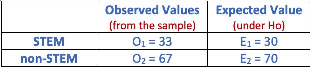
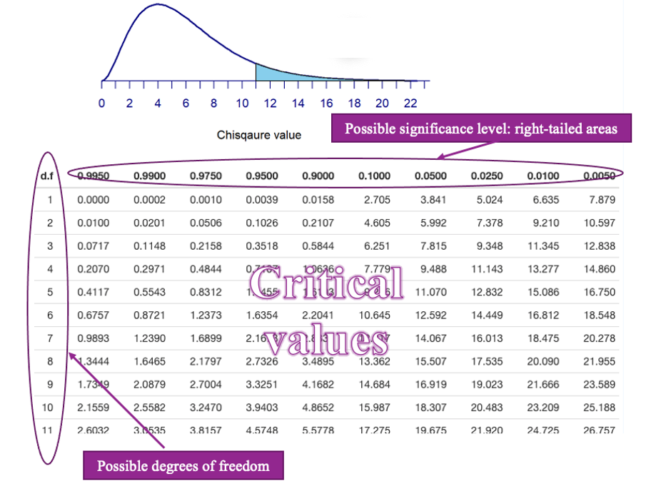
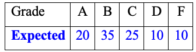
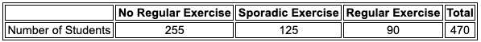

<style type="text/css">

div#TOC li {
    list-style:none;
    background-image:none;
    background-repeat:none;
    background-position:0;
}
h1.title {
  font-size: 24px;
  color: DarkRed;
  text-align: center;
}
h4.author { /* Header 4 - and the author and data headers use this too  */
    font-size: 18px;
  font-family: "Times New Roman", Times, serif;
  color: DarkRed;
  text-align: center;
}
h4.date { /* Header 4 - and the author and data headers use this too  */
  font-size: 18px;
  font-family: "Times New Roman", Times, serif;
  color: DarkBlue;
  text-align: center;
}

h1 { /* Header 3 - and the author and data headers use this too  */
    font-size: 20px;
    font-family: "Times New Roman", Times, serif;
    color: darkred;
    text-align: center;
}
h2 { /* Header 3 - and the author and data headers use this too  */
    font-size: 18px;
    font-family: "Times New Roman", Times, serif;
    color: navy;
    text-align: left;
}

h3 { /* Header 3 - and the author and data headers use this too  */
    font-size: 16px;
    font-family: "Times New Roman", Times, serif;
    color: navy;
    text-align: left;
}

</style>

```{r setup, include=FALSE}
# code chunk specifies whether the R code, warnings, and output 
# will be included in the output files.

if (!require("knitr")) {
   install.packages("knitr")
   library(knitr)
}
# knitr::opts_knit$set(root.dir = "C:/Users/75CPENG/OneDrive - West Chester University of PA/Documents")
# knitr::opts_knit$set(root.dir = "C:\\STA490\\w05")

knitr::opts_chunk$set(echo = FALSE,       
                      warning = FALSE,   
                      result = TRUE,   
                      message = FALSE)
```

\

\


# Introduction

We have discussed the relationship between two numerical variables using linear correlation coefficient and linear regression. We now explore the relationship between two categorical variables. The idea is to make an assumption (hypothesis) about the variable (s) and use the assumption to construct a frequency table (called the expected table). At the same time, we tabulated the data to obtain an observed table. The discrepancy between the expected table and the observed table can be used to make the inference about the relationship between categorical variables.

# Chi-square Test of Goodness-of-fit 

**A goodness-of-fit test** of a distribution is a testing procedure that justifies whether the null hypothesis that specified distribution is correct based on sample information. 

For a single categorical variable, the null hypothesis should specify the cell probabilities. In other words, if the category has k categories, then ($p_1, p_2 \cdots, p_k$) must be specified in the null hypothesis.

## A Motivational Example

As a special case, we look at the following example of testing the proportion problem. 

<font color = "darkred"> **Example 1**.</font> We want to justify a claim that about 30% of WCU students are STEM majors. That is, we test the following hypotheses.
$$
H_0: \  \ p = 0.3 \ \ \ \ v.s. \ \ \ \ H_a: \ \ p \ne 0.3.
$$
We take a random sample of 100 students and record the majors and found that 33 of them claimed a major in STEM. This means 67 of them are non-STEM majors. We have introduced a procedure to test the above hypotheses with the test statistic
$$
TS = \frac{\hat{p}-p_0}{\sqrt{p_0(1-p_0)/n}}
$$

that compares the claimed proportion with the sample proportion. 


Note that the proportion of STEM majors contains the number of majors (frequencies) in both STEM and non-STEM disciplines. we can think about using (observed)sample frequencies and null (expected) frequencies to define the test statistic. 

* **Under $H_0$**, we would **expect** to have 30 STEM majors and 70 non-STEM majors.

* We **observed** 33 STEM majors and 67 STEM majors in the random sample.

The above observed and expected number of STEM and non-STEM majors are summarized in the following table.

```{r fig.align='center', out.width = '50%'}

```  

In fact, a test statistic that measures the "distance" between the observed and expected frequency tables and has a $\chi^2$ (chi-square) distribution is defined below
$$
TS = \frac{(O_1 - E_1)^2}{E_1} + \frac{(O_2 - E_2)^2}{E_2} \to \chi_1^2.
$$

The value of the test statistic in this example 

$$TS = \frac{(33-30)^2}{30} + \frac{(67-70)^2}{70} = 9/30 + 49/70 = 3/10 + 7/10 = 1$$

With the above value of test statistic, we can make a statistical decision on $H_0$ based on a given significance level.


## Chi-squares Distribution

The chi-square distribution is used to characterize the positive random variable. Unlike normal and t distributions that have symmetric density curves, the chi-square distributions (dependent on the degrees of freedom) have skewed density curves.

```{r fig.align='center', out.width = '60%'}
include_graphics("week13/chisqDensity.png")
```  

We can find the critical value of chi-square distribution from the chi-square table that is available on the course web page. The structure of the chi-square table is similar to the t-table. 

```{r fig.align='center', out.width = '80%'}

``` 

The possible degrees of freedom are listed in the first column, the possible right-tail areas are listed in the top row, and the critical values are listed in the main body of the table.


The steps for finding the critical values are the same as those we followed for finding t- critical values.

<font color = "darkred"> **Example 2**.</font> Find the critical value of the chi-square distribution with 5 degrees of freedom with significance level 0.05.

```{r fig.align='center', out.width = '80%'}
include_graphics("week13/example02ChisqCV.png")
``` 

The above figure shows how to find the critical value, denoted by $CV = \chi^2_{5, 0.05} = 11.071$. The first subscript denotes 5 degrees of freedom and the second subscript is the significance level of 0.05.


## Formulation of Chi-square Test of Goodness-of-fit


Let $k$ be the number of categories of categorical variable $Y$. The category labels are $C_1, C_2, \cdots, C_k$. Let $P_1 = Pr(C_1), P_2 = Pr(C_2), \cdots, P_k = Pr(C_k)$. The null hypothesis claims that the categorical follows a specific distribution, and the alternative hypothesis claims that the categorical distribution does NOT follow the distribution specified in the null hypothesis. That is,
$$
H_0:\ \ P_1 = p_1, P_2 = p_2, \cdots, P_k = p_k \ \ \ \ v.s. \  \  \  \  H_a: \ \ the \ distribution \ in \ H_0 \ is \ not \ correct.
$$
The $N$ is the sample size. We can then calculate the **expected cell frequency** of each category using formulas: $E_1 = N\times p_1, E_2 = N \times p_2, \cdots, E_k = N \times p_k$. The **observed cell frequency**, denoted by $O_i$ (for $i=1,2, \cdots, k$), of each category is obtained from the data set. The **expected** and **observed** frequencies are summarized in the following table.

```{r fig.align='center', out.width = '60%'}
include_graphics("week13/obsExpTable.png")
``` 

The chi-square statistic is

$$
G^2 = \frac{(O_1-E_1)^2}{E_1} + \frac{(O_2-E_2)^2}{E_2} + \cdots + \frac{(O_k-E_k)^2}{E_k} \to \chi_{k-1}^2
$$

A small $G^2$ indicates a lack of evidence for rejecting the null hypothesis. This implies that **the Pearson chi-square test of goodness is always a right-tailed test**.
The degrees of freedom are always $(k-1)$ if the categorical factor variable has k levels.


<font color = "darkred"> **Example 3**.</font> A gambler wants to test a die to determine whether it is fair. The gambler rolls a die that has six possible outcomes: 1, 2, 3, 4, 5, and 6; and the die is fair if each of these outcomes is equally likely. The gambler rolls the die 60 times and counts the number of times each number comes up. These counts, which are called the observed frequencies, are

```{r fig.align='center', out.width = '35%'}
include_graphics("week13/example03Data.png")
``` 

**Solution**: The null hypothesis is that the six-sided die is fair. That is equivalent to
$$
H_0: \ \  p_1 = p_2 = p_3 = p_4 = p_5 = p_6 = 1/6 \ \ \ \ v.s. \ \ \ \ H_a: \ \ The \ die \ is \ NOT \ fair.
$$
Based on the observed frequency table, the size of the sample is 60. Using the *cell probabilities* in $H_0$, we have **expected frequencies** of the 6 categories to be equal to 10. We summarize the **expected** and **observed** frequencies in the following table.
```{r fig.align='center', out.width = '45%'}

``` 

The test statistic for testing $H_0$ is defined by
$$
G^2 = \frac{(12-10)^2}{10}+\frac{(7-10)^2}{10}+\frac{(14-10)^2}{10}+\frac{(15-10)^2}{10}
+\frac{(4-10)^2}{10}+\frac{(8-10)^2}{10} \\ =(4+9+16+25+36+4)/10=9.4
$$
Since the categorical variable (number of dots on the faces of the 6-sided die) has 6 categories. The test statistic has 5 degrees of freedom.  The critical value based on the significance level of 0.05 is given in the following figure
```{r fig.align='center', out.width = '85%'}
include_graphics("week13/example03CV.png")
``` 

The test statistic is NOT in the rejection region. We fail to reject the null hypothesis. The die is a fair die.


<font color = "darkred"> **Example 4**.</font>  Grade distribution: A statistics teacher claims that, on average, $20\%$ of her students get a grade of A, $35\%$ get a B, $25\%$ get a C, $10\%$ get a D, and $10\%$ get an F. The grades of a random sample of 100 students were recorded. The following table presents the sample frequencies of each grade.

```{r fig.align='center', out.width = '25%'}

``` 


**Solution**: Based on the given information. $N = 100$. The null hypothesis and the alternative hypothesis are
$$
H_0: \ \ p_A = 0.2, p_B = 0.35, p_C = 0.25, p_D = 0.1, p_F = 0.1 \ \ \ \ v.s. H_a: \ \ The \ claimed \ distribution \ is \ wrong.
$$
Under the null hypothesis, the expected table is given by

```{r fig.align='center', out.width = '25%'}

```

The test statistic has 4 degrees of freedom and the value is calculated as follows
$$
G^2=\frac{(29-20)^2}{20}+\frac{(42-35)^2}{35}+\frac{(20-25)^2}{25}+\frac{(5-10)^2}{10}+\frac{(4-10)^2}{10}=12.56
$$
The critical value with a significance level of 0.05 is given by
```{r fig.align='center', out.width = '75%'}
include_graphics("week13/example04CV.png")
```

Since the test statistic is inside the rejection region, we reject the null hypothesis. That is, the sample does not support the claimed grade distribution in $H_0$.


**Remark**: In the chi-square goodness-of-fit test, the crucial step is to find the *expected** frequency table under the null hypothesis.

\

**Here is another example that is different from the above example**

\

<center><a href="https://mat121.s3.amazonaws.com/Goodness-of-fit.mp4"></a>

\


# Chi-square Test of Independence

Let $X$ and $Y$ be two categorical variables with $k$ and $m$ categories respectively. Their relationship between $X$ and $Y$ is characterized by their joint distribution (table). For simplicity, we use the following two special categorical to explain the ideas of statistical testing of independence.


## Independence of Two Categorical Variables

We use the following example to illustrate **independence** and **dependence** between two categorical variables.

<font color = "darkred"> **Example 5**.</font> *Joint probabilities and contingency tables.* Let $X =$ political preference (Democrat vs Republican) and $Y =$gender (Male and Female). Let's **assume** their joint distribution to be of the following *contingency table*.

```{r fig.align='center', out.width = '65%'}
include_graphics("week13/twoWayContingencyTable.png")
```

The cell numbers are joint probabilities. For example, $p_{12} = 0.2 = 20\%$ says $20\%$ of the *study population* are male republicans. The row and column totals represent the percentage of male/female and democrats/republicans in the study population. Any observed data table is **governed** by the above joint distribution table.

**Definition** Two categorical variables are **independent** if and only if their joint probabilities are equal to the product of their corresponding marginal probabilities. 

With this definition, we can see that $X$ and $Y$ with joint distribution specified in the above table (in Example 5) ar NOT independent since $p_{11} =0.3 \ne 0.5\times 0.5 = 0.25$. 

<font color = "darkred"> **Example 6**.</font> We consider two variables $X =$ preference of hair color (Blonde and Brunette) and $Y =$ gender (Male and Female). Assume the joint distribution of the two variables is given by

```{r fig.align='center', out.width = '35%'}
include_graphics("week13/independenceContingencyTable.png")
```

Based on the definition of independence. The preference for hair color is independent of gender. Since **all** joint probabilities are equal to the product of their corresponding marginal probabilities.

$0.45\times 0.40 = 0.18, 0.45 \times 0.60 = 0.27, 0.55 \times 0.40 = 0.22$, and $0.55 \times 0.60 = 0.33.$


## Expected Table Under Independence Assumption (**$H_0$**)

We construct the **expected table** under the **null hypothesis of independence** and the **observed contingency table**. For ease of interpretation, we use an example to illustrate the steps for obtaining the expected table.


<font color = "darkred"> **Example 7**.</font>  Consider the potential dependence between the attendance (good vs poor) and course grade (pass vs fail). We take 50 students from a population and obtain the following observed table.

```{r fig.align='center', out.width = '35%'}
include_graphics("week13/attendancePassFail.png")
```

**Question**: Whether the attendance is independent of class performance?
$$
Ho: \ \ attendance \ is \ \ independent \ \ of \ the \ performance
$$
$$versus$$

$$
Ha: \ \ attendance \ is  \ \ dependent \ of \ the \ performance
$$

To obtain the expected table, we follow the next few steps.

1. Estimate the marginal probabilities

```{r fig.align='center', out.width = '50%'}
include_graphics("week13/marginalTable.png")
```

\ \ \ \ \ \ \ \ \ \ \ where marginal probabilities are calculated by Pr(Good) = 27/50 = 0.54, Pr(Poor) = 23/50 = 0.46, Pr(Pass) = 33/50 = 0.66, Pr(Fail) = 17/50 = 0.34.


2. Estimate the joint probability under the null hypothesis of independence

```{r fig.align='center', out.width = '50%'}

```

\ \ \ \ \ \ \ \ \ \ \ where joint probabilities under the independence assumption ($H_0$) are calculated by taking the product of the corresponding marginal probabilities. For example, <font color = "red"> 0.54 $\times$ 0.66 = </font> <font color = "blue">0.3564</font>.

3. Calculate Expected Table 

\ \ \ \ \ \ \ \ \ \ The expected frequencies are calculated in the following table (with detailed steps).

```{r fig.align='center', out.width = '65%'}
include_graphics("week13/expectedTable.png")
```

\

**Remark**. For categorical variables with **more than two categories**, the expected table can be found using ** the same 3 steps** as those used in the above example. 

\

## Formulation of Chi-squares Test of Independence

The test statistic used to test the independence of two categorical variables is the same as that used in the goodness-of-fit test. That is the standardized "distance" between the observed and the expected table (under $H_0$). 

**Assume that the two categorical variables have $k$ and $m$ categories respectively, then the resulting test statistic has a chi-square distribution with $(k-1)\times(m-1)$ degrees of freedom.**


<font color = "darkred"> **Example 8**.</font> [Continuation of **Example 7**]. Test whether **attendance** and **class performance**.

**Solution**: We have found the expected table under $H_0$ in **Example 7**, we put the observed and expected tables in the following.

```{r fig.align='center', out.width = '70%'}
include_graphics("week13/example08ExpObs.png")
```

The test statistic is given by

$$
TS = \frac{(25-18.82)^2}{17.82} + \frac{(2-9.18)^2}{9.18} + \frac{(8-15.18)^2}{15.18} + \frac{(15-7.82)^2}{7.82} = 17.75
$$

The test statistic has a chi-square distribution with $(2-1)\times (2-1) = 1$ degrees of freedom. The critical value at the significance level of 0.05 is found in the following figure.

```{r fig.align='center', out.width = '85%'}
include_graphics("week13/example08ChisqCV.png")
```

Since the test statistic is inside the rejection region, we reject the null hypothesis that attendance and class performance are independent.


<font color = "darkred"> **Example 9**.</font> Do some college majors require more studying than others? The National Survey of Student Engagement asked a number of college freshmen what their major was and how many hours per week they spent studying, on average. A sample of 1000 of these students was chosen, and the numbers of students in each category are tabulated in the following two-way contingency table.

```{r fig.align='center', out.width = '60%'}
include_graphics("week13/example09Data.png")
```

**Solution**: The null and alternative hypotheses are given by

```{}
       Ho: studying time is INDEPENDENT on majors
                   versus
       Ha: studying time is DEPENDENT on majors.
```


Under the null hypothesis, we obtained the expected table using the same steps in Example 7 in the following.

```{r fig.align='center', out.width = '55%'}
include_graphics("week13/example09ExpTable.png")
```

The test statistic is given by

```{r fig.align='center', out.width = '60%'}

```

The critical value and rejection region based on significance level 0.05 is given by

```{r fig.align='center', out.width = '80%'}

```

**Conclusion**: Since the test statistic is inside the rejection region, we reject the null hypothesis and conclude that the studying time is dependent on the majors.


# Use of Technology

Two apps were created for the two chi-square tests of goodness-of-fit and independence respectively.

## Goodness-of-fit Chi-square 

The app is at: <https://chpeng.shinyapps.io/chisq-gof/>. The following screenshot illustrates the use of this app using Example 03 in this note.

```{r fig.align='center', out.width = '100%'}
include_graphics("week13/useTech01.png")
```


## Chi-square Test of Independence

The app is at <https://chpeng.shinyapps.io/chisq-independence/>. We use this app with Example 09.

```{r fig.align='center', out.width = '100%'}
include_graphics("week13/useTech02.png")
```

\

# Practice Exercises

\
\
You can use the apps to do the following exercises.

1. **College Sports**

A University conducted a survey of its recent graduates to collect demographic and health information for future planning purposes as well as to assess students' satisfaction with their undergraduate experiences. The survey revealed that a substantial proportion of students were not engaging in regular exercise, many felt their nutrition was poor and a substantial number were smoking. In response to a question on regular exercise, 60% of all graduates reported getting no regular exercise, 25% reported exercising sporadically and 15% reported exercising regularly as undergraduates. The next year the University launched a health promotion campaign on campus in an attempt to increase health behaviors among undergraduates. The program included modules on exercise, nutrition, and smoking cessation. To evaluate the impact of the program, the University again surveyed graduates and asked the same questions. The survey was completed by 470 graduates and the following data were collected on the exercise question:

```{r fig.align='center', out.width = '75%'}

```

We specifically want to compare the distribution of responses in the sample to the distribution reported the previous year (i.e., 60%, 25%, 15% reporting no, sporadic and regular exercise, respectively). Whether the data supports the above distribution at a significance level of 0.05.  

 
2. **Political Affiliation and Opinion**

The following table based on the sample will be used to explore the relationship between Party Affiliation and Opinion on Tax Reform.

```{r fig.align='center', out.width = '35%'}

```

Find the expected counts for all of the cells.


3. **Tire Quality**

The operations manager of a company that manufactures tires wants to determine whether there are any differences in the quality of work among the three daily shifts. She randomly selects 496 tires and carefully inspects them. Each tire is either classified as perfect, satisfactory, or defective, and the shift that produced it is also recorded. The two categorical variables of interest are the shift and condition of the tire produced. The data can be summarized by the accompanying two-way table. Does the data provide sufficient evidence at the 5% significance level to infer that there are differences in quality among the three shifts?

```{r fig.align='center', out.width = '35%'}

```

4. **Condiment preference and gender**

A food services manager for a baseball park wants to know if there is a relationship between gender (male or female) and the preferred condiment on a hot dog. The following table summarizes the results. Test the hypothesis with a significance level of 10%.

```{r fig.align='center', out.width = '35%'}

```


